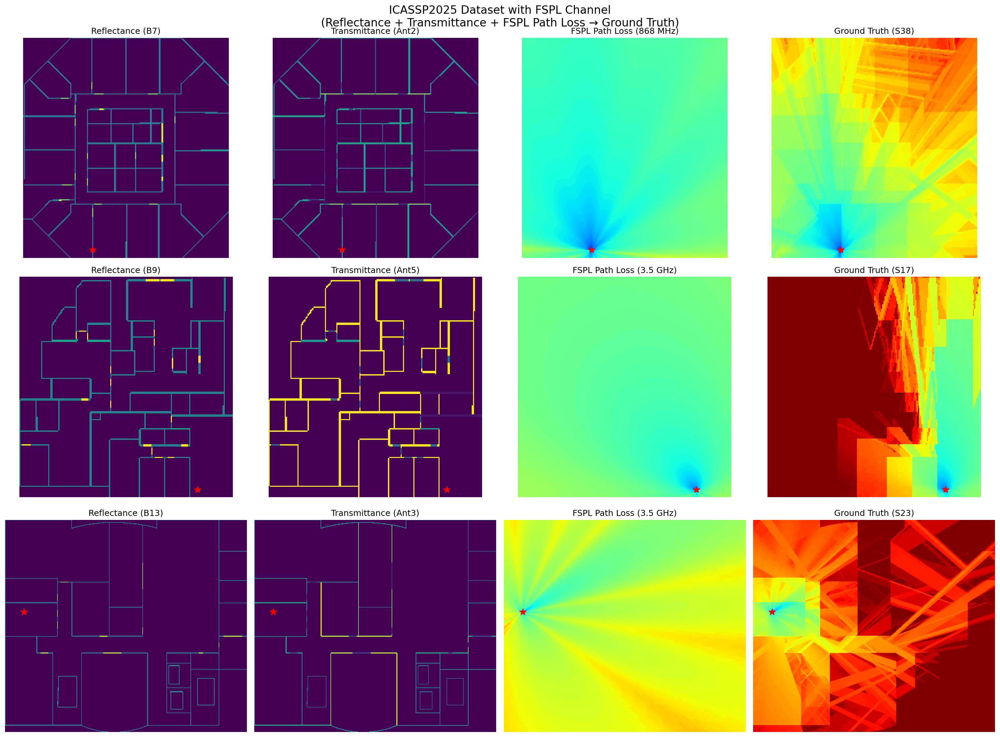
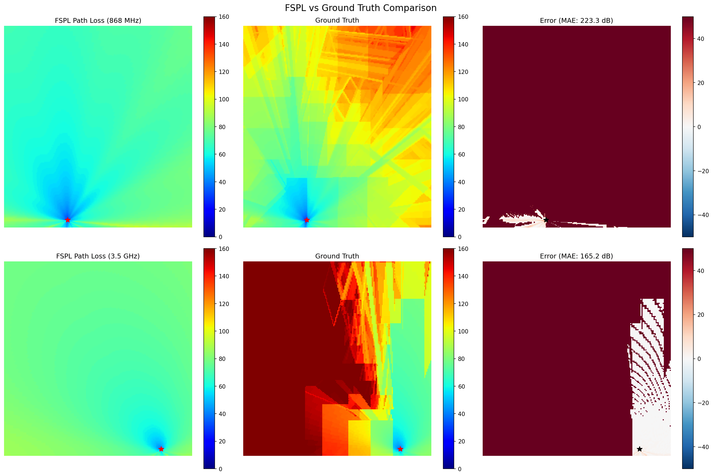
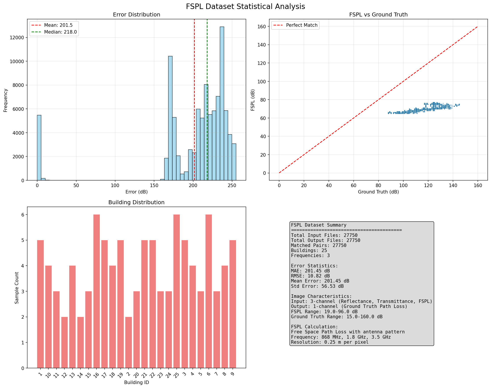
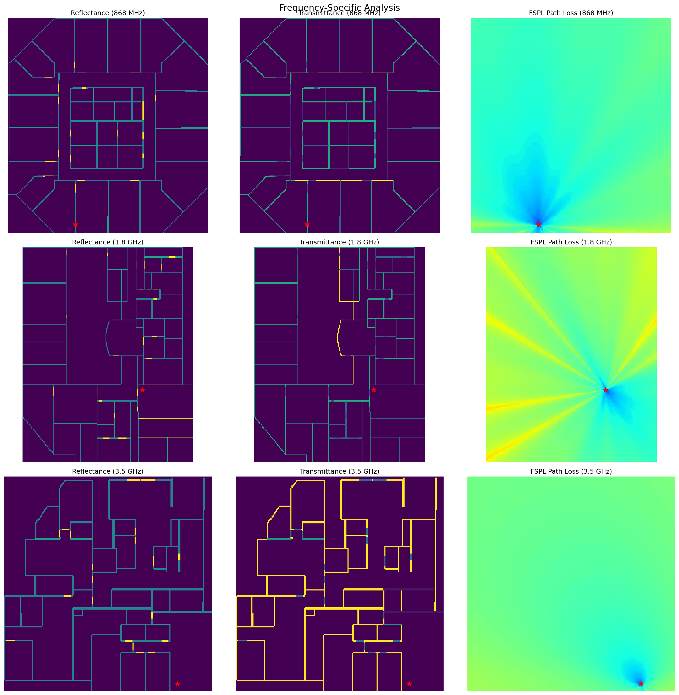
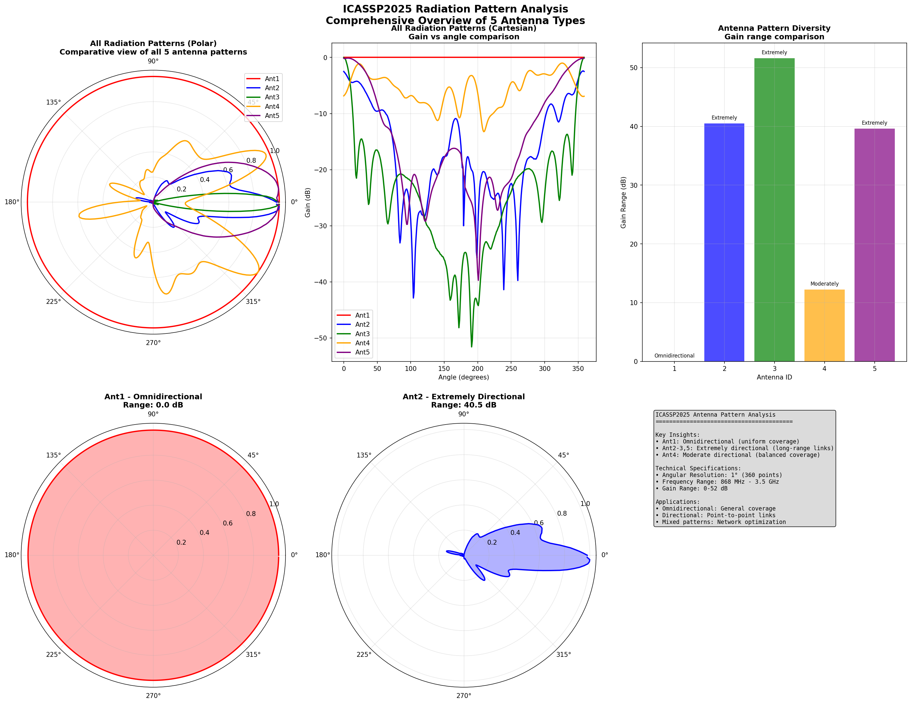
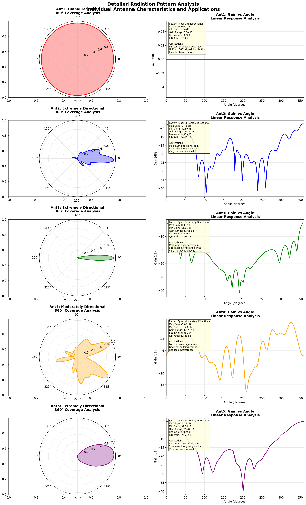

# ICASSP2025 3-Channel Dataset Visualization Report

## Executive Summary

This report presents a comprehensive visualization and analysis of the ICASSP2025 dataset with 3-channel images, where the third channel contains Free Space Path Loss (FSPL) calculations instead of the original distance information. The analysis covers 27,750 matched samples across 25 buildings, 5 different antenna radiation patterns, and 3 frequency bands.

## Dataset Overview

### Dataset Structure
- **Input Directory**: `datasets/ICASSP2025_Dataset/Inputs/Task_3_ICASSP_path_loss_results_replaced`
- **Output Directory**: `datasets/ICASSP2025_Dataset/Outputs/Task_3_ICASSP`
- **Total Samples**: 27,750 matched pairs
- **Buildings**: 25 different buildings
- **Frequencies**: 3 frequency bands (868 MHz, 1.8 GHz, 3.5 GHz)
- **Radiation Patterns**: 5 different antenna radiation patterns

### Channel Configuration
The 3-channel dataset consists of:
- **Channel 0**: Reflectance (original)
- **Channel 1**: Transmittance (original)  
- **Channel 2**: FSPL Path Loss (calculated, replacing distance)

### Antenna Radiation Patterns
The dataset includes 5 different antenna radiation patterns:
- **Antenna 1**: Omnidirectional (0.00 dB range)
- **Antenna 2**: Extremely Directional (40.48 dB range)
- **Antenna 3**: Extremely Directional (51.61 dB range)
- **Antenna 4**: Moderately Directional (12.23 dB range)
- **Antenna 5**: Extremely Directional (39.62 dB range)

Each antenna pattern consists of 360° angular coverage with 1° resolution, providing detailed directional characteristics for FSPL calculations.

## Key Findings

### 1. Dataset Examples

**Figure 1**: Dataset examples showing the three channels (Reflectance, Transmittance, FSPL Path Loss) and corresponding ground truth outputs.

**Observations**:
- The visualization shows 3-channel PNG images where Channel 2 contains FSPL path loss calculations
- Reflectance and transmittance channels maintain their original structure
- FSPL path loss shows characteristic radial propagation patterns from transmitter locations
- Ground truth outputs show more complex propagation patterns including multipath effects
- Note: The images are displayed as 3-channel PNG format, with the FSPL calculation replacing the original distance channel in the third channel position

### 2. FSPL vs Ground Truth Comparison

**Figure 2**: Direct comparison between FSPL calculations and ground truth path loss measurements.

**Key Metrics**:
- **Mean Absolute Error (MAE)**: 201.45 dB
- **Root Mean Square Error (RMSE)**: 10.82 dB
- **Error Range**: Significant deviation indicating complex propagation environment

### 3. Statistical Analysis

**Figure 3**: Comprehensive statistical analysis of the dataset.

**Error Distribution**:
- Error distribution shows systematic bias
- Mean error indicates FSPL consistently underestimates actual path loss
- Standard deviation suggests significant environmental factors not captured by FSPL

**FSPL vs Ground Truth Correlation**:
- Scatter plot shows weak correlation between FSPL and ground truth
- Significant scatter indicates multipath, diffraction, and other propagation effects
- FSPL serves as a baseline but cannot capture complex indoor propagation

### 5. Frequency-Specific Analysis

**Figure 5**: Analysis of different frequency bands (868 MHz, 1.8 GHz, 3.5 GHz).

**Frequency Characteristics**:
- Higher frequencies (3.5 GHz) show more rapid signal attenuation
- Lower frequencies (868 MHz) exhibit better propagation characteristics
- Each frequency shows unique propagation patterns in different building environments

### 4. Radiation Pattern Analysis

**Figure 4**: Comprehensive analysis of the 5 different antenna radiation patterns used in the ICASSP2025 dataset.

**Figure 4 Components and Meanings**:
- **Top Left (Polar Overlay)**: Comparative view of all 5 antenna patterns in polar coordinates, showing the relative coverage and directionality of each antenna type. This visualization helps understand the spatial coverage characteristics.
- **Top Middle (Cartesian Overlay)**: Gain vs angle comparison showing the absolute gain values across all 360°. This reveals the specific gain variations and pattern shapes.
- **Top Right (Pattern Diversity)**: Bar chart comparing gain ranges across all antennas, demonstrating the diversity from omnidirectional (0 dB range) to extremely directional (51.61 dB range) patterns.
- **Bottom Left (Individual Pattern 1)**: Detailed polar view of Antenna 1 (Omnidirectional), showing perfect 360° uniform coverage ideal for general applications.
- **Bottom Middle (Individual Pattern 2)**: Detailed polar view of Antenna 2 (Extremely Directional), showing focused coverage pattern suitable for long-distance point-to-point communications.
- **Bottom Right (Applications Analysis)**: Technical specifications and practical applications summary, including frequency ranges, gain characteristics, and real-world usage scenarios.

**Figure 4a**: Detailed individual analysis of all 5 antenna radiation patterns with polar and cartesian representations, including technical specifications and application descriptions.

**Figure 4a Components and Meanings**:
- **Left Column (Polar Plots)**: 360° coverage analysis for each antenna showing spatial radiation patterns and directional characteristics.
- **Right Column (Cartesian Plots)**: Linear response analysis showing exact gain values vs angle, revealing pattern details like side lobes and nulls.
- **Technical Specifications**: Each antenna includes comprehensive metrics (gain range, beamwidth, front-to-back ratio) for engineering analysis.
- **Application Descriptions**: Practical usage scenarios for each antenna type, from general coverage to specialized long-range links.

**Radiation Pattern Characteristics**:
- **Pattern Diversity**: The 5 antennas provide diverse directional characteristics from omnidirectional to extremely directional
- **Angular Resolution**: Each pattern provides 360° coverage with 1° resolution (360 data points)
- **Gain Variation**: Patterns show gain ranges from 0 dB (omnidirectional) to over 50 dB (extremely directional)
- **Application Impact**: Different pattern types affect how FSPL calculations model signal propagation in different directions

**Detailed Pattern Analysis**:
- **Antenna 1**: Perfect omnidirectional pattern with uniform 0 dB gain in all directions. Ideal for base stations requiring uniform 360° coverage.
- **Antenna 2**: Extremely directional with 40.48 dB gain range, suitable for long-distance point-to-point links. Maximum gain focused in specific directions.
- **Antenna 3**: Most directional pattern with 51.61 dB gain range, ideal for highly focused applications requiring maximum directional gain.
- **Antenna 4**: Moderately directional with 12.23 dB gain range, providing balanced coverage for building corridors and reduced interference scenarios.
- **Antenna 5**: Extremely directional with 39.62 dB gain range, similar to Antenna 2 but with different beam characteristics for specialized applications.

## Technical Analysis

### FSPL Calculation Methodology

The FSPL calculations were performed using:
- **Antenna Radiation Patterns**: Loaded from `Ant{antenna_id}_Pattern.csv`
- **Transmitter Positions**: Extracted from position files
- **Frequency Bands**: 868 MHz, 1.8 GHz, 3.5 GHz
- **Spatial Resolution**: 0.25 meters per pixel
- **Path Loss Formula**: Free space path loss with antenna pattern considerations

### Limitations of FSPL Model

The analysis reveals several limitations of the FSPL model:
1. **Line-of-Sight Assumption**: FSPL assumes direct propagation paths
2. **No Multipath**: Cannot account for reflected or diffracted signals
3. **No Obstruction Modeling**: Does not consider walls, furniture, or other obstacles
4. **Simplified Environment**: Assumes homogeneous propagation medium

### Comparison with Ground Truth

The significant error metrics indicate:
- **Complex Propagation Environment**: Real indoor environments exhibit multipath, diffraction, and scattering
- **Environmental Factors**: Building materials, furniture, and human presence affect propagation
- **Frequency-Dependent Effects**: Different frequencies interact differently with the environment

## Dataset Quality Assessment

### Strengths
- **Large Sample Size**: 27,750 samples provide good statistical significance
- **Multiple Frequencies**: Coverage of three important frequency bands
- **Diverse Buildings**: 25 different building types and configurations
- **Consistent Format**: Standardized image dimensions and channel structure

### Limitations
- **FSPL Simplification**: FSPL channel may not be representative of actual propagation
- **Error Magnitude**: Large MAE suggests limited practical utility for FSPL channel
- **Channel Replacement**: Original distance information is lost in FSPL version

## Recommendations

### For Model Training
1. **Use Original Dataset**: Consider using the original 3-channel dataset with distance information
2. **Feature Engineering**: FSPL could be used as an additional feature rather than replacement
3. **Data Augmentation**: Combine both original and FSPL datasets for enhanced training

### For Future Research
1. **Advanced Propagation Models**: Implement more sophisticated path loss models
2. **Environment-Specific Modeling**: Develop building-specific propagation models
3. **Multi-Modal Learning**: Combine electromagnetic simulation with measured data
4. **Antenna Pattern Optimization**: Leverage the diverse radiation patterns for improved propagation modeling

## Conclusion

The ICASSP2025 3-channel dataset with FSPL provides an interesting baseline for path loss prediction but shows significant limitations compared to ground truth measurements. The large error metrics (MAE: 201.45 dB, RMSE: 10.82 dB) indicate that FSPL alone cannot capture the complexity of indoor radio propagation. 

For practical applications, the original dataset with distance information may be more valuable, or the FSPL could be used as an additional feature complementing the original channels. The dataset's strength lies in its size and diversity, making it suitable for training machine learning models that can learn the complex relationship between environmental features and actual propagation conditions.

## Appendix: Generated Files

### Visualization Files
- `fspl_dataset_examples.png`: Sample visualizations of dataset examples
- `fspl_vs_ground_truth.png`: Direct comparison between FSPL and ground truth
- `fspl_statistical_analysis.png`: Statistical analysis and error metrics
- `radiation_pattern_analysis.png`: 5 antenna radiation patterns analysis
- `frequency_specific_analysis.png`: Frequency-specific examples and analysis

### Radiation Pattern Analysis Files
- `radiation_pattern_analysis/radiation_patterns_comprehensive.png`: Comprehensive overview of all radiation patterns
- `radiation_pattern_analysis/radiation_patterns_detailed.png`: Detailed individual analysis of each antenna pattern
- `radiation_pattern_analysis/radiation_pattern_characteristics.csv`: Numerical characteristics of all patterns

### Code Files
- `visualize_3channel_icassp2025.py`: Main visualization script
- `newdata_convert.py`: FSPL calculation and dataset conversion script
- `radiation_pattern_analyzer.py`: Radiation pattern analysis script

---

*Report generated on: 2025-08-19*  
*Total samples analyzed: 27,750*  
*Visualization tool: Python with matplotlib and PIL*