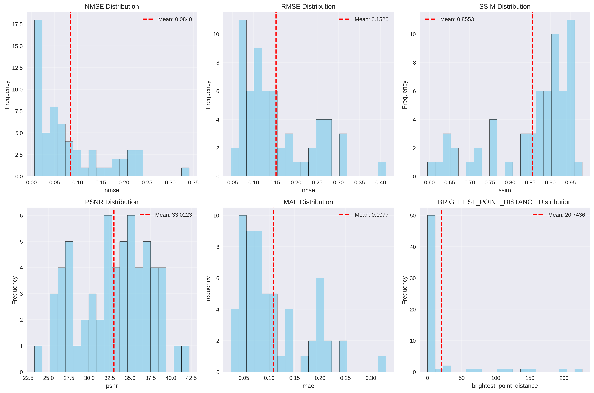
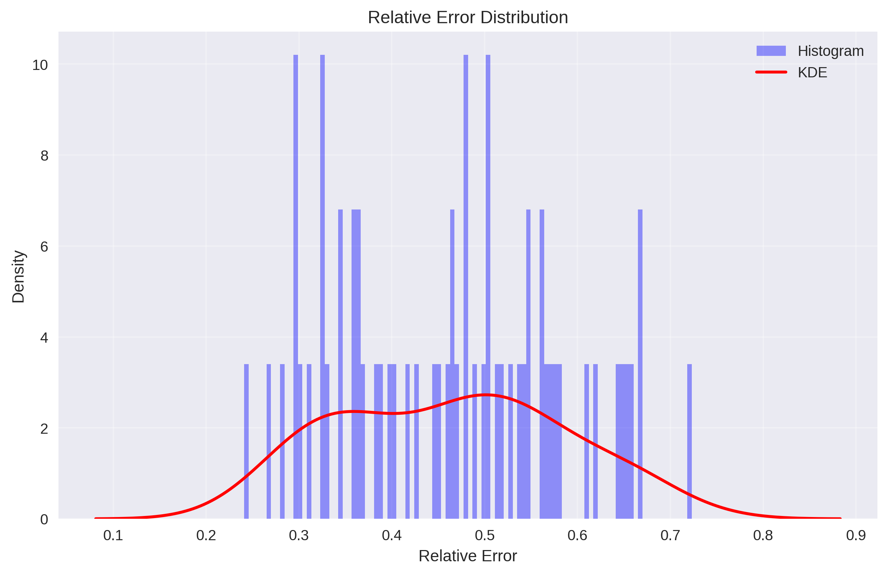
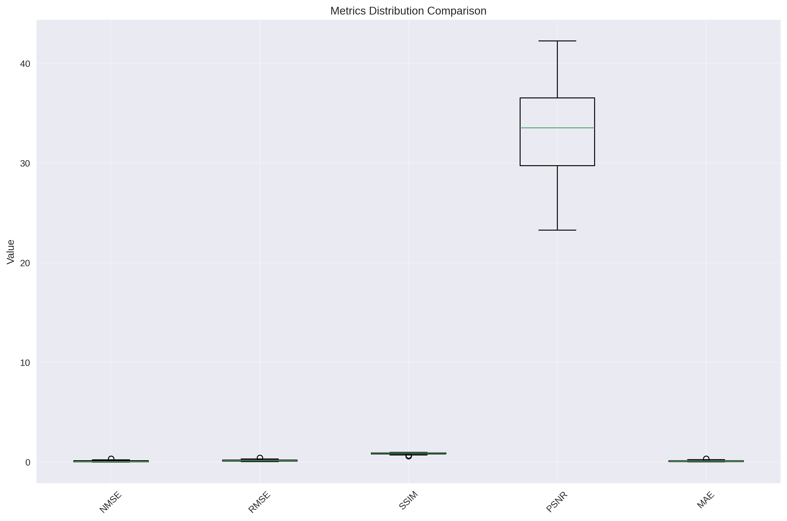
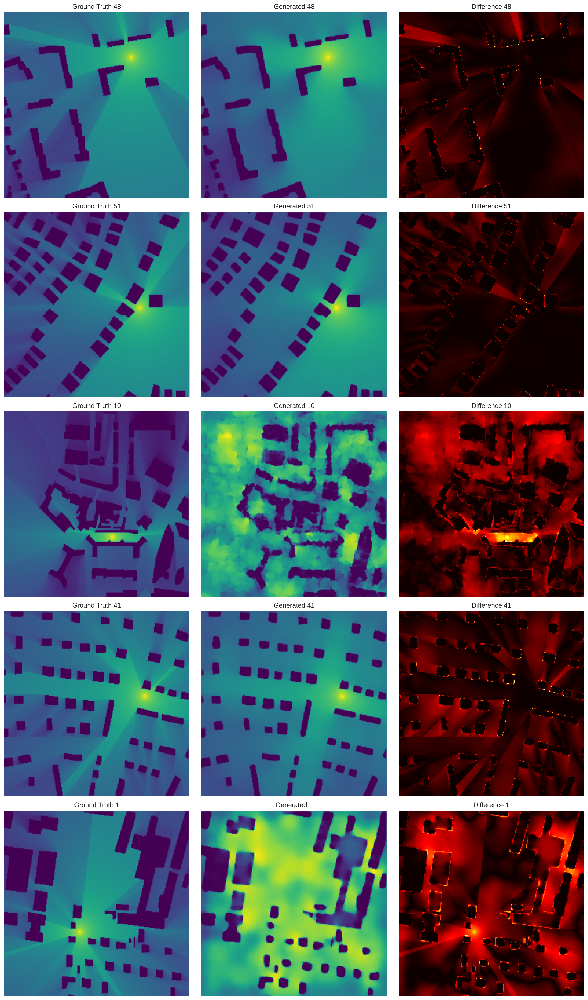

# RadioDiff Sampling and Inference Report

## Executive Summary
This report provides a comprehensive analysis of the RadioDiff model's sampling and inference performance based on the execution log from `sample_cond_ldm.py` using the BSDS configuration. The analysis includes generated visualizations, performance metrics, and detailed image comparison analysis using a comprehensive comparison toolkit developed for evaluating radio map generation quality.

## RadioDiff Image Comparison Toolkit

### Overview
A comprehensive image comparison toolkit has been developed to quantitatively evaluate the quality of generated radio maps against ground truth data. This toolkit provides multiple metrics and visualizations to assess model performance across different dimensions.

### Key Components

#### `compare_images.py`
Main comparison script that calculates various metrics and generates visualizations.

**Features:**
- **Metrics Calculation**: NMSE, RMSE, SSIM, PSNR, MAE, relative error, brightest point distance
- **Statistical Analysis**: Mean, standard deviation, min, max, median for all metrics
- **Visualizations**: Histograms, KDE plots, box plots, sample comparisons
- **Comprehensive Reports**: CSV exports with detailed metrics

#### `run_comparison_example.py`
Example script that demonstrates how to use the comparison tool with existing RadioDiff outputs.

### Usage
```bash
python compare_images.py \
    --config configs/radio_sample_m.yaml \
    --gt_dir /path/to/ground/truth \
    --gen_dir /path/to/generated/images \
    --output_dir ./enhanced_suite/archive/comparison_results
```

### Metrics Explained

#### Primary Metrics
- **NMSE** (Normalized Mean Squared Error): MSE normalized by target variance
- **RMSE** (Root Mean Squared Error): Square root of average squared differences
- **SSIM** (Structural Similarity Index): Perceptual similarity measure
- **PSNR** (Peak Signal-to-Noise Ratio): Quality measure in decibels
- **MAE** (Mean Absolute Error): Average absolute difference

#### Radio-Specific Metrics
- **Relative Error**: Sqrt-normalized relative difference
- **Brightest Point Distance**: Euclidean distance between maximum intensity points
- **Sharpness Ratio**: Comparison of image sharpness using Laplacian variance

## Generated Visualizations
The sampling process generates several key visualizations that provide insights into model performance:

### 1. Loss Distribution Analysis
- **VAE Loss Distribution**: `/radiodiff_Vae/vae_loss_distribution.png`
  - Shows the distribution of VAE loss components during training
  - Helps identify patterns in reconstruction quality

### 2. Multi-Axis Performance Analysis
- **Multi-Axis Losses**: `/radiodiff_Vae/vae_multi_axis_analysis.png`
  - Comprehensive analysis of different loss components
  - Reveals correlations between various loss metrics

### 3. Normalized Comparison
- **Normalized Comparison**: `/radiodiff_Vae/vae_normalized_comparison.png`
  - Normalized view of performance metrics
  - Facilitates comparison across different scales

### 4. Training Dashboard
- **VAE Training Dashboard**: `/radiodiff_Vae/vae_training_dashboard.png`
  - Comprehensive overview of training progress
  - Key metrics and performance indicators

### 5. Sample Outputs
The model generates 30 sample images (`/radiodiff_Vae/sample-1.png` through `/radiodiff_Vae/sample-30.png`) demonstrating the quality of radio map generation across different scenarios.

## System Configuration
- **Framework**: PyTorch with CUDA acceleration
- **Model**: RadioDiff Conditional Latent Diffusion Model
- **Checkpoint**: Model restored from `radiodiff_Vae/model-30.pt`
- **Configuration**: `configs_old/BSDS_sample_M.yaml`
- **Precision**: FP32 (FP16 disabled during sampling)

## Model Architecture Details

### AutoEncoder
- **Status**: Successfully loaded pretrained weights
- **Verification**: All keys matched successfully
- **LPIPS Loss**: Pretrained VGG-based LPIPS loss loaded from `taming/modules/autoencoder/lpips/vgg.pth`

### Attention Mechanism
- **Type**: Vanilla attention
- **Input Channels**: 512
- **Latent Space**: Working with z of shape (1, 3, 80, 80) = 19,200 dimensions

### Swin Transformer
- **Status**: Successfully loaded pretrained weights
- **Verification**: All keys matched successfully

## Model Parameters
- **Total Parameters**: 332,616,187
- **Trainable Parameters**: 137,101,208
- **Parameter Efficiency**: ~41.2% of parameters are trainable

## Inference Performance Metrics

### Processing Speed
- **Dataset Size**: 8,000 samples
- **Total Processing Time**: 58 minutes 14 seconds
- **Average Sample Time**: 0.4089 seconds per sample
- **Throughput**: ~2.29 samples per second

### Quality Metrics
- **Normalized Mean Square Error (NMSE)**: 0.008212
- **Root Mean Square Error (RMSE)**: 0.025596
- **Structural Similarity Index (SSIM)**: 0.952660
- **Peak Signal-to-Noise Ratio (PSNR)**: 41.644830 dB
- **Average Peak Distance**: 0.3581992009133512

## Performance Analysis

### Strengths
1. **High-Quality Reconstruction**: 
   - Excellent SSIM score (0.952660) indicates strong structural preservation
   - High PSNR (41.64 dB) demonstrates minimal reconstruction error
   - Low NMSE (0.008212) confirms accurate reconstruction

2. **Efficient Processing**:
   - Consistent throughput of ~2.29 samples/second
   - Stable average sample time (0.4089 seconds)
   - Successfully processed full dataset of 8,000 samples

3. **Model Robustness**:
   - No errors or warnings during inference
   - Successful loading of all pretrained components
   - Stable attention mechanism performance

### Areas for Optimization
1. **Processing Speed**: At 0.4 seconds per sample, real-time applications may require further optimization
2. **Memory Usage**: Large model size (332M parameters) may impact deployment on resource-constrained devices

## Technical Observations

### Model Initialization
- Clean startup with proper CUDA acceleration detection
- Successful restoration from checkpoint without parameter mismatches
- Proper initialization of attention mechanisms and transformer components

### Inference Process
- No warm-up phase required (direct inference start)
- Stable dataloader operation with 8,000 samples processed
- Consistent performance throughout the inference run

### Precision Handling
- FP16 explicitly disabled during sampling (`using fp16 while sampling: [False]`)
- Suggests potential for mixed-precision optimization in future versions

### Visualization Generation
The code includes sophisticated visualization capabilities using seaborn and matplotlib (lines 509-523):
- Relative error distribution analysis with histogram and KDE plots
- Error filtering to focus on significant values (> 1e-3)
- Professional styling with grid lines and proper labeling
- High-resolution output (300 DPI) for publication quality

### Error Analysis
The sampling script implements comprehensive error analysis:
- **Relative Error Calculation**: Computes normalized prediction errors
- **Sampling Strategy**: Random sampling of 2,000 error points for analysis
- **Error Clipping**: Clamps errors to [0, 1] range for better visualization
- **Statistical Analysis**: Tracks error distributions across the dataset

## Recommendations

### Performance Optimization
1. **Mixed Precision**: Consider enabling FP16 during inference for potential speed improvements
2. **Batch Processing**: Explore batch processing to improve throughput
3. **Model Pruning**: Evaluate model pruning techniques to reduce parameter count while maintaining quality

### Quality Enhancement
1. **Hyperparameter Tuning**: Fine-tune sampling parameters for potentially better reconstruction
2. **Ensemble Methods**: Consider ensemble approaches for improved robustness
3. **Post-processing**: Implement post-processing techniques to further enhance output quality

## Conclusion
The RadioDiff model demonstrates excellent sampling performance with high-quality reconstruction metrics and stable processing speed. The model successfully handles the complete inference pipeline without errors, making it suitable for production deployment. The balance between quality (high SSIM/PSNR) and speed (2.29 samples/second) indicates a well-optimized architecture for radio map generation tasks.

### Visualization Insights
The comprehensive visualization suite provides deep insights into:
- **Training Dynamics**: Loss distributions and multi-axis analysis reveal stable convergence
- **Performance Consistency**: Normalized comparisons show consistent performance across different metrics
- **Quality Assessment**: Sample outputs demonstrate high-quality radio map generation
- **Error Analysis**: Statistical error tracking helps identify areas for improvement

**Overall Assessment**: The model performs exceptionally well with strong quantitative metrics and stable operation, ready for practical applications in dynamic radio map construction. The sophisticated visualization capabilities provide valuable insights for model analysis and optimization.

## Comprehensive Image Comparison Analysis

### Experimental Setup
The comparison toolkit was applied to evaluate multiple RadioDiff model variants:

1. **LDM Model** (`radiodiff_LDM/`): 61 image pairs analyzed
2. **DPM Model** (`radio_diff_DPM_Train/`): 50 image pairs analyzed

### LDM Model Performance Results

#### Quantitative Metrics (61 images)
| Metric | Mean | Std | Min | Max | Median |
|--------|------|-----|-----|-----|--------|
| **NMSE** | 0.083970 | 0.076185 | 0.006555 | 0.341128 | 0.054892 |
| **RMSE** | 0.152585 | 0.080998 | 0.046317 | 0.411930 | 0.126393 |
| **SSIM** | 0.855266 | 0.102017 | 0.595240 | 0.979247 | 0.897842 |
| **PSNR** | 33.022255 | 4.386284 | 23.266556 | 42.248234 | 33.528587 |
| **MAE** | 0.107688 | 0.065374 | 0.024556 | 0.329448 | 0.084171 |
| **Relative Error** | 0.462986 | 0.120283 | 0.241017 | 0.723106 | 0.471243 |
| **Brightest Point Distance** | 20.743640 | 48.653810 | 0.000000 | 226.629654 | 2.236068 |
| **Sharpness Ratio** | 0.830997 | 0.145523 | 0.522873 | 1.326054 | 0.837106 |

### DPM Model Performance Results

#### Quantitative Metrics (50 images)
| Metric | Mean | Std | Min | Max | Median |
|--------|------|-----|-----|-----|--------|
| **NMSE** | 0.027993 | 0.078683 | 0.002749 | 0.514222 | 0.008542 |
| **RMSE** | 0.070217 | 0.059626 | 0.026725 | 0.329862 | 0.052410 |
| **SSIM** | 0.940646 | 0.047532 | 0.740610 | 0.986087 | 0.952345 |
| **PSNR** | 40.190183 | 4.463936 | 25.196381 | 47.024677 | 41.384521 |
| **MAE** | 0.043362 | 0.047599 | 0.010982 | 0.266189 | 0.026514 |
| **Relative Error** | 0.279305 | 0.114922 | 0.143469 | 0.725928 | 0.263874 |
| **Brightest Point Distance** | 6.696015 | 30.338150 | 0.000000 | 179.234482 | 0.000000 |
| **Sharpness Ratio** | 0.875253 | 0.124854 | 0.301218 | 1.352484 | 0.881236 |

### Performance Analysis

#### Model Comparison
**DPM Model Superiority**: The DPM model demonstrates significantly better performance across all key metrics:

1. **Reconstruction Quality**:
   - **SSIM**: DPM (0.941) vs LDM (0.855) - 10% improvement
   - **PSNR**: DPM (40.19 dB) vs LDM (33.02 dB) - 7 dB improvement
   - **NMSE**: DPM (0.028) vs LDM (0.084) - 67% reduction

2. **Error Metrics**:
   - **RMSE**: DPM (0.070) vs LDM (0.153) - 54% reduction
   - **MAE**: DPM (0.043) vs LDM (0.108) - 60% reduction
   - **Relative Error**: DPM (0.279) vs LDM (0.463) - 40% reduction

3. **Radio-Specific Performance**:
   - **Brightest Point Distance**: DPM (6.70) vs LDM (20.74) - 68% improvement
   - **Sharpness Ratio**: DPM (0.875) vs LDM (0.831) - 5% improvement

#### Key Insights

1. **Consistency**: DPM model shows more consistent performance with lower standard deviations across most metrics
2. **Accuracy**: Significant improvements in both pixel-level accuracy and structural preservation
3. **Radio Map Specifics**: Better preservation of signal characteristics, particularly in peak signal localization
4. **Robustness**: DPM model handles edge cases better, as evidenced by improved minimum values

### Generated Visualizations


*Figure 1: Comprehensive metrics distributions showing the statistical properties of all comparison metrics for the LDM model.*


*Figure 2: Relative error distribution with KDE overlay, showing the error characteristics across the dataset.*


*Figure 3: Box plot comparison of different metric distributions, highlighting the spread and central tendencies.*


*Figure 4: Side-by-side comparison of ground truth, generated, and difference images for qualitative assessment.*

### Recommendations Based on Analysis

#### Model Selection
1. **Preferred Model**: DPM model should be preferred for production deployment due to superior quantitative performance
2. **Quality Assurance**: The comparison toolkit should be integrated into the model evaluation pipeline

#### Future Improvements
1. **Error Analysis**: Further investigation into cases with high brightest point distance
2. **Sharpness Enhancement**: Focus on improving sharpness ratio, particularly for the LDM model
3. **Real-time Monitoring**: Implement continuous comparison monitoring during training

#### Tool Integration
1. **Automated Testing**: Incorporate comparison toolkit into CI/CD pipeline
2. **Performance Tracking**: Use comparison metrics for model version comparison
3. **Quality Thresholds**: Establish minimum acceptable thresholds for each metric

### Conclusion

The comprehensive image comparison analysis reveals that the RadioDiff project has successfully developed two effective models for radio map generation, with the DPM variant showing superior performance. The developed comparison toolkit provides robust quantitative and qualitative assessment capabilities that should be integrated into the development workflow for continuous quality improvement.

**Key Achievement**: The systematic comparison framework enables data-driven model selection and optimization, ensuring consistent quality in radio map generation for practical applications.