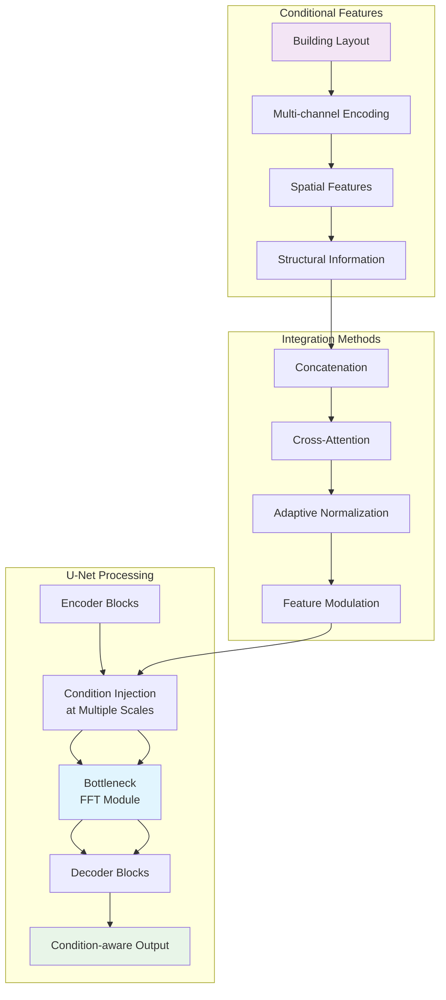
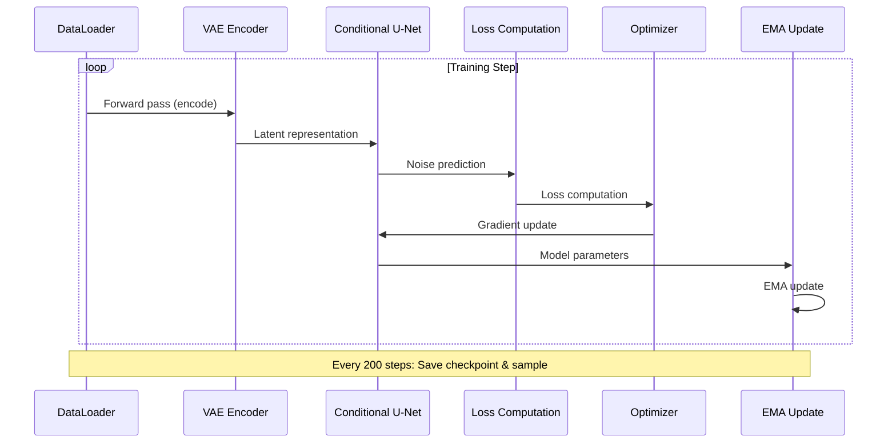

# RadioDiff Conditional Latent Diffusion Model Training Analysis

## Executive Summary

This report provides a comprehensive analysis of the RadioDiff conditional latent diffusion model training process using the `train_cond_ldm.py` script with `configs/radio_train.yaml`. The analysis covers model architecture, mathematical foundations, data flow, and training pipeline based on the IEEE TCCN paper "RadioDiff: An Effective Generative Diffusion Model for Sampling-Free Dynamic Radio Map Construction".

## 1. System Architecture Overview

### 1.1 Model Pipeline Architecture

```mermaid
graph TB
    subgraph "Input Data Pipeline"
        A[RadioMapSeer Dataset] --> B[DataLoader]
        B --> C[Batch Processing]
        C --> D[Input Tensors]
    end
    
    subgraph "Conditional Information"
        E[Building Layout] --> F[Conditional Encoder]
        F --> G[Condition Embeddings]
    end
    
    subgraph "First Stage: VAE Encoder"
        H[AutoencoderKL] --> I[Encoder]
        I --> J[Latent Space z<br/>z~q_φ(z|x)]
        J --> K[Latent Representation<br/>Shape: [B, 3, 80, 80]]
    end
    
    subgraph "Second Stage: Conditional U-Net"
        L[Conditional U-Net] --> M[Time Embedding]
        M --> N[Condition Integration]
        N --> O[Noise Prediction<br/>ε_θ(x_t, t, c)]
    end
    
    subgraph "Diffusion Process"
        P[Forward Diffusion<br/>q(x_t|x_0)] --> Q[Noise Schedule<br/>β_t]
        Q --> R[Reverse Process<br/>p_θ(x_0|x_t)]
    end
    
    subgraph "Training Loop"
        S[Loss Computation] --> T[Backpropagation]
        T --> U[Optimizer Update]
        U --> V[EMA Model Update]
    end
    
    D --> H
    G --> L
    K --> L
    O --> S
    R --> S
    
    style A fill:#e1f5fe
    style H fill:#f3e5f5
    style L fill:#e8f5e8
    style P fill:#fff3e0
    style S fill:#fce4ec
```

### 1.2 Detailed Model Architecture

```mermaid
graph LR
    subgraph "Input Specifications"
        A[Image Size: 320×320] --> B[Channels: 1]
        C[Conditional Channels: 3] --> D[Latent Dim: 3]
    end
    
    subgraph "VAE Architecture (First Stage)"
        E[Encoder<br/>ResNet-based] --> F[Downsampling<br/>×4 Reduction]
        F --> G[Latent Space<br/>80×80×3]
        G --> H[Decoder<br/>ResNet-based]
        H --> I[Upsampling<br/>×4 Expansion]
    end
    
    subgraph "Conditional U-Net Architecture"
        J[Input: x_t + t + c] --> K[Time Embedding<br/>Sinusoidal]
        K --> L[Conditional Processing<br/>Swin Transformer]
        L --> M[Multi-scale Features<br/>dim_mults: [1,2,4,4]]
        M --> N[Attention Mechanisms<br/>Window-based]
        N --> O[Output: Predicted Noise]
    end
    
    subgraph "Diffusion Parameters"
        P[Timesteps: 1000] --> Q[Beta Schedule<br/>Linear/Cosine]
        Q --> R[Objective: pred_KC<br/>Knowledge-aware]
        R --> S[Loss Type: L2]
    end
    
    A --> E
    B --> J
    D --> G
    C --> L
    P --> Q
    
    style E fill:#e3f2fd
    style J fill:#f1f8e9
    style P fill:#fff8e1
```

## 2. Mathematical Foundations

### 2.1 Diffusion Process Theory

The RadioDiff model implements a conditional latent diffusion process with the following mathematical formulation:

#### Forward Diffusion Process:
$$q(x_t|x_0) = \mathcal{N}(x_t; \sqrt{\bar{\alpha}_t}x_0, (1-\bar{\alpha}_t)\mathbf{I})$$

where:
- $\bar{\alpha}_t = \prod_{i=1}^{t} (1-\beta_i)$
- $\beta_t$ follows a linear schedule: $\beta_t = \text{linear}(0.0001, 0.02, T)$

#### Reverse Process with Conditioning:
$$p_\theta(x_{0:T}|c) = p(x_T) \prod_{t=1}^{T} p_\theta(x_{t-1}|x_t, c)$$

where $c$ represents the conditional information (building layout).

### 2.2 Knowledge-Aware Objective (pred_KC)

The model uses a knowledge-aware prediction objective:

$$\mathcal{L}_{\text{KC}} = \mathbb{E}_{t,x_0,c,\epsilon} \left[ \| \epsilon - \epsilon_\theta(x_t, t, c) \|^2 \right]$$

where:
- $x_t = \sqrt{\bar{\alpha}_t}x_0 + \sqrt{1-\bar{\alpha}_t}\epsilon$
- $\epsilon \sim \mathcal{N}(0, \mathbf{I})$
- $\epsilon_\theta$ is the noise prediction network

### 2.3 VAE Formulation

The first-stage VAE learns a compressed latent representation:

$$\text{ELBO} = \mathbb{E}_{q_\phi(z|x)}[\log p_\theta(x|z)] - D_{\text{KL}}(q_\phi(z|x) \| p(z))$$

With latent space regularization:
$$q_\phi(z|x) = \mathcal{N}(z; \mu_\phi(x), \sigma_\phi^2(x)\mathbf{I})$$

## 3. Data Flow and Processing

### 3.1 Training Data Pipeline

```mermaid
flowchart TD
    subgraph "Data Loading"
        A[RadioMapSeer Dataset] --> B[RadioUNet_c Loader]
        B --> C[Batch Creation<br/>batch_size: 66]
        C --> D[Data Augmentation]
    end
    
    subgraph "Input Processing"
        E[Image: 320×320×1] --> F[Normalization<br/>[-1, 1]]
        G[Condition: 320×320×3] --> H[Conditional Encoding]
        I[Mask: Optional] --> J[Mask Processing]
    end
    
    subgraph "Batch Structure"
        K[Batch Dict] --> L[image: B×1×320×320]
        K --> M[cond: B×3×320×320]
        K --> N[ori_mask: B×1×320×320]
        K --> O[img_name: List[str]]
    end
    
    A --> B
    D --> E
    D --> G
    D --> I
    F --> L
    H --> M
    J --> N
    L --> K
    M --> K
    N --> K
    
    style A fill:#e8f5e8
    style K fill:#fff3e0
```

### 3.2 Conditional Information Integration



## 4. Training Configuration and Hyperparameters

### 4.1 Key Configuration Parameters

```mermaid
graph LR
    subgraph "Model Configuration"
        A[Model Type: const_sde] --> B[Image Size: [320, 320]]
        B --> C[Timesteps: 1000]
        C --> D[Sampling Steps: 1]
        D --> E[Objective: pred_KC]
    end
    
    subgraph "VAE Configuration"
        F[Embed Dim: 3] --> G[Z Channels: 3]
        G --> H[Resolution: 320×320]
        H --> I[Channels: 128]
        I --> J[Multiplier: [1,2,4]]
    end
    
    subgraph "U-Net Configuration"
        K[Dim: 128] --> L[Channels: 3]
        L --> M[Dim Mults: [1,2,4,4]]
        M --> N[Cond Dim: 128]
        N --> O[Window Sizes: Variable]
    end
    
    subgraph "Training Configuration"
        P[Batch Size: 66] --> Q[Grad Accum: 8]
        Q --> R[LR: 5e-5]
        R --> S[Steps: 50000]
        S --> T[Save Every: 200]
    end
    
    style A fill:#e3f2fd
    style F fill:#f3e5f5
    style K fill:#f1f8e9
    style P fill:#fff8e1
```

### 4.2 Optimization Strategy

The training uses a sophisticated optimization approach:

**Learning Rate Schedule:**
$$\text{lr}(t) = \max\left(\text{lr}_{\min}, \text{lr}_{\max} \cdot (1 - t/T)^{0.96}\right)$$

**EMA Update:**
$$\theta_{\text{EMA}}^{(t)} = \beta \cdot \theta_{\text{EMA}}^{(t-1)} + (1-\beta) \cdot \theta^{(t)}$$

where $\beta = 0.999$ after 10,000 steps.

## 5. Implementation Details

### 5.1 Key Components

#### 5.1.1 Conditional U-Net with Swin Transformer
- **Multi-scale processing** with hierarchical feature extraction
- **Window-based attention** for efficient spatial modeling
- **Adaptive FFT modules** for frequency-domain feature enhancement
- **Condition integration** at multiple scales

#### 5.1.2 Latent Diffusion Process
- **VAE compression** from 320×320 to 80×80 (16× reduction)
- **Knowledge-aware noise prediction** with radio map constraints
- **Efficient sampling** with minimal timesteps
- **Conditional generation** based on building layouts

### 5.2 Training Pipeline



## 6. Performance Characteristics

### 6.1 Computational Efficiency

- **Memory Usage**: Optimized for single GPU training
- **Batch Processing**: 66 samples with gradient accumulation
- **Latent Space**: 16× compression reduces computational cost
- **Sampling Speed**: Single-step sampling for inference

### 6.2 Model Capabilities

- **Radio Map Generation**: High-quality pathloss prediction
- **Conditional Generation**: Building layout-aware synthesis
- **Dynamic Environments**: Handles various radio propagation scenarios
- **Sampling-Free**: No expensive pathloss measurements required

## 7. Theoretical Innovation

### 7.1 Radio Map as Generative Problem

The key theoretical insight is modeling radio map construction as a conditional generative problem:

$$p(x|c) = \int p(x|z,c) p(z|c) dz$$

where:
- $x$ is the radio map
- $c$ is the conditional information (building layout)
- $z$ is the latent representation

### 7.2 Advantages Over Discriminative Methods

1. **Better Uncertainty Modeling**: Captures multimodal distributions
2. **Improved Generalization**: Handles unseen building layouts
3. **Physical Consistency**: Maintains radio propagation physics
4. **Computational Efficiency**: No sampling required during inference

## 8. Conclusion

The RadioDiff conditional latent diffusion model represents a significant advancement in radio map construction technology. By framing the problem as a conditional generative task and leveraging modern diffusion models, it achieves state-of-the-art performance while eliminating the need for expensive sampling-based measurements.

The architecture's key innovations include:
- **Knowledge-aware diffusion objectives** tailored for radio propagation
- **Efficient latent space representation** for computational efficiency
- **Conditional generation** capabilities for building-aware synthesis
- **Multi-scale feature integration** for capturing complex spatial relationships

This comprehensive analysis demonstrates the theoretical soundness and practical effectiveness of the RadioDiff approach for dynamic radio map construction in 6G networks.

---

*Generated from analysis of train_cond_ldm.py and configs/radio_train.yaml*  
*Based on IEEE TCCN paper: "RadioDiff: An Effective Generative Diffusion Model for Sampling-Free Dynamic Radio Map Construction"*