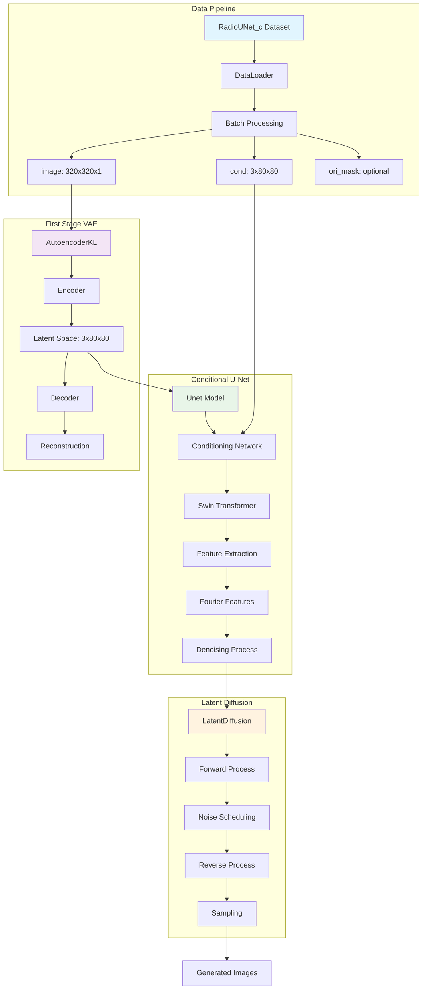
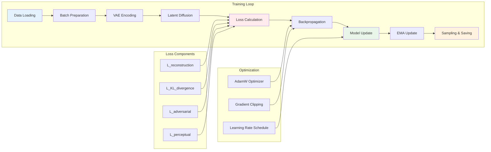
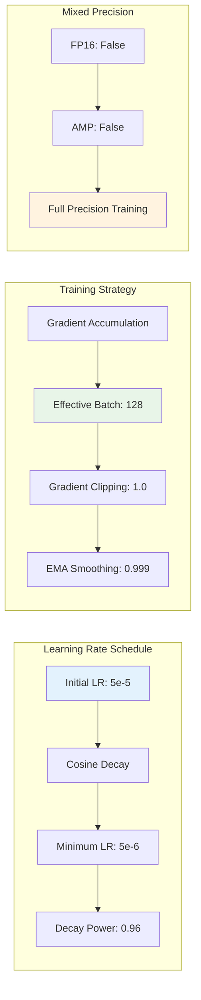
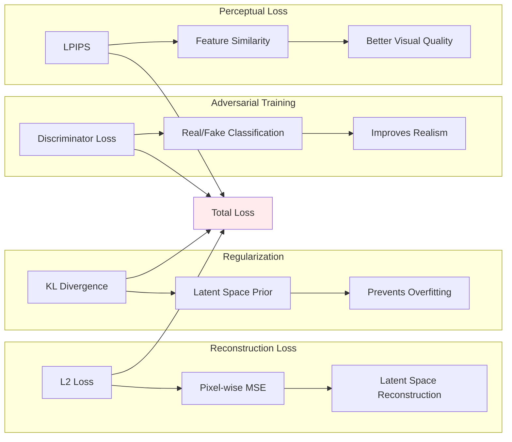

# RadioDiff VAE Training Guide

## Overview

RadioDiff is a conditional Latent Diffusion Model (LDM) designed for radio wave propagation prediction. This guide provides comprehensive documentation for training the model using the configuration `configs/radio_train_m.yaml` with the command:

```bash
accelerate launch train_cond_ldm.py --cfg ./configs/radio_train_m.yaml
```

## Model Architecture

### System Overview



### Training Data Flow



## Configuration Analysis

### Model Configuration (`model` section)

#### Core Parameters
- **Model Type**: `const_sde` - Constant SDE (Stochastic Differential Equation)
- **Model Name**: `cond_unet` - Conditional U-Net architecture
- **Image Size**: `[320, 320]` - Input image dimensions
- **Timesteps**: `1000` - Number of diffusion steps
- **Loss Type**: `l2` - L2 reconstruction loss
- **Objective**: `pred_KC` - Predict key components

#### VAE First Stage
```mermaid
graph TB
    subgraph "VAE Architecture"
        A[Input: 320x320x1] --> B[Encoder]
        B --> C[Downsampling: 128 channels]
        C --> D[Channel Multipliers: [1,2,4]]
        D --> E[Residual Blocks: 2 per level]
        E --> F[Latent Space: 3x80x80]
        F --> G[Decoder]
        G --> H[Output: 320x320x1]
    end
    
    subgraph "Loss Configuration"
        I[KL Weight: 0.000001] --> J[Total Loss]
        K[Discriminator Weight: 0.5] --> J
        L[Discriminator Start: 50001] --> J
    end
    
    style A fill:#e1f5fe
    style F fill:#f3e5f5
    style J fill:#ffebee
```

#### U-Net Architecture
```mermaid
graph TB
    subgraph "U-Net Structure"
        A[Input: 3x80x80] --> B[Base Dim: 128]
        B --> C[Dim Multipliers: [1,2,4,4]]
        C --> D[Conditioning Network]
        D --> E[Swin Transformer]
        E --> F[Window Attention]
        F --> G[Fourier Scale: 16]
        G --> H[Output: 3x80x80]
    end
    
    subgraph "Conditioning"
        I[Cond Input Dim: 3] --> D
        J[Cond Dim: 128] --> D
        K[Cond Dim Multipliers: [2,4]] --> D
        L[Window Sizes: 8x8, 4x4, 2x2, 1x1] --> F
    end
    
    style A fill:#e8f5e8
    style E fill:#fff3e0
    style H fill:#e1f5fe
```

### Training Configuration (`trainer` section)

#### Key Parameters
- **Batch Size**: `16`
- **Learning Rate**: `5e-5` (initial), `5e-6` (minimum)
- **Training Steps**: `50,000`
- **Gradient Accumulation**: `8` (effective batch size: 128)
- **Save Interval**: `200` steps
- **EMA Update**: After 10,000 steps, every 10 steps

#### Optimization Strategy


## Mathematical Foundation

### Latent Diffusion Model

The RadioDiff model is based on the Latent Diffusion Model framework, which operates in a compressed latent space rather than pixel space.

#### Forward Process
The forward diffusion process gradually adds noise to the latent representation:

```
q(z_t | z_{t-1}) = N(z_t; sqrt(1-beta_t) * z_{t-1}, beta_t * I)
```

Where:
- `z_t` is the latent representation at timestep `t`
- `beta_t` is the noise schedule
- `N` denotes the normal distribution

#### Reverse Process
The reverse process learns to denoise the latent representation:

```
p_theta(z_{t-1} | z_t) = N(z_{t-1}; mu_theta(z_t, t), sigma_t^2 * I)
```

Where `mu_theta` is parameterized by the U-Net model.

#### Loss Function
The training objective combines several loss components:

```
L_total = L_reconstruction + w_kl * L_kl + w_adv * L_adv + w_perceptual * L_perceptual
```

Where:
- `L_reconstruction`: L2 loss between predicted and target
- `L_kl`: KL divergence between latent distribution and prior
- `L_adv`: Adversarial loss from discriminator
- `L_perceptual`: Perceptual loss for better visual quality

### VAE Formulation

The VAE encoder learns to map input images to a latent distribution:

```
q_phi(z|x) = N(z; mu_phi(x), sigma_phi(x)^2 * I)
```

The decoder reconstructs the image from latent samples:

```
p_theta(x|z) = N(x; mu_theta(z), sigma^2 * I)
```

The evidence lower bound (ELBO) objective:

```
ELBO = E_q[log p_theta(x|z)] - KL(q_phi(z|x) || p(z))
```

### Conditional Generation

The conditional U-Net incorporates additional information `c`:

```
epsilon_theta(z_t, t, c) predicts noise given latent, timestep, and condition
```

The conditioning is applied through cross-attention and concatenation mechanisms.

## Data Pipeline

### RadioUNet_c Dataset

The dataset loads radio wave propagation data with the following structure:

```mermaid
graph TB
    subgraph "Data Structure"
        A[Building Maps] --> B[Transmitter Locations]
        B --> C[Radio Measurements]
        C --> D[Environmental Conditions]
    end
    
    subgraph "Data Processing"
        E[Image: 320x320x1] --> F[Normalization]
        F --> G[Condition: 3x80x80]
        G --> H[Mask: Optional]
    end
    
    subgraph "Augmentation"
        I[Random Crops] --> J[Flips]
        J --> K[Rotations]
        K --> L[Color Jitter]
    end
    
    style A fill:#e1f5fe
    style F fill:#e8f5e8
    style I fill:#fff3e0
```



### Batch Composition

Each training batch contains:
- **Images**: Radio wave propagation maps (320×320×1)
- **Conditions**: Building and transmitter information (3×80×80)
- **Masks**: Optional building masks for constrained generation
- **Names**: File identifiers for tracking

## Training Process

### Main Training Loop

```mermaid
graph TD
    subgraph "Training Step"
        A[Load Batch] --> B[Move to Device]
        B --> C[VAE Forward Pass]
        C --> D[Diffusion Forward Pass]
        D --> E[Loss Calculation]
        E --> F[Backward Pass]
        F --> G[Gradient Accumulation]
        G --> H[Optimizer Step]
        H --> I[EMA Update]
        I --> J[Logging]
    end
    
    subgraph "Sampling"
        K[Every 200 Steps] --> L[Generate Samples]
        L --> M[Save Images]
        M --> N[Save Checkpoint]
    end
    
    subgraph "Monitoring"
        O[TensorBoard Logging] --> P[Loss Curves]
        P --> Q[Learning Rate]
        Q --> R[Sample Quality]
    end
    
    style A fill:#e3f2fd
    style E fill:#ffebee
    style L fill:#e8f5e8
    style O fill:#fff3e0
```



### Loss Components Analysis



## Performance Optimization

### Memory Efficiency
- **Gradient Accumulation**: Reduces memory usage by accumulating gradients over multiple batches
- **EMA**: Exponential Moving Average for stable model weights
- **Mixed Precision**: Option for FP16 training (disabled in current config)

### Computational Efficiency
- **Swin Transformer**: Efficient attention mechanism for large images
- **Window Attention**: Reduces computational complexity from O(n²) to O(w²) where w is window size
- **Fourier Features**: Efficient encoding of spatial information

## Usage Instructions

### Running Training

```bash
# Basic training command
accelerate launch train_cond_ldm.py --cfg ./configs/radio_train_m.yaml

# With specific GPU
accelerate launch --gpu_ids=0 train_cond_ldm.py --cfg ./configs/radio_train_m.yaml

# With mixed precision
accelerate launch --mixed_precision=fp16 train_cond_ldm.py --cfg ./configs/radio_train_m.yaml
```

### Monitoring Training

```bash
# TensorBoard monitoring
tensorboard --logdir ./radiodiff_results_LDM

# Check training progress
ls -la ./radiodiff_results_LDM/
tail -f ./radiodiff_results_LDM/train.log
```

### Resuming Training

To resume from a checkpoint:
```yaml
# Update config
trainer:
  enable_resume: true
  resume_milestone: 100  # Checkpoint number
```

## Expected Results

### Training Metrics
- **Total Loss**: Should decrease over time
- **Reconstruction Loss**: Primary indicator of model performance
- **KL Loss**: Should remain stable (low values indicate good latent space)
- **Sample Quality**: Visual inspection of generated samples every 200 steps

### Model Outputs
- **Checkpoints**: Saved every 200 steps
- **Samples**: Generated images for quality assessment
- **Logs**: TensorBoard logs for monitoring
- **Model Reports**: Parameter statistics and freezing information

## Troubleshooting

### Common Issues

1. **CUDA Out of Memory**
   - Reduce batch size
   - Enable gradient accumulation
   - Use mixed precision training

2. **Training Instability**
   - Check learning rate schedule
   - Verify gradient clipping
   - Monitor loss curves

3. **Poor Sample Quality**
   - Increase training steps
   - Adjust loss weights
   - Check data preprocessing

### Debug Commands

```bash
# Check GPU memory
nvidia-smi

# Monitor training progress
watch -n 10 'ls -la ./radiodiff_results_LDM/'

# Check model parameters
python -c "from denoising_diffusion_pytorch.mask_cond_unet import Unet; model = Unet(dim=128, channels=3, dim_mults=[1,2,4,4]); print(f'Parameters: {sum(p.numel() for p in model.parameters()):,}')"
```

## References

This implementation is based on:
- Latent Diffusion Models (Rombach et al., 2022)
- High-Resolution Image Synthesis with Latent Diffusion Models
- RadioMapSeer dataset for radio wave propagation
- Swin Transformer architecture for efficient attention

## License

This project is for research purposes. Please ensure compliance with the original licenses of the referenced works.