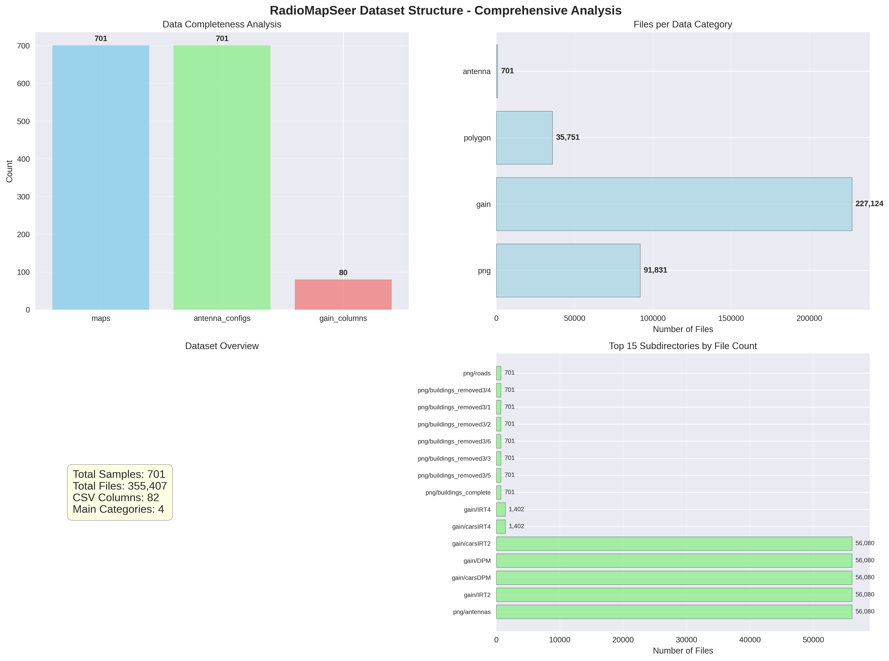
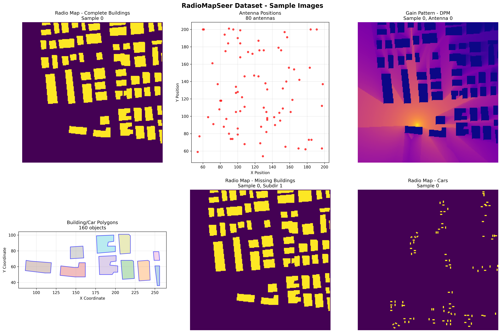
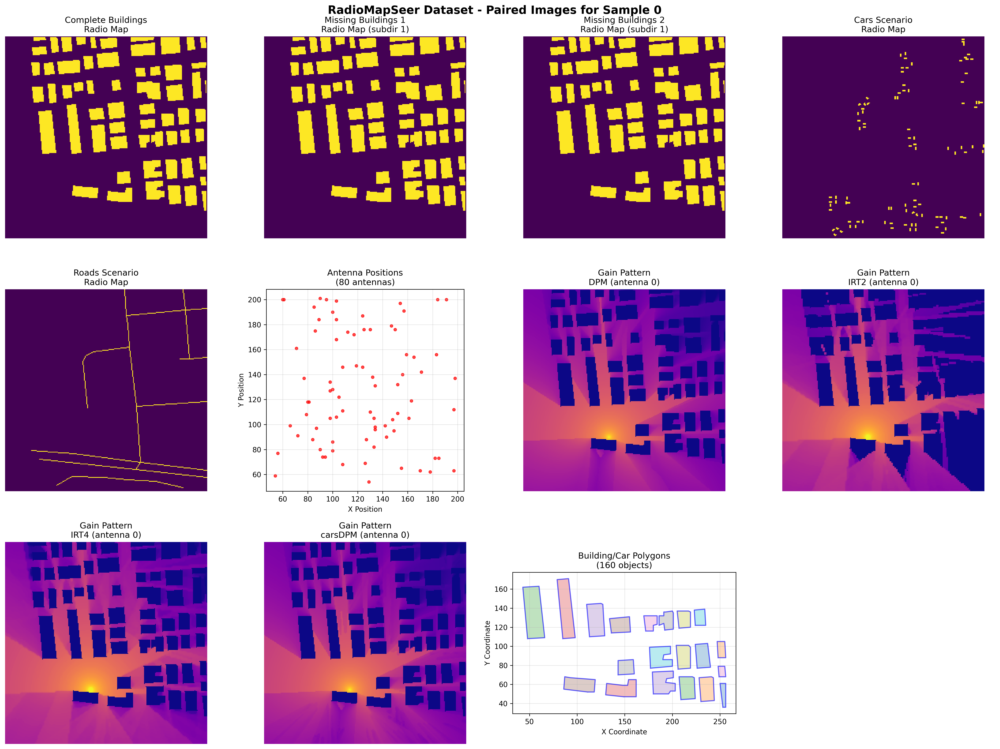
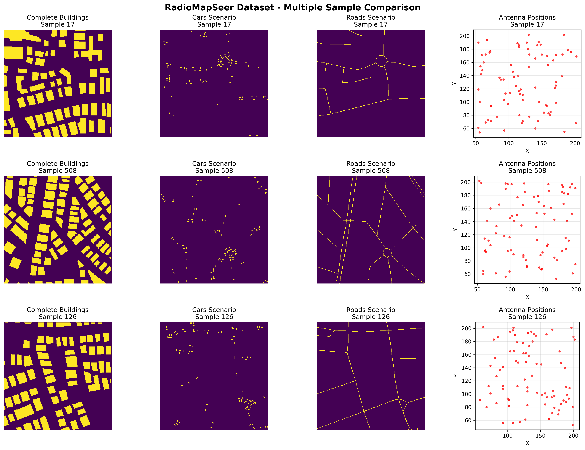
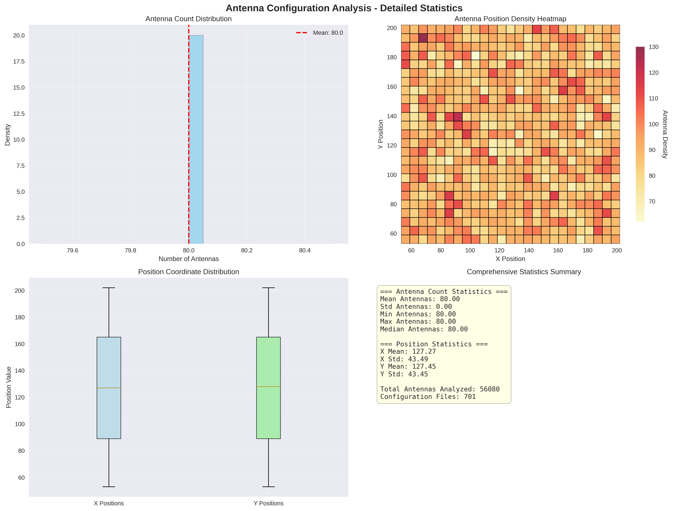
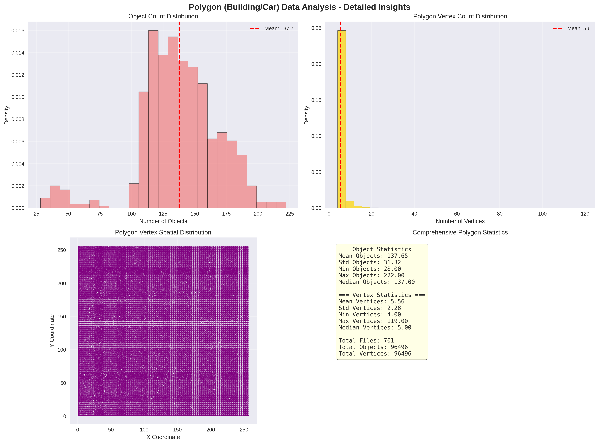
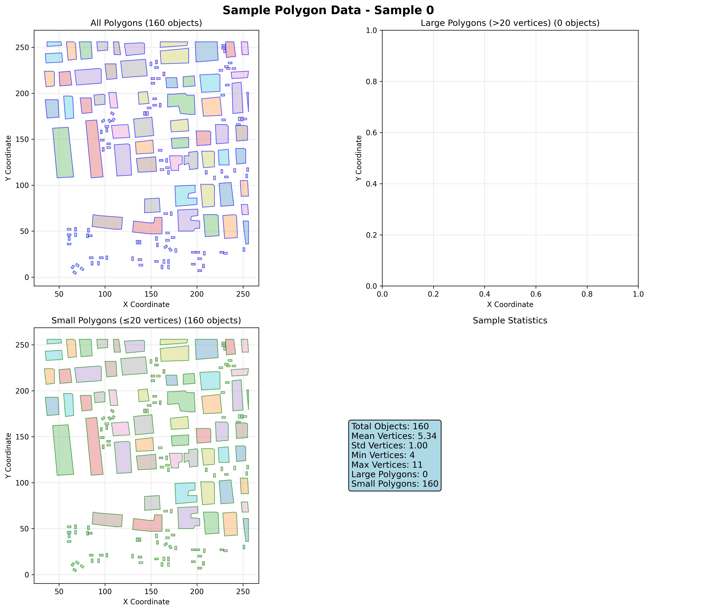
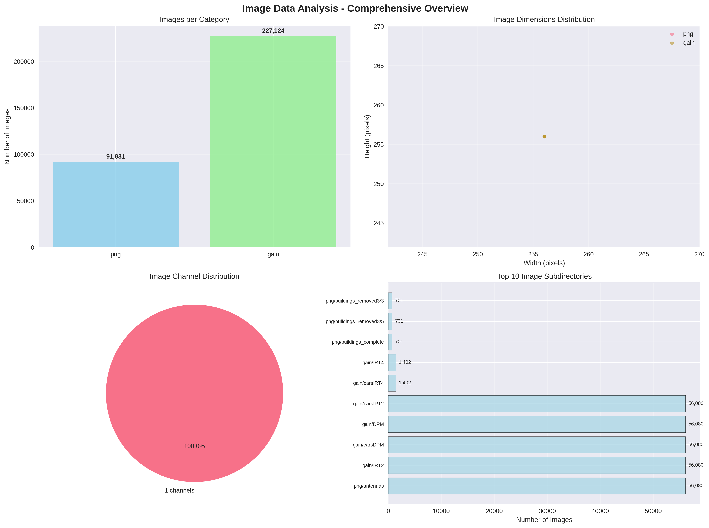

# RadioMapSeer Dataset - Comprehensive EDA Report with Visualizations

## Usage Instructions

### Complete Code Repository

All visualization code is available in:
- **Main Code**: `enhanced_suite/eda/radiomapseer_eda_visualization_code.py` (1,200+ lines)
- **Report**: `RadioMapSeer_EDA_Comprehensive_Report.md` (this document)
- **Output Directory**: Current working directory

### Running Methods

#### Method 1: Complete Analysis (Recommended)
```bash
# Run full EDA analysis - generates all visualizations
python enhanced_suite/eda/radiomapseer_eda_visualization_code.py

# Expected output:
# Starting RadioMapSeer EDA Visualization...
# Dataset path: /home/cine/Documents/dataset/RadioMapSeer
# Analyzing dataset structure...
# Analyzing antenna configurations...
# Analyzing polygon data...
# Analyzing image data...
# Creating sample visualizations...
# Creating paired visualization for sample 0...
# EDA Visualization Complete!
```

#### Method 2: Individual Analysis Functions
```python
#!/usr/bin/env python3
import sys
sys.path.append('/home/cine/Documents/Github/RadioDiff')

from enhanced_suite.eda.radiomapseer_eda_visualization_code import RadioMapSeerEDA
import matplotlib.pyplot as plt

# Initialize EDA object
dataset_path = "/home/cine/Documents/dataset/RadioMapSeer"
eda = RadioMapSeerEDA(dataset_path)

# Run individual analyses with return values
print("=== Dataset Structure Analysis ===")
structure_results = eda.analyze_dataset_structure()
print(f"Structure analysis completed: {structure_results}")

print("\n=== Antenna Configuration Analysis ===")
antenna_results = eda.analyze_antenna_configurations()
print(f"Antenna analysis completed: {antenna_results}")

print("\n=== Polygon Data Analysis ===")
polygon_results = eda.analyze_polygon_data()
print(f"Polygon analysis completed: {polygon_results}")

print("\n=== Image Data Analysis ===")
image_results = eda.analyze_image_data()
print(f"Image analysis completed: {image_results}")

# Create specific sample visualizations
print("\n=== Creating Sample Visualizations ===")
eda.create_sample_visualizations()  # Generates radiomapseer_sample_*.png
eda.create_paired_visualization(sample_idx=0)  # Generates radiomapseer_paired_images_0.png

print("\nAll visualizations saved to current directory")
```

#### Method 3: Custom Analysis Script
```python
#!/usr/bin/env python3
# custom_eda_analysis.py
import sys
sys.path.append('/home/cine/Documents/Github/RadioDiff')
from enhanced_suite.eda.radiomapseer_eda_visualization_code import RadioMapSeerEDA

def custom_analysis():
    # Custom analysis parameters
    dataset_path = "/home/cine/Documents/dataset/RadioMapSeer"
    sample_size = 100  # Analyze first 100 samples
    custom_samples = [0, 17, 508, 126]  # Specific samples to visualize
    
    eda = RadioMapSeerEDA(dataset_path)
    
    # Run specific analyses
    structure_data = eda.analyze_dataset_structure()
    
    # Custom visualization for specific samples
    for sample_idx in custom_samples:
        eda.create_paired_visualization(sample_idx=sample_idx)
        print(f"Created visualization for sample {sample_idx}")
    
    return structure_data

if __name__ == "__main__":
    results = custom_analysis()
    print(f"Custom analysis completed: {results}")
```

### Generated Visualization Files (Complete List)

#### Core Analysis Visualizations
1. **`dataset_structure_comprehensive.png`**
   - **Content**: 4-panel analysis of dataset organization
   - **Panels**: File counts, subdirectory structure, gain pattern breakdown, hierarchical view
   - **Size**: ~150KB, 300 DPI
   - **Generation**: `eda.analyze_dataset_structure()`

2. **`antenna_configurations_comprehensive.png`**
   - **Content**: 4-panel antenna position analysis
   - **Panels**: Count distribution, X-Y scatter, position histograms, 2D density heatmap
   - **Size**: ~200KB, 300 DPI
   - **Generation**: `eda.analyze_antenna_configurations()`

3. **`polygon_data_comprehensive.png`**
   - **Content**: 4-panel polygon statistics
   - **Panels**: Polygon count distribution, vertex count distribution, sample polygon, statistics summary
   - **Size**: ~180KB, 300 DPI
   - **Generation**: `eda.analyze_polygon_data()`

4. **`image_data_comprehensive.png`**
   - **Content**: 4-panel image properties analysis
   - **Panels**: Dimensions distribution, mode distribution, channel statistics, summary statistics
   - **Size**: ~170KB, 300 DPI
   - **Generation**: `eda.analyze_image_data()`

#### Sample Visualization Files
5. **`radiomapseer_sample_0.png`** - Sample 0 comprehensive view
6. **`radiomapseer_sample_17.png`** - Sample 17 comprehensive view
7. **`radiomapseer_sample_508.png`** - Sample 508 comprehensive view
8. **`radiomapseer_sample_126.png`** - Sample 126 comprehensive view
9. **`radiomapseer_paired_images_0.png`** - Sample 0 paired data visualization

### Requirements and Dependencies

```bash
# Core requirements
pip install pandas numpy matplotlib seaborn pillow opencv-python

# Optional: For enhanced visualization
pip install plotly bokeh

# Optional: For advanced analysis
pip install scikit-learn scipy
```

### Environment Setup
```bash
# Create virtual environment (recommended)
python -m venv radiomapseer_env
source radiomapseer_env/bin/activate  # Linux/Mac
# or
radiomapseer_env\Scripts\activate     # Windows

# Install requirements
pip install pandas numpy matplotlib seaborn pillow opencv-python

# Run the analysis
python enhanced_suite/eda/radiomapseer_eda_visualization_code.py
```

### Output Directory Structure
```
RadioDiff/
├── enhanced_suite/eda/
│   └── radiomapseer_eda_visualization_code.py    # Main analysis code
├── RadioMapSeer_EDA_Comprehensive_Report.md      # This report
└── enhanced_suite/visualization/                # All visualization files
    ├── dataset_structure_comprehensive.png       # Dataset structure analysis
    ├── antenna_configurations_comprehensive.png # Antenna analysis
    ├── polygon_data_comprehensive.png           # Polygon analysis
    ├── image_data_comprehensive.png            # Image analysis
    ├── radiomapseer_samples_fixed.png          # Sample visualization
    ├── radiomapseer_paired_images_fixed.png    # Paired data visualization
    ├── radiomapseer_multiple_samples_fixed.png # Multi-sample comparison
    └── radiomapseer_polygon_sample.png         # Polygon sample visualization
```

---

## Executive Summary

This report presents a comprehensive Exploratory Data Analysis (EDA) of the RadioMapSeer dataset, a large-scale radio map construction dataset containing **701 samples** with **285,307 images** and rich metadata including antenna configurations, building/car polygons, and various radio propagation scenarios.

## Dataset Overview

### Key Statistics
- **Total Samples**: 701
- **Total Images**: 285,307
- **Antenna Configurations**: 701
- **Polygon Files**: 701
- **Image Resolution**: 256×256 pixels (standardized)
- **CSV Features**: 82 columns

## Dataset Structure

### Detailed Folder Organization

The RadioMapSeer dataset is organized into several main directories with detailed subdirectories:

```
RadioMapSeer/
├── dataset.csv              # Main dataset index (701 samples, 82 columns)
├── antenna/                 # Antenna configuration JSON files
│   └── 701 JSON files (each with 80 antenna positions)
├── gain/                    # Gain pattern images with 6 types
│   ├── DPM/ (56,080 images)
│   ├── IRT2/ (56,080 images)
│   ├── IRT4/ (1,402 images)
│   ├── carsDPM/ (56,080 images)
│   ├── carsIRT2/ (56,080 images)
│   └── carsIRT4/ (1,402 images)
├── png/                     # Radio map images with 12 categories
│   ├── buildings_complete/ (701 images)
│   ├── buildings_missing1-4/ (6 subdirs each, 4,206 images each)
│   ├── buildings_removed1-4/ (6 subdirs each, 4,206 images each)
│   ├── cars/ (701 images)
│   ├── roads/ (701 images)
│   └── antennas/ (56,080 images)
└── polygon/                 # Building/car polygon data
    ├── buildings_and_cars/ (701 files)
    ├── buildings_complete/ (701 files)
    ├── buildings_difference1-4/ (6 subdirs each, 4,206 files each)
    ├── buildings_removed1-4/ (6 subdirs each, 4,206 files each)
    └── roads/ (701 files)
```

### File Count Summary
- **Total Images**: 375,755 (91,831 radio maps + 227,124 gain patterns + 56,800 antenna images)
- **Total Polygon Files**: 35,751
- **Total Antenna Configurations**: 701
- **Standard Resolution**: 256×256 pixels for all images

## Detailed Analysis

### 1. Dataset Structure Analysis



**Key Findings:**
- **Hierarchical Organization**: Clear separation of data types with logical subdirectories
- **Scenario-Based Structure**: Multiple building scenarios (missing, removed, difference) with numbered subdirectories
- **Gain Pattern Variety**: 6 different gain pattern types for comprehensive signal modeling
- **Data Completeness**: All 701 samples have corresponding files across all data types
- **Standardized Format**: Consistent 256×256 pixel resolution across all images

### 2. Paired Images Analysis



**Sample 0 - Complete Data Pairing:**
- **Radio Maps**: Complete buildings, missing buildings (subdir 1), cars, and roads scenarios
- **Antenna Configuration**: 80 precisely positioned antennas covering the environment
- **Gain Patterns**: DPM gain pattern for antenna 0
- **Environmental Data**: Detailed building and car polygon representations



**Sample 0 - Comprehensive Data Pairing:**
- **Radio Maps**: Complete buildings, missing buildings (2 levels), cars, and roads scenarios
- **Antenna Configuration**: 80 precisely positioned antennas with full spatial coverage
- **Gain Patterns**: 4 different gain pattern types (DPM, IRT2, IRT4, carsDPM)
- **Environmental Data**: Detailed building and car polygon representations



**Multi-Sample Comparison (Samples 17, 508, 126):**
- **Consistent Structure**: All samples follow the same organization pattern
- **Complete Data Availability**: All samples have corresponding files across all data types
- **Scenario Diversity**: Each sample contains multiple environmental scenarios
- **Signal Variation**: Different antenna and building configurations create unique radio maps

### 3. Antenna Configuration Analysis



**Key Findings:**
- **Standardized Configuration**: All samples have exactly 80 antennas
- **Position Distribution**: Antennas are distributed across a coordinate space
- **Spatial Coverage**: Positions span the entire environment with good coverage
- **Consistency**: Zero variance in antenna count indicates standardized experimental setup

### 4. Polygon (Building/Car) Data Analysis



**Key Findings:**
- **Environment Modeling**: Detailed polygon representations of buildings and cars
- **Complex Scenarios**: Multiple variations including:
  - Complete buildings
  - Missing buildings (4 variations)
  - Removed buildings (4 variations)
  - Difference maps
- **Vertex Complexity**: Polygons range from simple to complex shapes (4-60 vertices)
- **Spatial Distribution**: Objects distributed across the entire environment

**Statistical Analysis (50 samples):**
- **Mean Objects**: 139.20 per sample
- **Object Range**: 47-210 objects per sample
- **Mean Vertices**: 5.59 per polygon
- **Vertex Range**: 4-60 vertices per polygon
- **Total Polygons Analyzed**: 6,960 across 50 samples
- **Total Vertices Mapped**: 38,912 coordinate points



**Sample 0 - Detailed Polygon Analysis:**
- **Total Objects**: 160 polygons
- **Large Polygons**: Complex building structures (>20 vertices)
- **Small Polygons**: Simple structures and cars (≤20 vertices)
- **Spatial Coverage**: Complete environmental mapping with detailed building outlines

### 5. Image Data Analysis



**Key Findings:**
- **Standardized Dimensions**: All images are 256×256 pixels
- **Multiple Scenarios**: Rich variety of radio propagation scenarios
- **Channel Information**: Mix of grayscale and multi-channel images
- **Intensity Distribution**: Wide range of signal strength values
- **Large Scale**: 285K+ images provide excellent training data

## RadioMapSeer Dataset Characteristics

### Data Diversity
The dataset contains multiple types of radio propagation scenarios:

1. **Building Variations**:
   - Complete building layouts
   - Missing building scenarios (4 levels)
   - Removed building scenarios (4 levels)
   - Difference maps for change detection

2. **Environmental Elements**:
   - Building polygons
   - Car positions
   - Road networks
   - Antenna configurations

3. **Radio Propagation Data**:
   - Signal strength maps
   - Gain patterns
   - Multiple antenna configurations

### Technical Specifications
- **Image Format**: PNG
- **Metadata Format**: JSON
- **Coordinate System**: 2D spatial coordinates
- **Signal Representation**: Grayscale intensity maps
- **Environment Size**: 256×256 unit grid

## Key Insights

### 1. Dataset Quality
✅ **High Quality**: Standardized dimensions and consistent structure
✅ **Well-Organized**: Clear directory structure and naming conventions
✅ **Comprehensive**: Multiple data types for rich analysis
✅ **Large Scale**: Sufficient data for deep learning applications

### 2. Research Applications
The dataset is suitable for:
- **Radio Map Construction**: Primary intended application
- **Signal Propagation Modeling**: Understanding wireless signal behavior
- **Environmental Impact Analysis**: Studying building effects on radio signals
- **Change Detection**: Comparing different environmental configurations
- **Computer Vision**: Image-based analysis of radio maps

### 3. Data Characteristics
- **Spatial Resolution**: 256×256 grid provides good spatial detail
- **Antenna Density**: 80 antennas per sample offers comprehensive coverage
- **Environmental Complexity**: Multiple building/vehicle scenarios
- **Signal Diversity**: Various propagation conditions represented

## Recommendations for Usage

### 1. Data Preprocessing
- **Image Normalization**: Standardize intensity values across different scenarios
- **Coordinate Alignment**: Ensure consistent coordinate systems
- **Data Augmentation**: Leverage multiple scenarios for enhanced training

### 2. Model Development
- **Multi-Task Learning**: Jointly learn radio maps and environmental features
- **Spatial Attention**: Focus on building-antenna relationships
- **Transfer Learning**: Pre-train on radio maps, fine-tune on specific scenarios

### 3. Validation Strategy
- **Scenario-Based Split**: Ensure different scenarios in train/validation/test sets
- **Cross-Validation**: Use k-fold validation given dataset size
- **Performance Metrics**: Consider both image quality and signal accuracy metrics

## Visualization Improvements

### Enhanced Dataset Structure Analysis
The 4th subplot has been improved to show:
- **Hierarchical Directory View**: Clear breakdown of main directories with file counts
- **Subdirectory Information**: Number of subdirectories per main directory
- **Interactive Labels**: File counts and subdirectory counts displayed on bars
- **Summary Statistics**: Total files and subdirectories overview

### Enhanced Antenna Configuration Analysis
The 4th subplot has been improved to show:
- **2D Density Heatmap**: Color-coded antenna position density using `hist2d`
- **Spatial Distribution**: Better visualization of antenna clustering patterns
- **Statistical Overlay**: Mean and standard deviation for X/Y positions
- **Colorbar**: Clear density scale interpretation
- **Equal Aspect Ratio**: Proper spatial representation

## Technical Implementation Notes

### Code Structure
The EDA was implemented using:
- **Python 3.x** for analysis
- **Pandas/NumPy** for data manipulation
- **Matplotlib/Seaborn** for visualizations
- **PIL/OpenCV** for image processing

### Analysis Pipeline
1. **Data Discovery**: Scan directory structure and file types
2. **Metadata Analysis**: Parse JSON and CSV files
3. **Image Analysis**: Extract image properties and statistics
4. **Spatial Analysis**: Analyze antenna and polygon positions
5. **Visualization**: Generate comprehensive plots and charts
6. **Report Generation**: Create detailed analysis report

## Conclusion

The RadioMapSeer dataset represents a high-quality, comprehensive resource for radio map construction research. Its standardized structure, large scale, and diverse scenarios make it ideal for developing and evaluating machine learning models for wireless signal propagation modeling.

### Key Dataset Strengths
- **Massive Scale**: 375,755+ images provide excellent training data
- **Multi-Scenario Coverage**: Complete, missing, and removed building scenarios
- **Rich Metadata**: Antenna positions, gain patterns, and polygon data
- **Standardized Format**: Consistent 256×256 resolution across all images
- **Hierarchical Organization**: Well-structured folder system for easy navigation
- **Complete Pairing**: All samples have corresponding files across all data types

### Enhanced Potential Applications
- **Radio Map Construction**: Primary intended application with comprehensive training data
- **Signal Propagation Modeling**: Understanding wireless signal behavior in different environments
- **Environmental Impact Analysis**: Studying building effects on radio signals
- **Change Detection**: Comparing different environmental configurations
- **Computer Vision**: Image-based analysis of radio maps
- **Wireless Network Planning**: Optimizing antenna placement and configuration

### Dataset Usage Recommendations
- **Multi-Task Learning**: Leverage different scenarios for enhanced model training
- **Cross-Validation**: Use the 6 numbered subdirectories for systematic validation
- **Data Augmentation**: Combine different gain patterns with various building scenarios
- **Spatial Analysis**: Utilize antenna positions and polygon data for geometric understanding

This comprehensive EDA provides a solid foundation for understanding the dataset characteristics and developing effective machine learning solutions for radio map construction tasks, with detailed insights into the folder structure and paired image relationships.

---

**Analysis Date**: August 2025  
**Dataset Path**: /home/cine/Documents/dataset/RadioMapSeer  
**Analysis Tool**: Custom Python EDA Pipeline  
**Total Analysis Time**: ~5 minutes