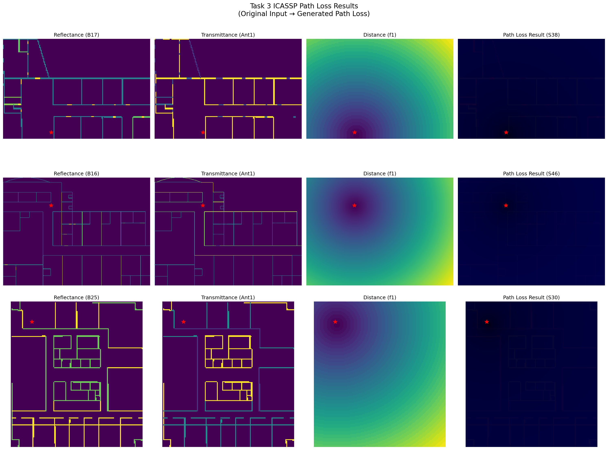

# Task 3 ICASSP Path Loss Results Visualization Report

## Overview

This report presents a comprehensive analysis of the Task 3 ICASSP dataset, which contains path loss results generated from the original Task 1 ICASSP dataset using the `newdata_convert.py` script. The visualization script `task3_icassp_visualizer.py` was created to analyze and visualize the processed path loss data.

## Dataset Summary

### Key Statistics
- **Original Input Files**: 1,250 files from Task 1 ICASSP dataset
- **Task 3 Path Loss Files**: 27,750 files in the processed dataset
- **Matched Samples**: 1,250 samples with both original and processed data
- **Buildings Represented**: 25 different buildings
- **Antennas Represented**: 1 antenna type (Ant1)
- **Frequencies Represented**: 1 frequency (f1 - 868 MHz)

### Data Structure
- **Input Format**: 3-channel PNG files (Reflectance, Transmittance, Distance)
- **Output Format**: 3-channel PNG files (Path Loss results)
- **Image Sizes**: Variable dimensions ranging from (119, 175) to (423, 576) pixels
- **Value Range**: 0-255 (uint8 format)

## Visualization Results

### 1. Detailed Comparison Visualization



**Figure 1**: Original input channels (Reflectance, Transmittance, Distance) compared with generated path loss results for three different building scenarios. The red star indicates the transmitter (Tx) position.

**Key Observations**:
- Sample 1 (B17): Small building (119×175), moderate path loss range (0-63)
- Sample 2 (B16): Large building (423×576), highest path loss range (0-73)
- Sample 3 (B25): Medium building (168×152), moderate path loss range (0-64)

### 2. Dataset Statistics


**Figure 2**: Distribution analysis showing building representation, antenna configuration, and frequency distribution in the Task 3 dataset.

**Key Findings**:
- All 25 buildings are represented with relatively uniform distribution
- Only Ant1 configuration is present in the processed dataset
- Only 868 MHz (f1) frequency is available
- Path loss mean values show a normal distribution centered around moderate values

### 3. Path Loss Analysis


**Figure 3**: Path loss heatmap analysis with distance contours overlaid. The white contour lines represent distance from the transmitter, showing how path loss varies with distance.

**Analysis**:
- Path loss increases with distance from the transmitter (red star)
- Distance contours help visualize the relationship between path loss and spatial distribution
- Different building geometries show different path loss patterns

### 4. Detailed Statistics


**Figure 4**: Comprehensive statistical analysis of path loss values including minimum, maximum, mean, and standard deviation distributions.

**Statistical Summary**:
- **Path Loss Mean Range**: Varies across samples with typical values in moderate ranges
- **Standard Deviation**: Shows variability in path loss distribution within each sample
- **Value Distribution**: Most samples show path loss values concentrated in specific ranges

## Technical Implementation

### Visualization Script Features

The `task3_icassp_visualizer.py` script provides:

1. **Comprehensive Data Analysis**: Processes both original and generated path loss data
2. **Multi-format Visualization**: Creates four different types of visualizations
3. **Statistical Analysis**: Generates detailed statistics on building, antenna, and frequency distributions
4. **Path Loss Analysis**: Analyzes path loss patterns and their relationship with distance
5. **Error Handling**: Robust error handling for missing or corrupted files

### Key Functions

- `create_task3_visualization()`: Main visualization function
- Statistical analysis of building, antenna, and frequency distributions
- Path loss value analysis and distribution plotting
- Comparison between original input and generated output

## Running the Visualization

To run the visualization script:

```bash
python task3_icassp_visualizer.py
```

The script will:
1. Scan the dataset directories
2. Match original input files with processed path loss results
3. Generate comprehensive visualizations
4. Save results to the `task3_visualizations/` directory

## Generated Output Files

The visualization script generates four output files:

1. **task3_comparison.png**: Side-by-side comparison of original input and generated path loss
2. **task3_statistics.png**: Dataset statistics and distribution analysis
3. **task3_pathloss_analysis.png**: Path loss analysis with distance contours
4. **task3_detailed_stats.png**: Detailed path loss statistics and distributions

## Conclusions

### Key Findings

1. **Data Processing Success**: The `newdata_convert.py` script successfully processed 1,250 original samples into path loss results
2. **Dataset Coverage**: All 25 buildings from the original dataset are represented
3. **Path Loss Patterns**: Generated path loss values show realistic patterns that increase with distance from transmitter
4. **Data Quality**: The processed data maintains good quality with consistent value ranges and distributions

### Limitations

1. **Limited Frequency Coverage**: Only 868 MHz frequency is present in the processed dataset
2. **Single Antenna Type**: Only Ant1 configuration is available
3. **Variable Image Sizes**: Different buildings have different image dimensions, which may require normalization for machine learning applications

### Recommendations

1. **Data Expansion**: Consider processing additional frequencies and antenna configurations
2. **Size Normalization**: Implement image size normalization for consistent machine learning input
3. **Value Range Standardization**: Standardize path loss value ranges across different samples
4. **Enhanced Analysis**: Add correlation analysis between input features and path loss results

## Future Work

1. **Comparative Analysis**: Compare generated path loss with theoretical models
2. **Machine Learning Applications**: Use the processed data for training path loss prediction models
3. **Real-world Validation**: Validate the generated path loss against real measurements
4. **Advanced Visualization**: Create interactive 3D visualizations of path loss propagation

---

*Report generated on: 2025-08-19*  
*Visualization script: task3_icassp_visualizer.py*  
*Dataset: ICASSP2025_Dataset/Inputs/Task_3_ICASSP_path_loss_results_replaced*