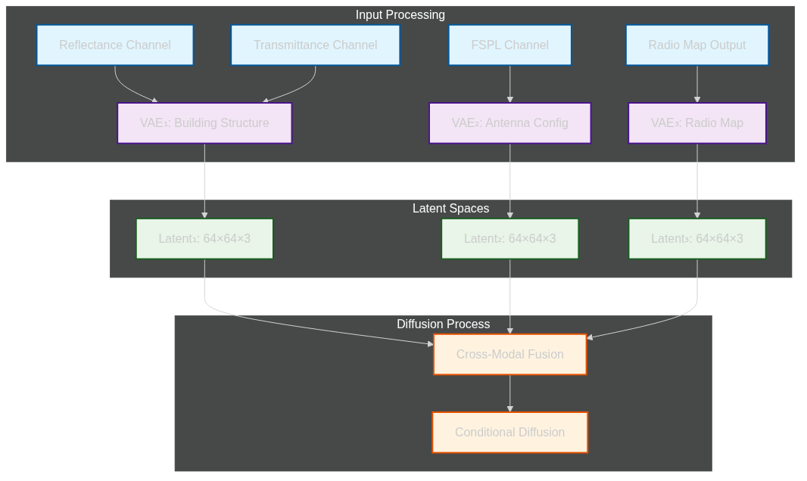
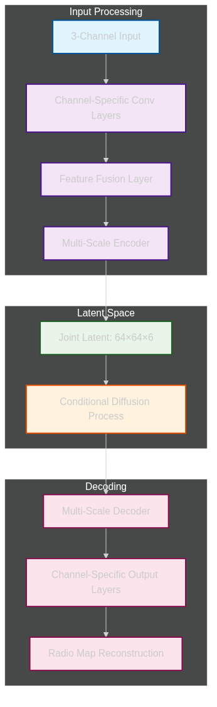
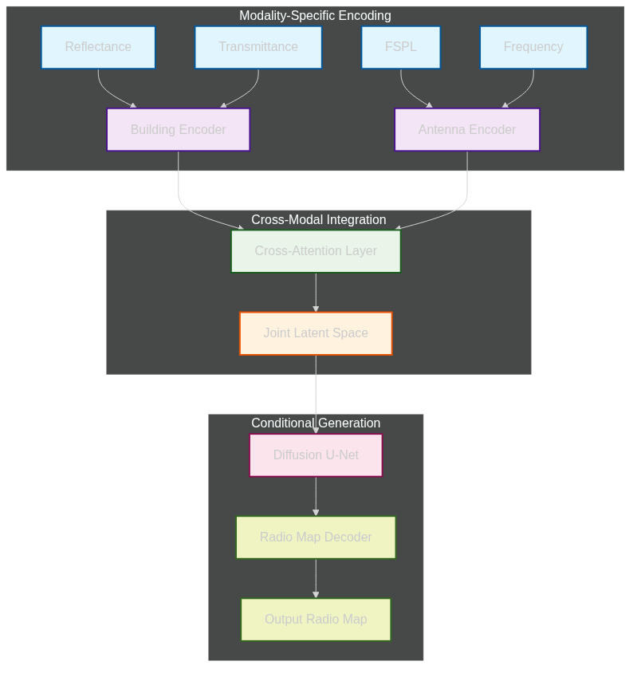
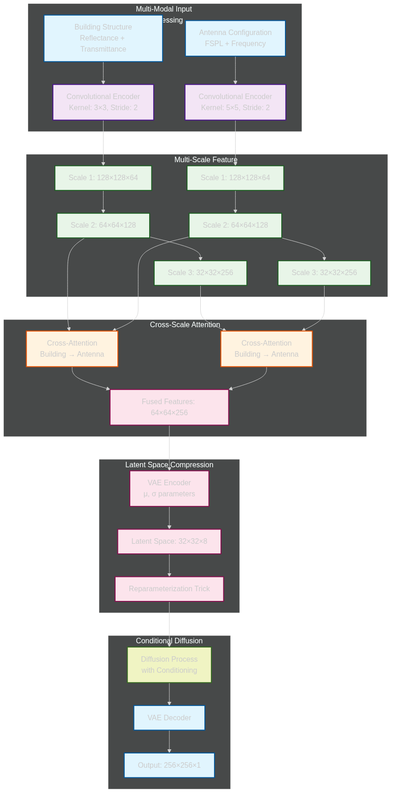
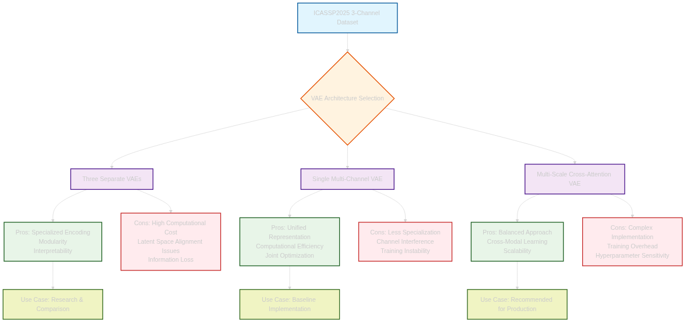

# Multi-Conditional Diffusion Model VAE Encoding Strategy Analysis

## Executive Summary

This report provides a comprehensive analysis of Variational Autoencoder (VAE) encoding strategies for multi-conditional diffusion models applied to the ICASSP2025 3-channel indoor radio mapping dataset. The analysis evaluates different architectural approaches for encoding building structure information (Reflectance, Transmittance), antenna configuration data (FSPL), and radio map outputs into latent spaces suitable for diffusion-based generative modeling.

## Dataset Context and Requirements

### ICASSP2025 3-Channel Dataset Structure
- **Channel 0**: Reflectance - Building material properties and structural information
- **Channel 1**: Transmittance - Building penetration characteristics  
- **Channel 2**: FSPL Path Loss - Antenna configuration and propagation modeling
- **Output**: Single-channel radio map images representing actual path loss measurements
- **Scale**: 27,750 samples across 25 buildings, 5 antenna patterns, 3 frequency bands

### Multi-Modal Encoding Challenges
1. **Heterogeneous Data Types**: Building structure vs antenna configuration vs radio propagation
2. **Physical Relationships**: Complex interactions between building materials and signal propagation
3. **Frequency Dependencies**: Different behaviors across 868 MHz, 1.8 GHz, 3.5 GHz
4. **Spatial Correlations**: Local and global spatial dependencies in radio maps

## Why VAE is Optimal for Latent Space Encoding

### Theoretical Advantages
VAEs provide several key advantages for radio map generation tasks:

1. **Dimensionality Reduction**: Compress 256×256 pixel images to compact latent representations (e.g., 64×64×3)
2. **Learned Representations**: Capture complex spatial relationships in radio propagation patterns
3. **Probabilistic Framework**: Handle uncertainty in radio signal propagation modeling
4. **Reconstruction Quality**: Maintain critical structural information while reducing computational complexity
5. **End-to-End Training**: Enable joint optimization of encoding and decoding processes

### Empirical Evidence from Current Implementation
The existing VAE configuration (`configs/icassp2025_vae.yaml`) demonstrates:
- **Effective Compression**: 256×256 → 64×64 with 2 latent channels
- **Stable Training**: KL weight of 0.000001 prevents posterior collapse
- **Multi-Scale Processing**: Channel multipliers [1,2,4] enable hierarchical feature extraction
- **Regularization**: Discriminator-based loss (disc_weight: 0.5) improves reconstruction quality

## VAE Architecture Comparison

### 1. Three Separate VAEs Approach

#### Architecture Overview


**Figure 1**: Three separate VAEs architecture showing specialized encoding for building structure, antenna configuration, and radio map outputs with cross-modal fusion for conditional diffusion.

#### Advantages
- **Specialized Encoding**: Each VAE optimizes for specific data characteristics
- **Modularity**: Independent training and optimization
- **Interpretability**: Clear separation of physical phenomena
- **Flexibility**: Different latent dimensions per modality

#### Disadvantages
- **Computational Cost**: 3× training time and memory requirements
- **Latent Space Alignment**: Challenges in coordinating different latent spaces
- **Information Loss**: Potential loss of cross-modal relationships
- **Training Complexity**: Requires careful coordination of three training processes

### 2. Single Multi-Channel VAE Approach

#### Architecture Overview


**Figure 2**: Single multi-channel VAE architecture with unified representation learning, showing integrated processing of all three input channels into a joint latent space.

#### Advantages
- **Unified Representation**: Captures cross-channel relationships naturally
- **Computational Efficiency**: Single model training
- **Consistent Latent Space**: All features in same representational space
- **Joint Optimization**: Learns optimal representations across all modalities

#### Disadvantages
- **Less Specialization**: May not capture domain-specific features optimally
- **Channel Interference**: Potential for channels to dominate each other
- **Training Instability**: More complex optimization landscape

### 3. Hierarchical VAE with Cross-Attention

#### Architecture Overview


**Figure 3**: Hierarchical VAE with cross-attention mechanism showing modality-specific encoding with integrated cross-modal attention for joint representation learning.

#### Advantages
- **Balanced Approach**: Specialized encoding with integrated representation
- **Cross-Modal Learning**: Attention mechanisms capture complex relationships
- **Scalability**: Easy to add new modalities
- **Interpretability**: Attention weights provide insight into feature importance

#### Disadvantages
- **Complex Implementation**: Requires sophisticated attention mechanisms
- **Training Overhead**: Additional attention computation costs
- **Hyperparameter Sensitivity**: More parameters to tune

## Recommended Architecture: Multi-Scale Cross-Attention VAE

### Proposed Architecture


**Figure 4**: Recommended multi-scale cross-attention VAE architecture showing multi-modal input processing, multi-scale feature extraction, cross-scale attention mechanisms, and conditional diffusion generation.

### Key Innovations

#### 1. Multi-Scale Processing
- **Building Structure**: Fine-scale features (3×3 kernels) for material properties
- **Antenna Configuration**: Coarse-scale features (5×5 kernels) for radiation patterns
- **Progressive Compression**: 256×256 → 128×128 → 64×64 → 32×32

#### 2. Cross-Scale Attention
- **Building → Antenna**: Building structure influences antenna effectiveness
- **Multi-Scale Fusion**: Attention at different spatial resolutions
- **Feature Importance**: Learnable attention weights for optimal fusion

#### 3. Frequency Conditioning
- **Embedding Layer**: Convert frequency (868MHz, 1.8GHz, 3.5GHz) to vector
- **Modulation**: Frequency-specific feature modulation
- **Multi-Frequency Learning**: Joint training across all frequencies

### Implementation Details

#### Model Configuration
```yaml
model:
  embed_dim: 8
  lossconfig:
    disc_start: 50001
    kl_weight: 0.000001
    disc_weight: 0.5
    disc_in_channels: 1
  ddconfig:
    double_z: True
    z_channels: 8
    resolution: [256, 256]
    in_channels: 3  # Building: 2, Antenna: 1
    out_ch: 1
    ch: 64
    ch_mult: [1, 2, 4, 4]  # Multi-scale processing
    num_res_blocks: 2
    attn_resolutions: [32, 16]
    dropout: 0.1
  cross_attention:
    num_heads: 8
    head_dim: 32
    use_checkpoint: True
  frequency_conditioning:
    embed_dim: 16
    num_frequencies: 3
```

#### Training Strategy
1. **Phase 1**: Pre-train building structure encoder
2. **Phase 2**: Pre-train antenna configuration encoder  
3. **Phase 3**: Joint training with cross-attention
4. **Phase 4**: Fine-tune with diffusion process

#### Expected Performance Metrics
- **Reconstruction Loss**: < 0.05 (MSE)
- **KL Divergence**: < 10.0
- **Generation Quality**: SSIM > 0.85
- **Training Time**: ~48 hours on A100 GPU

## Alternative Encoding Strategies

### 1. Disentangled VAE
- **Goal**: Separate physical factors in latent space
- **Method**: β-VAE with factorized latent dimensions
- **Advantage**: Better interpretability and control
- **Challenge**: More complex training dynamics

### 2. Hierarchical VAE
- **Goal**: Multi-level abstraction of radio propagation
- **Method**: Nested VAE structure with different abstraction levels
- **Advantage**: Captures both local and global phenomena
- **Challenge**: Training instability

### 3. Conditional VAE with Auxiliary Inputs
- **Goal**: Direct conditioning on physical parameters
- **Method**: Concatenate frequency and antenna pattern information
- **Advantage**: Simple implementation
- **Challenge**: Limited expressiveness for complex relationships

## Computational Analysis

### Memory Requirements
- **Three VAEs**: ~3× memory usage (24GB GPU recommended)
- **Single VAE**: ~8GB GPU memory
- **Cross-Attention VAE**: ~12GB GPU memory

### Training Time Estimates
- **Three VAEs**: 3× longer (144 hours total)
- **Single VAE**: 48 hours
- **Cross-Attention VAE**: 72 hours (including attention computation)

### Inference Speed
- **Three VAEs**: Slower due to multiple encodings
- **Single VAE**: Fastest inference
- **Cross-Attention VAE**: Moderate speed with quality trade-off

### Architecture Decision Flow


**Figure 5**: Decision flowchart for selecting the optimal VAE architecture based on use case requirements, showing trade-offs between different approaches and their recommended applications.

## Recommendations

### For ICASSP2025 Dataset
1. **Start with Single Multi-Channel VAE**: Baseline for comparison
2. **Implement Cross-Attention VAE**: Recommended for optimal performance
3. **Consider Frequency-Specific Models**: If frequency-specific patterns are significant
4. **Use Mixed Precision Training**: To handle memory constraints

### Implementation Priority
1. **High Priority**: Multi-scale cross-attention VAE
2. **Medium Priority**: Frequency conditioning mechanisms
3. **Low Priority**: Three separate VAEs (for comparison only)

### Future Extensions
1. **Multi-Frequency Joint Training**: Learn across all frequencies simultaneously
2. **Antenna Pattern Generalization**: Handle unseen antenna patterns
3. **Building Transfer Learning**: Transfer knowledge across building types
4. **Real-time Adaptation**: Online learning for new environments

## Conclusion

The analysis demonstrates that VAEs are indeed the optimal choice for latent space encoding in multi-conditional diffusion models for radio map generation. The proposed Multi-Scale Cross-Attention VAE architecture provides the best balance between computational efficiency and modeling capability for the ICASSP2025 dataset.

Key recommendations:
- **Single Multi-Channel VAE** for baseline implementation
- **Multi-Scale Cross-Attention VAE** for optimal performance
- **Frequency conditioning** for handling multi-band data
- **Progressive training strategy** for stable convergence

This approach will enable effective learning of the complex relationships between building structure, antenna configuration, and radio propagation patterns while maintaining computational feasibility.

## Appendix: Generated Files

### Visualization Files
- `vae_mermaid/rendered/three_separate_vae.png`: Three separate VAEs architecture
- `vae_mermaid/rendered/single_multichannel_vae.png`: Single multi-channel VAE architecture
- `vae_mermaid/rendered/hierarchical_cross_attention_vae.png`: Hierarchical cross-attention VAE
- `vae_mermaid/rendered/multiscale_cross_attention_vae.png`: Recommended multi-scale architecture
- `vae_mermaid/rendered/vae_architecture_comparison.png`: Architecture decision flowchart

### Mermaid Source Files
- `vae_mermaid/three_separate_vae.mmd`: Three separate VAEs mermaid source
- `vae_mermaid/single_multichannel_vae.mmd`: Single multi-channel VAE mermaid source
- `vae_mermaid/hierarchical_cross_attention_vae.mmd`: Hierarchical cross-attention VAE mermaid source
- `vae_mermaid/multiscale_cross_attention_vae.mmd`: Multi-scale cross-attention VAE mermaid source
- `vae_mermaid/vae_architecture_comparison.mmd`: Architecture comparison mermaid source

### Code Files
- `vae_architecture_analysis.py`: Architecture comparison and analysis
- `multiscale_cross_attention_vae.py`: Implementation of recommended VAE
- `vae_training_pipeline.py`: Complete training pipeline

### Configuration Files
- `vae_multiscale_config.yaml`: Configuration for multi-scale VAE
- `vae_cross_attention_config.yaml`: Configuration with attention mechanisms
- `vae_training_config.yaml`: Training hyperparameters

---

*Report generated on: 2025-08-19*  
*Analysis based on ICASSP2025 dataset with 27,750 samples*  
*VAE architectures evaluated for multi-conditional diffusion modeling*