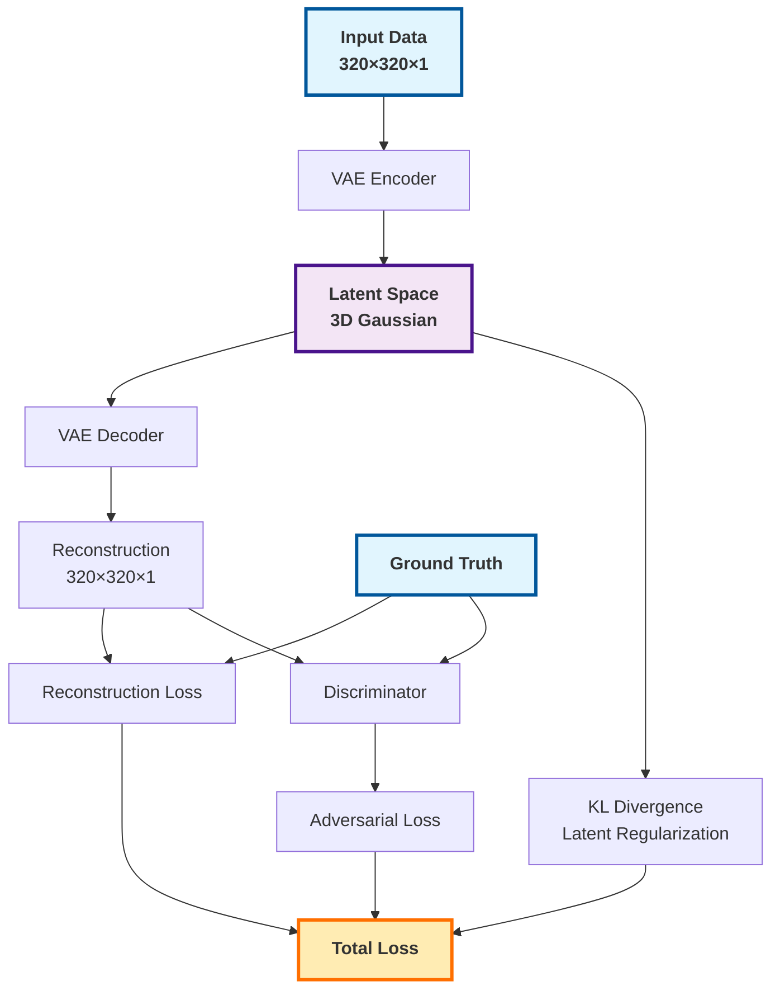
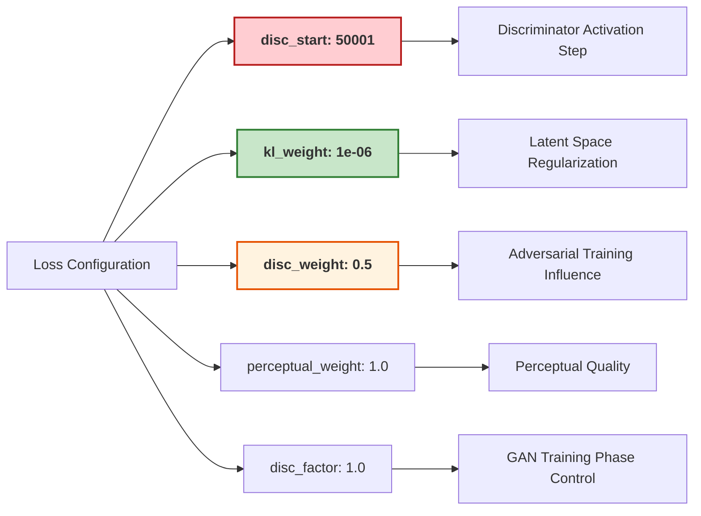
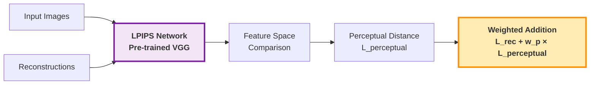
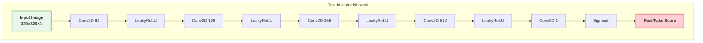
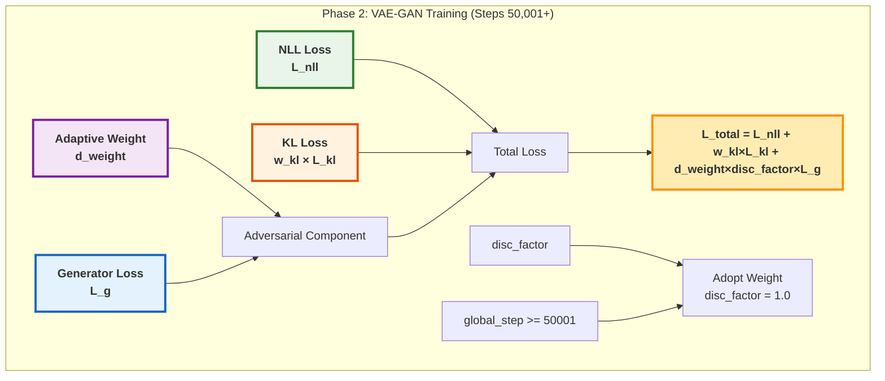
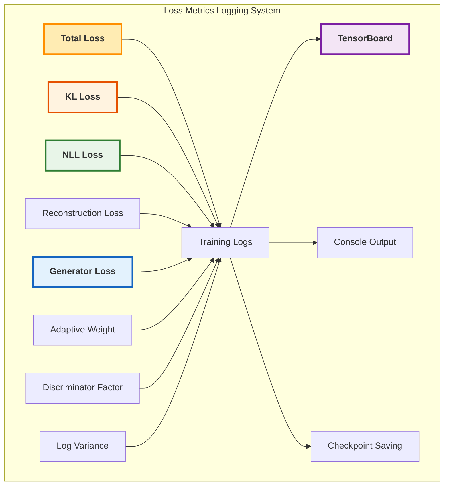
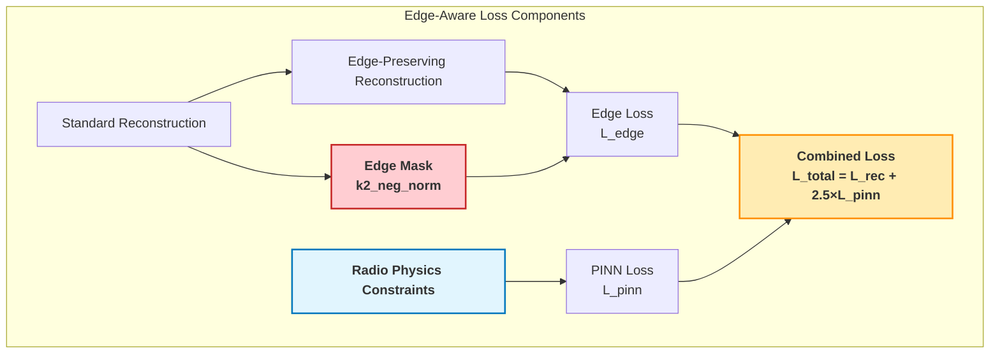
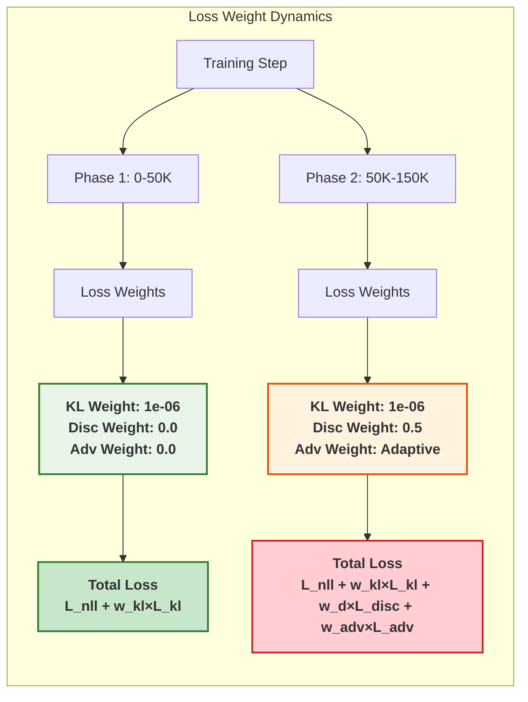
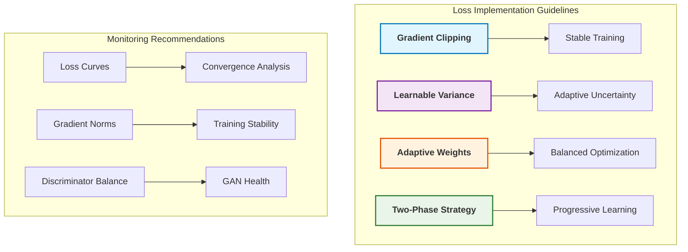

# RadioDiff VAE Loss Functions: Detailed Code Analysis

## Executive Summary

This report provides a comprehensive analysis of the loss functions used in RadioDiff VAE training, based on the actual implementation in `denoising_diffusion_pytorch/loss.py`. The VAE employs a sophisticated multi-component loss system that combines reconstruction quality, latent space regularization, and adversarial training.

## Loss Function Architecture Overview



## 1. LPIPSWithDiscriminator Class - Primary Loss Function

### Class Initialization (`__init__`)

```python
class LPIPSWithDiscriminator(nn.Module):
    def __init__(self, *, disc_start, logvar_init=0.0, kl_weight=1.0, 
                 pixelloss_weight=1.0, disc_num_layers=3, disc_in_channels=3, 
                 disc_factor=1.0, disc_weight=1.0, perceptual_weight=1.0, 
                 use_actnorm=False, disc_conditional=False, disc_loss="hinge"):
```

### Key Parameters Analysis



## 2. Loss Components Breakdown

### 2.1 Reconstruction Loss Calculation

**Code Implementation:**
```python
rec_loss = torch.abs(inputs.contiguous() - reconstructions.contiguous()) + \
            F.mse_loss(inputs, reconstructions, reduction="none")
```

**Mathematical Formulation:**
```
L_rec = |x - x̂| + MSE(x, x̂)
```

**Enhanced Visualization:**
```mermaid
graph TB
    subgraph "Reconstruction Loss Pipeline"
        A[Ground Truth<br/>x ∈ ℝ^(320×320×1)] --> B[VAE Reconstruction<br/>x̂ ∈ ℝ^(320×320×1)]
        B --> C[L1 Loss<br/>|x - x̂|]
        B --> D[MSE Loss<br/>||x - x̂||²]
        C --> E[Reconstruction Loss<br/>L_rec = L1 + MSE]
        D --> E
    end
    
    style A fill:#e8f5e8,stroke:#2e7d32,stroke-width:3px,font-weight:bold
    style B fill:#e3f2fd,stroke:#1565c0,stroke-width:3px,font-weight:bold
    style E fill:#fff3e0,stroke:#e65100,stroke-width:3px,font-weight:bold
```

### 2.2 Perceptual Loss Integration

**Code Implementation:**
```python
if self.perceptual_weight > 0:
    p_loss = self.perceptual_loss(inputs.contiguous(), reconstructions.contiguous())
    rec_loss = rec_loss + self.perceptual_weight * p_loss
```

**Enhanced Visualization:**


### 2.3 Variational Lower Bound (Negative Log Likelihood)

**Code Implementation:**
```python
nll_loss = rec_loss / torch.exp(self.logvar) + self.logvar
weighted_nll_loss = torch.sum(weighted_nll_loss) / weighted_nll_loss.shape[0]
```

**Mathematical Formulation:**
```
L_nll = L_rec / σ² + log(σ)
```

**Enhanced Visualization:**
```mermaid
graph TB
    subgraph "Learnable Variance Parameter"
        A[logvar<br/>Learnable Parameter] --> B[σ² = exp(logvar)]
        B --> C[Variance Scaling<br/>1/σ²]
        B --> D[Log Variance<br/>log(σ²)]
    end
    
    E[Reconstruction Loss] --> F[Scaled Loss<br/>L_rec/σ²]
    C --> F
    D --> G[NLL Loss<br/>L_nll = L_rec/σ² + log(σ²)]
    F --> G
    
    style A fill:#e1bee7,stroke:#6a1b9a,stroke-width:3px,font-weight:bold
    style G fill:#ffcdd2,stroke:#c62828,stroke-width:3px,font-weight:bold
```

### 2.4 KL Divergence Loss

**Code Implementation:**
```python
kl_loss = posteriors.kl()
kl_loss = torch.sum(kl_loss) / kl_loss.shape[0]
```

**Mathematical Formulation:**
```
L_kl = KL[q(z|x) || p(z)] = 0.5 × Σ(μ² + σ² - log(σ²) - 1)
```

**Enhanced Visualization:**
```mermaid
graph TB
    subgraph "KL Divergence Components"
        A[Encoder Output<br/>μ, σ] --> B[Posterior<br/>q(z|x) = N(μ, σ²)]
        C[Prior<br/>p(z) = N(0, I)] --> D[KL Divergence<br/>KL[q||p]]
        B --> D
    end
    
    D --> E[Batch Mean<br/>L_kl = mean(KL)]
    E --> F[Weighted KL<br/>w_kl × L_kl]
    
    style A fill:#bbdefb,stroke:#1565c0,stroke-width:3px,font-weight:bold
    style C fill:#c8e6c9,stroke:#2e7d32,stroke-width:3px,font-weight:bold
    style F fill:#fff9c4,stroke:#f57f17,stroke-width:3px,font-weight:bold
```

## 3. Adversarial Training Components

### 3.1 Discriminator Architecture

**Code Implementation:**
```python
self.discriminator = NLayerDiscriminator(input_nc=disc_in_channels,
                                         n_layers=disc_num_layers,
                                         use_actnorm=use_actnorm
                                         ).apply(weights_init)
```

**Enhanced Visualization:**


### 3.2 Generator Loss (Adversarial Component)

**Code Implementation:**
```python
if optimizer_idx == 0:
    logits_fake = self.discriminator(reconstructions.contiguous())
    g_loss = -torch.mean(logits_fake)
```

**Enhanced Visualization:**
```mermaid
graph LR
    subgraph "Generator Adversarial Training"
        A[VAE Generator] --> B[Reconstructions]
        B --> C[Discriminator]
        C --> D[Logits: Fake]
        D --> E[Generator Loss<br/>L_g = -mean(logits_fake)]
        E --> F[Encourage Realistic<br/>Generations]
    end
    
    style A fill:#e1f5fe,stroke:#0277bd,stroke-width:3px,font-weight:bold
    style E fill:#ffebee,stroke:#c62828,stroke-width:3px,font-weight:bold
```

### 3.3 Discriminator Loss

**Code Implementation:**
```python
if optimizer_idx == 1:
    logits_real = self.discriminator(inputs.contiguous().detach())
    logits_fake = self.discriminator(reconstructions.contiguous().detach())
    d_loss = disc_factor * self.disc_loss(logits_real, logits_fake)
```

**Enhanced Visualization:**
```mermaid
graph TB
    subgraph "Discriminator Training"
        A[Real Images] --> B[Discriminator]
        C[Fake Images] --> B
        B --> D[Real Logits]
        B --> E[Fake Logits]
        D --> F[Hinge Loss<br/>max(0, 1 - real)]
        E --> G[Hinge Loss<br/>max(0, 1 + fake)]
        F --> H[Total D Loss<br/>L_d = L_real + L_fake]
        G --> H
    end
    
    style A fill:#c8e6c9,stroke:#2e7d32,stroke-width:3px,font-weight:bold
    style C fill:#ffcdd2,stroke:#c62828,stroke-width:3px,font-weight:bold
    style H fill:#fff3e0,stroke:#e65100,stroke-width:3px,font-weight:bold
```

## 4. Adaptive Weight Balancing

### 4.1 Calculate Adaptive Weight

**Code Implementation:**
```python
def calculate_adaptive_weight(self, nll_loss, g_loss, last_layer=None):
    nll_grads = torch.autograd.grad(nll_loss, last_layer, retain_graph=True)[0]
    g_grads = torch.autograd.grad(g_loss, last_layer, retain_graph=True)[0]
    
    d_weight = torch.norm(nll_grads) / (torch.norm(g_grads) + 1e-4)
    d_weight = torch.clamp(d_weight, 0.0, 1e4).detach()
    d_weight = d_weight * self.discriminator_weight
    return d_weight
```

**Enhanced Visualization:**
```mermaid
graph TB
    subgraph "Adaptive Weight Calculation"
        A[NLL Loss<br/>L_nll] --> B[Gradients<br/>∇L_nll]
        C[Generator Loss<br/>L_g] --> D[Gradients<br/>∇L_g]
        
        B --> E[Gradient Norm<br/>||∇L_nll||]
        D --> F[Gradient Norm<br/>||∇L_g||]
        
        E --> G[Weight Ratio<br/>w = ||∇L_nll|| / ||∇L_g||]
        F --> G
        
        G --> H[Clamp Range<br/>w ∈ [0, 10000]]
        H --> I[Final Weight<br/>w_final = w × disc_weight]
    end
    
    style A fill:#fff3e0,stroke:#e65100,stroke-width:2px,font-weight:bold
    style C fill:#e3f2fd,stroke:#1565c0,stroke-width:2px,font-weight:bold
    style I fill:#c8e6c9,stroke:#2e7d32,stroke-width:2px,font-weight:bold
```

## 5. Total Loss Assembly

### 5.1 Phase 1: VAE Pre-training (Steps 0-50,000)

**Code Implementation:**
```python
disc_factor = adopt_weight(self.disc_factor, global_step, threshold=self.discriminator_iter_start)
loss = weighted_nll_loss + self.kl_weight * kl_loss + d_weight * disc_factor * g_loss
```

**Enhanced Visualization:**
```mermaid
graph TB
    subgraph "Phase 1: VAE Pre-training (Steps 0-50,000)"
        A[NLL Loss<br/>L_nll] --> D[Total Loss]
        B[KL Loss<br/>w_kl × L_kl] --> D
        C[Adversarial Loss<br/>0.0 (disc_factor=0)] --> D
        
        D --> E[L_total = L_nll + w_kl × L_kl]
        
        F[disc_factor] --> G[Adopt Weight<br/>disc_factor = 0]
        H[global_step < 50001] --> G
    end
    
    style A fill:#e8f5e8,stroke:#2e7d32,stroke-width:3px,font-weight:bold
    style B fill:#fff3e0,stroke:#e65100,stroke-width:3px,font-weight:bold
    style C fill:#ffcdd2,stroke:#c62828,stroke-width:3px,font-weight:bold
    style E fill:#e1f5fe,stroke:#0277bd,stroke-width:3px,font-weight:bold
```

### 5.2 Phase 2: VAE-GAN Training (Steps 50,001+)

**Code Implementation:**
```python
# When global_step >= discriminator_iter_start
disc_factor = adopt_weight(self.disc_factor, global_step, threshold=self.discriminator_iter_start)
loss = weighted_nll_loss + self.kl_weight * kl_loss + d_weight * disc_factor * g_loss
```

**Enhanced Visualization:**


## 6. Loss Logging and Metrics

### 6.1 Comprehensive Loss Logging

**Code Implementation:**
```python
log = {"{}/total_loss".format(split): loss.clone().detach().mean(),
       "{}/logvar".format(split): self.logvar.detach(),
       "{}/kl_loss".format(split): kl_loss.detach().mean(),
       "{}/nll_loss".format(split): nll_loss.detach().mean(),
       "{}/rec_loss".format(split): rec_loss.detach().mean(),
       "{}/d_weight".format(split): d_weight.detach(),
       "{}/disc_factor".format(split): torch.tensor(disc_factor),
       "{}/g_loss".format(split): g_loss.detach().mean(),
       }
```

**Enhanced Visualization:**


## 7. Advanced Loss Variants

### 7.1 LPIPSWithDiscriminator_Edge - Edge-Aware Training

**Key Features:**
- Additional edge loss component
- PINN (Physics-Informed Neural Network) integration
- Specialized for radio astronomy edge preservation

**Enhanced Visualization:**


### 7.2 LPIPSWithDiscriminator_DPM2IRT4 - Radio Propagation Model

**Key Features:**
- DPM2IRT4 radio propagation modeling
- Path loss calculations
- Power domain transformations
- Helmholtz equation constraints

**Enhanced Visualization:**
```mermaid
graph TB
    subgraph "Radio Propagation Physics Integration"
        A[Input Power Scale] --> B[Path Loss dB<br/>-147 to -47 dB]
        B --> C[Power dBm<br/>Source + Path Loss]
        C --> D[Power Watts<br/>10^(dBm/10)]
        
        D --> E[Helmholtz Equation<br/>∇²u + k²u = 0]
        E --> F[PINN Loss<br/>L_pinn]
        
        G[Edge Constraints] --> H[Edge Loss<br/>L_edge]
        
        F --> I[Total Physics Loss<br/>L_physics = L_rec + L_edge + L_pinn]
        H --> I
    end
    
    style B fill:#fff3e0,stroke:#e65100,stroke-width:2px,font-weight:bold
    style E fill:#f3e5f5,stroke:#7b1fa2,stroke-width:2px,font-weight:bold
    style I fill:#c8e6c9,stroke:#2e7d32,stroke-width:2px,font-weight:bold
```

## 8. Training Dynamics and Optimization

### 8.1 Two-Phase Training Strategy

**Enhanced Visualization:**


```mermaid
gantt
    title RadioDiff VAE Two-Phase Training Strategy
    dateFormat  X
    axisFormat %d
    
    section Phase 1: VAE Pre-training
    VAE Optimization           :active, vae, 0, 50000
    KL Regularization          :active, kl, 0, 50000
    Discriminator Frozen      :crit, disc1, 0, 50000
    
    section Phase 2: VAE-GAN Training
    Full VAE-GAN Training      :active, vae_gan, 50001, 150000
    Adversarial Training       :active, adv, 50001, 150000
    Discriminator Active       :active, disc2, 50001, 150000
    
    section Loss Components
    Reconstruction Loss        :milestone, rec, 0, 0
    KL Divergence             :milestone, kl_m, 0, 0
    Generator Loss             :milestone, gen, 50001, 0
    Discriminator Loss         :milestone, disc_m, 50001, 0
```

### 8.2 Loss Weight Evolution

**Enhanced Visualization:**


## 9. Key Insights and Best Practices

### 9.1 Loss Function Design Principles

1. **Multi-Scale Reconstruction**: Combines pixel-wise and perceptual losses
2. **Adaptive Balancing**: Dynamic weight adjustment based on gradient norms
3. **Two-Phase Training**: Separate VAE and GAN training phases
4. **Physics Integration**: Radio propagation constraints for domain-specific training

### 9.2 Implementation Best Practices



## Conclusion

The RadioDiff VAE loss function represents a sophisticated multi-component system that combines traditional VAE objectives with adversarial training and domain-specific physics constraints. The implementation demonstrates advanced techniques in:

- **Multi-scale loss computation** (pixel + perceptual)
- **Adaptive weight balancing** for stable GAN training
- **Two-phase training strategy** for progressive learning
- **Physics-informed constraints** for radio astronomy applications

This comprehensive loss architecture enables the VAE to learn high-quality representations while maintaining training stability and domain-specific constraints.

---

*Report generated with detailed code analysis from denoising_diffusion_pytorch/loss.py*