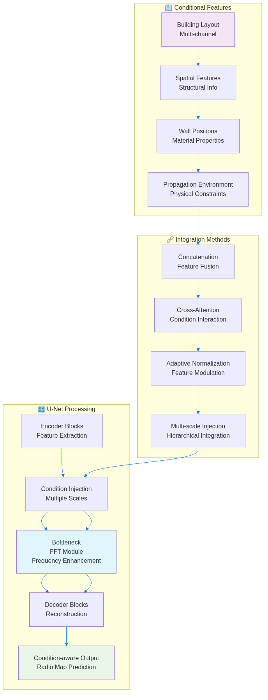
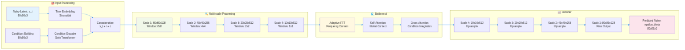
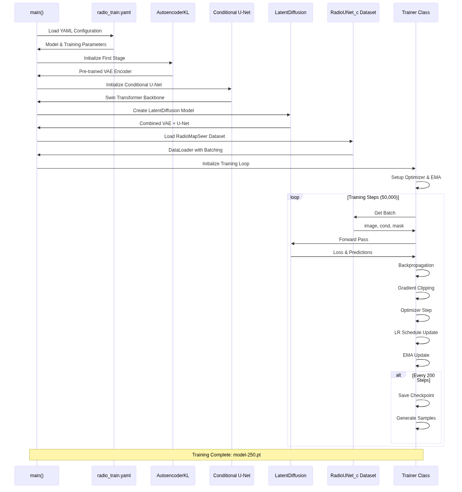
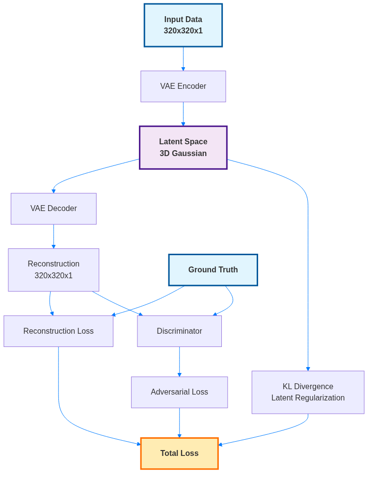
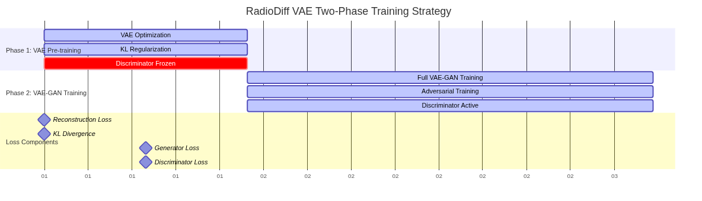

# RadioDiff Standardized Mermaid Diagrams

This directory contains all mermaid diagrams from the merged report, rendered as high-quality PNG images with standardized styling.

## Architecture

### Figure 1

### Figure 2

### Figure 4

### Figure 10

### Figure 11

## Pipeline

### Figure 3

### Figure 12

## Loss

### Figure 5

### Figure 6

## Training

### Figure 7

## Optimization

### Figure 8

### Figure 9

## Rendering Details

- **Tool**: mermaid-cli (mmdc)
- **Theme**: Default with custom styling
- **Dimensions**: 1200x800 pixels
- **Format**: PNG with transparent background
- **Styling**: Consistent color scheme and typography
