# RadioDiff Conditional Latent Diffusion Model - Comprehensive Training Analysis

## Executive Summary

This report provides a comprehensive analysis of the RadioDiff conditional latent diffusion model training process based on the IEEE TCCN paper **"RadioDiff: An Effective Generative Diffusion Model for Sampling-Free Dynamic Radio Map Construction"**. The analysis covers the complete system architecture, mathematical foundations, data processing pipelines, and training optimization strategies implemented in `train_cond_ldm.py` with `configs/radio_train.yaml`.

## 1. System Architecture Overview

### 1.1 Complete Model Pipeline

```mermaid
graph TB
    subgraph "📡 Input Data Pipeline"
        A[RadioMapSeer Dataset<br/>320×320 Radio Maps] --> B[RadioUNet_c Loader<br/>batch_size: 66]
        B --> C[Gradient Accumulation<br/>8 steps → Effective: 528]
        C --> D[Input Tensors<br/>image: B×1×320×320<br/>cond: B×3×320×320]
    end
    
    subgraph "🎯 First Stage: VAE Encoder"
        E[AutoencoderKL<br/>embed_dim: 3] --> F[Encoder<br/>ResNet Architecture]
        F --> G[Latent Space z<br/>z~q_φ(z|x)<br/>Shape: [B, 3, 80, 80]]
        G --> H[16× Compression<br/>320×320 → 80×80<br/>Computational Efficiency]
    end
    
    subgraph "🔄 Second Stage: Conditional U-Net"
        I[Conditional U-Net<br/>dim: 128] --> J[Time Embedding<br/>Sinusoidal Encoding]
        J --> K[Condition Integration<br/>Swin Transformer<br/>Window-based Attention]
        K --> L[Multi-scale Features<br/>dim_mults: [1,2,4,4]]
        L --> M[Adaptive FFT Module<br/>Frequency Domain Enhancement]
        M --> N[Noise Prediction<br/>ε_θ(x_t, t, c)]
    end
    
    subgraph "🌊 Diffusion Process"
        O[Forward Diffusion<br/>q(x_t|x_0) = 𝒩(√ᾱ_tx_0, (1-ᾱ_t)𝐈)] --> P[Noise Schedule<br/>β_t: linear 0.0001→0.02]
        P --> Q[Reverse Process<br/>p_θ(x_0|x_t, c)]
        Q --> R[Knowledge-Aware Objective<br/>pred_KC]
    end
    
    subgraph "⚙️ Training Loop"
        S[L2 Loss Computation] --> T[Backpropagation<br/>Gradient Clipping: 1.0]
        T --> U[AdamW Optimizer<br/>lr: 5e-5, wd: 1e-4]
        U --> V[Cosine LR Schedule<br/>lr(t) = max(5e-6, 5e-5×(1-t/T)^0.96)]
        V --> W[EMA Model Update<br/>β: 0.999<br/>after 10,000 steps]
    end
    
    D --> E
    G --> I
    N --> S
    R --> S
    
    style A fill:#E3F2FD
    style E fill:#F3E5F5
    style I fill:#E8F5E8
    style O fill:#FFF3E0
    style S fill:#FCE4EC
```

### 1.2 Detailed Architecture Components

```mermaid
graph LR
    subgraph "📊 Input Specifications"
        A[Image: 320×320×1<br/>Radio Map Pathloss] --> B[Condition: 320×320×3<br/>Building Layout]
        B --> C[Mask: Optional<br/>Spatial Constraints]
        C --> D[Latent: 80×80×3<br/>Compressed Representation]
    end
    
    subgraph "🏗️ VAE Architecture (First Stage)"
        E[Encoder<br/>ResNet Blocks] --> F[Downsampling<br/>4× Reduction]
        F --> G[Bottleneck<br/>Latent Space]
        G --> H[Decoder<br/>ResNet Blocks]
        H --> I[Upsampling<br/>4× Expansion]
        I --> J[Reconstruction<br/>Original Space]
    end
    
    subgraph "🎛️ Conditional U-Net Architecture"
        K[Input: x_t + t + c] --> L[Time Embedding<br/>Positional Encoding]
        L --> M[Conditional Processing<br/>Swin Transformer]
        M --> N[Multi-scale Features<br/>Hierarchical Extraction]
        N --> O[Window Attention<br/>[8,8], [4,4], [2,2], [1,1]]
        O --> P[Adaptive FFT<br/>Fourier Scale: 16]
        P --> Q[Output: Predicted Noise<br/>ε_θ(x_t, t, c)]
    end
    
    subgraph "📈 Diffusion Parameters"
        R[Timesteps: 1000] --> S[Beta Schedule<br/>Linear: 0.0001→0.02]
        S --> T[Objective: pred_KC<br/>Knowledge-Aware]
        T --> U[Loss: L2<br/>Mean Squared Error]
        U --> V[Scale Factor: 0.3<br/>Latent Space Scaling]
    end
    
    A --> E
    B --> M
    D --> G
    R --> S
    
    style E fill:#E3F2FD
    style K fill:#F1F8E9
    style R fill:#FFF8E1
```

## 2. Mathematical Foundations

### 2.1 Diffusion Process Theory

The RadioDiff model implements a conditional latent diffusion process with sophisticated mathematical formulations:

#### Forward Diffusion Process:
$$q(x_t|x_0) = \mathcal{N}(x_t; \sqrt{\bar{\alpha}_t}x_0, (1-\bar{\alpha}_t)\mathbf{I})$$

where:
- $\bar{\alpha}_t = \prod_{i=1}^{t} (1-\beta_i)$
- $\beta_t$ follows a linear schedule: $\beta_t = \text{linear}(0.0001, 0.02, T)$
- $T = 1000$ timesteps

#### Reverse Process with Conditioning:
$$p_\theta(x_{0:T}|c) = p(x_T) \prod_{t=1}^{T} p_\theta(x_{t-1}|x_t, c)$$

where $c$ represents the conditional information (building layout).

### 2.2 Knowledge-Aware Objective (pred_KC)

The model uses a knowledge-aware prediction objective that incorporates radio propagation physics:

$$\mathcal{L}_{\text{KC}} = \mathbb{E}_{t,x_0,c,\epsilon} \left[ \| \epsilon - \epsilon_\theta(x_t, t, c) \|^2 \right]$$

where:
- $x_t = \sqrt{\bar{\alpha}_t}x_0 + \sqrt{1-\bar{\alpha}_t}\epsilon$
- $\epsilon \sim \mathcal{N}(0, \mathbf{I})$
- $\epsilon_\theta$ is the noise prediction network with conditioning

### 2.3 VAE Formulation with Latent Space Compression

The first-stage VAE learns a compressed latent representation for computational efficiency:

$$\text{ELBO} = \mathbb{E}_{q_\phi(z|x)}[\log p_\theta(x|z)] - D_{\text{KL}}(q_\phi(z|x) \| p(z))$$

With latent space regularization:
$$q_\phi(z|x) = \mathcal{N}(z; \mu_\phi(x), \sigma_\phi^2(x)\mathbf{I})$$

The VAE achieves 16× spatial compression (320×320 → 80×80) while preserving essential radio propagation features.

### 2.4 Conditional Generation Framework

Radio map construction is framed as a conditional generative problem:

$$p(x|c) = \int p(x|z,c) p(z|c) dz$$

where:
- $x$ is the radio map (pathloss distribution)
- $c$ is the conditional information (building layout)
- $z$ is the latent representation

## 3. Data Flow and Processing

### 3.1 Training Data Pipeline

```mermaid
flowchart TD
    subgraph "📂 Data Loading"
        A[RadioMapSeer Dataset<br/>Real-world Radio Maps] --> B[RadioUNet_c Loader<br/>DPM Simulation]
        B --> C[Batch Creation<br/>batch_size: 66]
        C --> D[Data Augmentation<br/>Horizontal Flip]
    end
    
    subgraph "🔧 Input Processing"
        E[Image: 320×320×1<br/>Radio Map] --> F[Normalization<br/>[-1, 1]]
        G[Condition: 320×320×3<br/>Building Info] --> H[Multi-channel Encoding]
        I[Mask: Optional<br/>320×320×1] --> J[Binary Processing]
    end
    
    subgraph "📦 Batch Structure"
        K[Batch Dictionary] --> L[image: B×1×320×320<br/>Pathloss Values]
        K --> M[cond: B×3×320×320<br/>Building Layout]
        K --> N[ori_mask: B×1×320×320<br/>Spatial Mask]
        K --> O[img_name: List[str]<br/>Metadata]
    end
    
    subgraph "🎯 Forward Pass"
        P[VAE Encoder] --> Q[Latent Representation<br/>B×3×80×80]
        Q --> R[Conditional U-Net<br/>Noise Prediction]
        R --> S[Loss Computation<br/>L2 Distance]
    end
    
    A --> B
    D --> E
    D --> G
    D --> I
    F --> L
    H --> M
    J --> N
    L --> K
    M --> K
    N --> K
    K --> P
    Q --> R
    
    style A fill:#E8F5E8
    style K fill:#FFF3E0
    style P fill:#E3F2FD
    style S fill:#FCE4EC
```

### 3.2 Conditional Information Integration

```mermaid
graph TB
    subgraph "🏢 Conditional Features"
        A[Building Layout<br/>Multi-channel] --> B[Spatial Features<br/>Structural Info]
        B --> C[Wall Positions<br/>Material Properties]
        C --> D[Propagation Environment<br/>Physical Constraints]
    end
    
    subgraph "🔗 Integration Methods"
        E[Concatenation<br/>Feature Fusion] --> F[Cross-Attention<br/>Condition Interaction]
        F --> G[Adaptive Normalization<br/>Feature Modulation]
        G --> H[Multi-scale Injection<br/>Hierarchical Integration]
    end
    
    subgraph "🎛️ U-Net Processing"
        I[Encoder Blocks<br/>Feature Extraction] --> J[Condition Injection<br/>Multiple Scales]
        J --> K[Bottleneck<br/>FFT Module<br/>Frequency Enhancement]
        K --> L[Decoder Blocks<br/>Reconstruction]
        L --> M[Condition-aware Output<br/>Radio Map Prediction]
    end
    
    D --> E
    H --> J
    J --> K
    K --> L
    
    style A fill:#F3E5F5
    style K fill:#E1F5FE
    style M fill:#E8F5E8
```



## 4. Training Configuration and Hyperparameters

### 4.1 Key Configuration Parameters

```mermaid
graph LR
    subgraph "🤖 Model Configuration"
        A[Model Type: const_sde<br/>Constant SDE] --> B[Image Size: [320, 320]]
        B --> C[Timesteps: 1000<br/>Diffusion Steps]
        C --> D[Sampling Steps: 1<br/>Inference Efficiency]
        D --> E[Objective: pred_KC<br/>Knowledge-Aware]
    end
    
    subgraph "🎛️ VAE Configuration"
        F[Embed Dim: 3<br/>Latent Space] --> G[Z Channels: 3<br/>Compression]
        G --> H[Resolution: 320×320<br/>Input Size]
        H --> I[Channels: 128<br/>Feature Dim]
        I --> J[Multiplier: [1,2,4]<br/>Scale Factors]
    end
    
    subgraph "🔧 U-Net Configuration"
        K[Dim: 128<br/>Base Dimension] --> L[Channels: 3<br/>Input Channels]
        L --> M[Dim Mults: [1,2,4,4]<br/>Multi-scale]
        M --> N[Cond Dim: 128<br/>Condition Dim]
        N --> O[Window Sizes<br/>[8,8], [4,4], [2,2], [1,1]]
    end
    
    subgraph "⚙️ Training Configuration"
        P[Batch Size: 66<br/>Per GPU] --> Q[Grad Accum: 8<br/>Effective: 528]
        Q --> R[LR: 5e-5<br/>Learning Rate]
        R --> S[Steps: 50000<br/>Total Training]
        S --> T[Save Every: 200<br/>Checkpoint Freq]
    end
    
    A --> F
    F --> K
    K --> P
    
    style A fill:#E3F2FD
    style F fill:#F3E5F5
    style K fill:#F1F8E9
    style P fill:#FFF8E1
```

### 4.2 Optimization Strategy

The training uses a sophisticated optimization approach with learning rate scheduling and model regularization:

**Learning Rate Schedule:**
$$\text{lr}(t) = \max\left(\text{lr}_{\min}, \text{lr}_{\max} \cdot (1 - t/T)^{0.96}\right)$$

**EMA Update for Model Stability:**
$$\theta_{\text{EMA}}^{(t)} = \beta \cdot \theta_{\text{EMA}}^{(t-1)} + (1-\beta) \cdot \theta^{(t)}$$

where $\beta = 0.999$ after 10,000 steps.

**Gradient Clipping:**
$$\|\nabla\theta\|_2 \leq 1.0$$

## 5. Implementation Details

### 5.1 Key Components

#### 5.1.1 Conditional U-Net with Swin Transformer
- **Multi-scale processing** with hierarchical feature extraction using `dim_mults: [1,2,4,4]`
- **Window-based attention** for efficient spatial modeling with variable window sizes
- **Adaptive FFT modules** for frequency-domain feature enhancement (`fourier_scale: 16`)
- **Condition integration** at multiple scales through the network

#### 5.1.2 Latent Diffusion Process
- **VAE compression** from 320×320 to 80×80 (16× reduction) for computational efficiency
- **Knowledge-aware noise prediction** with radio propagation physics constraints
- **Efficient sampling** with single-step inference (`sampling_timesteps: 1`)
- **Conditional generation** based on building layout information

### 5.2 Training Pipeline Execution


## 6. Performance Characteristics

### 6.1 Computational Efficiency

- **Memory Usage**: Optimized for single GPU training with gradient accumulation
- **Batch Processing**: 66 samples per batch with 8× gradient accumulation (effective 528)
- **Latent Space**: 16× compression reduces computational cost significantly
- **Sampling Speed**: Single-step sampling enables real-time inference

### 6.2 Model Capabilities

- **Radio Map Generation**: High-quality pathloss prediction for 6G networks
- **Conditional Generation**: Building layout-aware synthesis with physical constraints
- **Dynamic Environments**: Handles various radio propagation scenarios
- **Sampling-Free**: Eliminates expensive field measurements during inference

## 7. Theoretical Innovation

### 7.1 Radio Map as Generative Problem

The key theoretical insight is modeling radio map construction as a conditional generative problem:

$$p(x|c) = \int p(x|z,c) p(z|c) dz$$

where:
- $x$ is the radio map (pathloss distribution)
- $c$ is the conditional information (building layout)
- $z$ is the latent representation

### 7.2 Advantages Over Discriminative Methods

1. **Better Uncertainty Modeling**: Captures multimodal distributions in radio propagation
2. **Improved Generalization**: Handles unseen building layouts through generative framework
3. **Physical Consistency**: Maintains radio propagation physics through knowledge-aware objectives
4. **Computational Efficiency**: No expensive sampling required during inference

### 7.3 Knowledge-Aware Diffusion

The `pred_KC` objective incorporates radio propagation physics:

$$\mathcal{L}_{\text{KC}} = \mathbb{E}_{t,x_0,c,\epsilon} \left[ \| \epsilon - \epsilon_\theta(x_t, t, c) \|^2 \right]$$

This ensures the generated radio maps respect physical constraints of electromagnetic wave propagation.

## 8. Model Architecture Details

### 8.1 VAE Architecture (First Stage)

```mermaid
graph TB
    subgraph "📥 Encoder Path"
        A[Input: 320×320×1<br/>Radio Map] --> B[Conv2D: 128×320×320]
        B --> C[ResNet Block 1<br/>Downsample: 160×160]
        C --> D[ResNet Block 2<br/>Downsample: 80×80]
        D --> E[Bottleneck<br/>Latent Space: 80×80×3]
    end
    
    subgraph "📤 Decoder Path"
        F[Latent: 80×80×3] --> G[ResNet Block 1<br/>Upsample: 160×160]
        G --> H[ResNet Block 2<br/>Upsample: 320×320]
        H --> I[Conv2D: 1×320×320<br/>Reconstruction]
    end
    
    subgraph "🔧 Regularization"
        J[KL Divergence<br/>D_KL(q_φ(z|x)‖p(z))] --> K[Reconstruction Loss<br/>‖x-x̂‖²]
        K --> L[Total Loss<br/>ELBO Optimization]
    end
    
    E --> F
    J --> L
    K --> L
    
    style A fill:#E3F2FD
    style F fill:#F3E5F5
    style L fill:#FFF8E1
```

### 8.2 Conditional U-Net Architecture (Second Stage)

```mermaid
graph LR
    subgraph "🎯 Input Processing"
        A[Noisy Latent: x_t<br/>80×80×3] --> B[Time Embedding<br/>Sinusoidal]
        C[Condition: Building<br/>80×80×3] --> D[Condition Encoder<br/>Swin Transformer]
        B --> E[Concatenation<br/>x_t + t + c]
        D --> E
    end
    
    subgraph "🔍 Multi-scale Processing"
        E --> F[Scale 1: 80×80×128<br/>Window: 8×8]
        F --> G[Scale 2: 40×40×256<br/>Window: 4×4]
        G --> H[Scale 3: 20×20×512<br/>Window: 2×2]
        H --> I[Scale 4: 10×10×512<br/>Window: 1×1]
    end
    
    subgraph "🌊 Bottleneck"
        I --> J[Adaptive FFT<br/>Frequency Domain]
        J --> K[Self-Attention<br/>Global Context]
        K --> L[Cross-Attention<br/>Condition Integration]
    end
    
    subgraph "📈 Decoder"
        L --> M[Scale 4: 10×10×512<br/>Upsample]
        M --> N[Scale 3: 20×20×512<br/>Upsample]
        N --> O[Scale 2: 40×40×256<br/>Upsample]
        O --> P[Scale 1: 80×80×128<br/>Final Output]
        P --> Q[Predicted Noise: ε_θ<br/>80×80×3]
    end
    
    style A fill:#E3F2FD
    style F fill:#F1F8E9
    style J fill:#FFF8E1
    style Q fill:#FCE4EC
```



## 9. Training Optimization Details

### 9.1 Learning Rate Schedule

```mermaid
graph TB
    subgraph "📈 Cosine Decay Schedule"
        A[Initial LR: 5e-5] --> B[Warmup Phase<br/>Optional]
        B --> C[Decay Phase<br/>(1-t/T)^0.96]
        C --> D[Minimum LR: 5e-6<br/>Floor Value]
    end
    
    subgraph "🔧 Optimization Parameters"
        E[Optimizer: AdamW] --> F[Weight Decay: 1e-4]
        F --> G[Gradient Clipping: 1.0]
        G --> H[Accumulation: 8 steps<br/>Effective Batch: 528]
    end
    
    subgraph "🎯 Model Regularization"
        I[EMA Update] --> J[Beta: 0.999]
        J --> K[Start After: 10,000 steps]
        K --> L[Update Every: 10 steps]
    end
    
    A --> E
    E --> I
    
    style A fill:#E3F2FD
    style E fill:#F1F8E9
    style I fill:#FFF8E1
```

### 9.2 Training Pipeline Optimization


## 10. Conclusion and Future Directions

### 10.1 Key Achievements

The RadioDiff conditional latent diffusion model represents a significant advancement in radio map construction technology:

1. **Theoretical Innovation**: First comprehensive framework modeling radio map construction as a conditional generative problem
2. **Architectural Excellence**: Two-stage VAE + U-Net architecture with Swin Transformer backbone
3. **Computational Efficiency**: 16× latent space compression with single-step inference
4. **Physical Consistency**: Knowledge-aware objectives incorporating radio propagation physics

### 10.2 Technical Contributions

- **Knowledge-Aware Diffusion**: `pred_KC` objective tailored for radio propagation constraints
- **Efficient Sampling**: Elimination of expensive field measurements during inference
- **Multi-scale Processing**: Hierarchical feature extraction with window-based attention
- **Adaptive FFT**: Frequency-domain enhancement for better spatial modeling

### 10.3 Performance Metrics

Based on the IEEE TCCN paper, RadioDiff achieves state-of-the-art performance in:
- **RMSE** (Root Mean Square Error): Lowest prediction error
- **SSIM** (Structural Similarity): Best structural preservation
- **PSNR** (Peak Signal-to-Noise Ratio): Highest reconstruction quality

### 10.4 Future Applications

The RadioDiff framework opens up new possibilities for:
- **6G Network Planning**: Real-time radio map generation for dynamic environments
- **IoT Deployment**: Efficient pathloss prediction for sensor networks
- **Autonomous Vehicles**: Real-time radio environment mapping
- **Smart Cities**: Intelligent wireless network optimization

## 11. Mathematical Appendix

### 11.1 Complete Diffusion Formulation

**Forward Process:**
$$q(x_t|x_0) = \mathcal{N}(x_t; \sqrt{\bar{\alpha}_t}x_0, (1-\bar{\alpha}_t)\mathbf{I})$$

**Reverse Process:**
$$p_\theta(x_{t-1}|x_t, c) = \mathcal{N}(x_{t-1}; \mu_\theta(x_t, t, c), \Sigma_\theta(x_t, t, c))$$

**Training Objective:**
$$\mathcal{L}_{\text{simple}} = \mathbb{E}_{t,x_0,c,\epsilon} \left[ \| \epsilon - \epsilon_\theta(x_t, t, c) \|^2 \right]$$

### 11.2 VAE Mathematical Foundation

**Encoder:**
$$q_\phi(z|x) = \mathcal{N}(z; \mu_\phi(x), \sigma_\phi^2(x)\mathbf{I})$$

**Decoder:**
$$p_\theta(x|z) = \mathcal{N}(x; \mu_\theta(z), \sigma^2\mathbf{I})$$

**ELBO Objective:**
$$\mathcal{L}_{\text{ELBO}} = \mathbb{E}_{q_\phi(z|x)}[\log p_\theta(x|z)] - D_{\text{KL}}(q_\phi(z|x) \| p(z))$$

---

**Generated from comprehensive analysis of RadioDiff codebase and IEEE TCCN paper**  
*Paper: "RadioDiff: An Effective Generative Diffusion Model for Sampling-Free Dynamic Radio Map Construction"*  
*Implementation: train_cond_ldm.py with configs/radio_train.yaml*