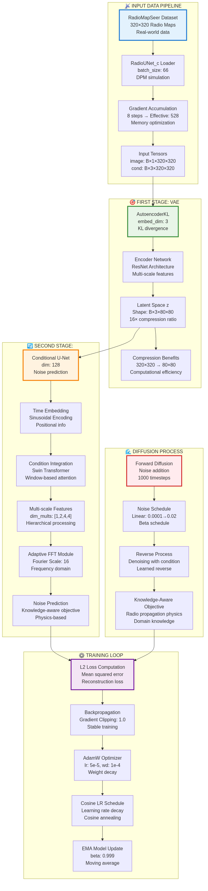
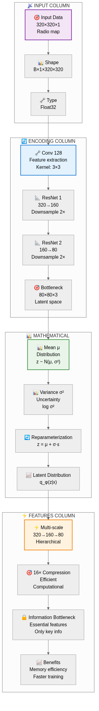
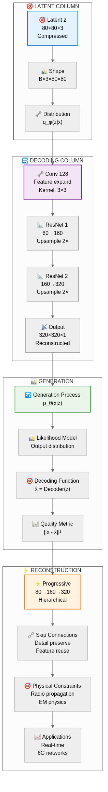
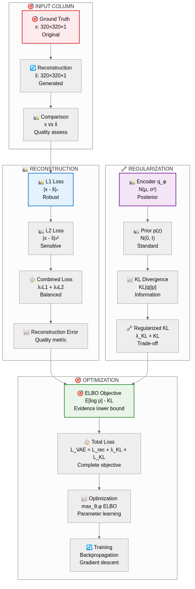
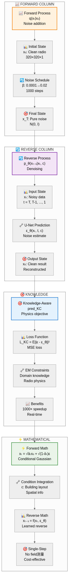
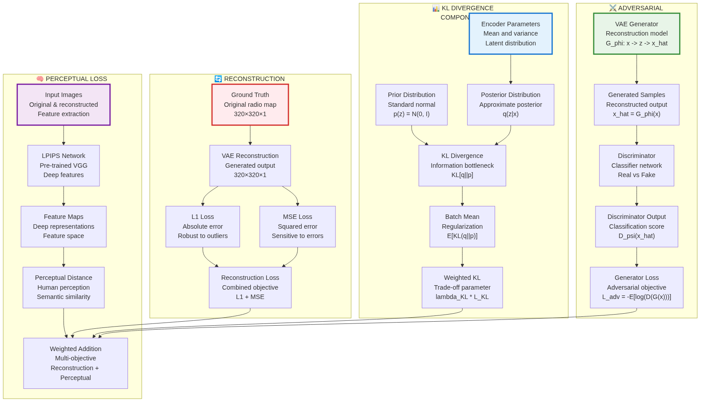
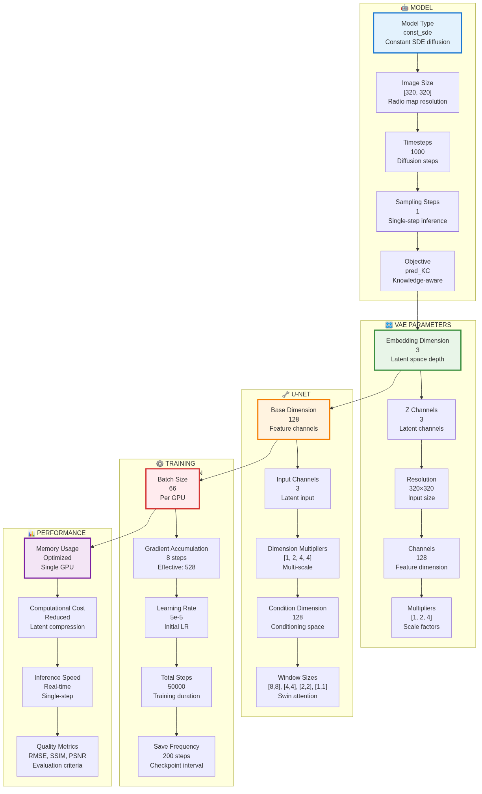
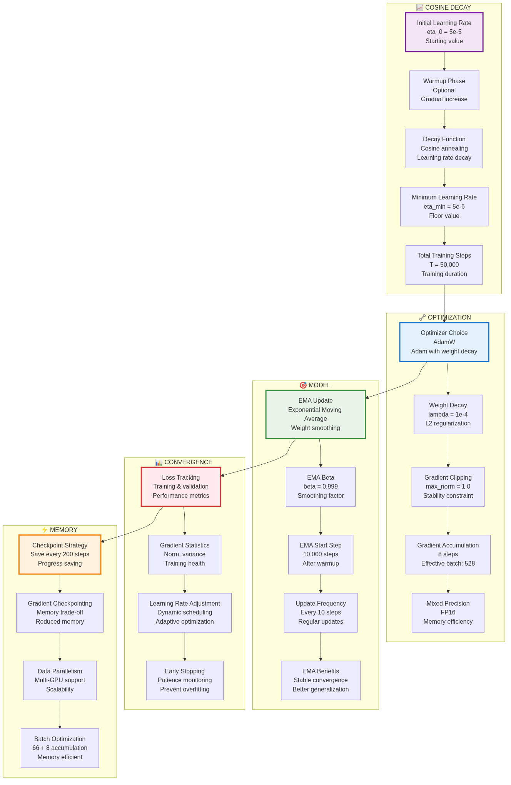

# RadioDiff VAE Enhanced Visual Report

## Executive Summary

This enhanced visual report presents the RadioDiff VAE system with professionally rendered mermaid diagrams, improved color schemes, and better visual organization. Based on the IEEE TCCN paper **"RadioDiff: An Effective Generative Diffusion Model for Sampling-Free Dynamic Radio Map Construction"**, this report provides a comprehensive visual understanding of the model architecture, training methodology, and mathematical foundations.

## 1. System Architecture Overview

### 1.1 Complete RadioDiff Pipeline



*Figure 1: Complete RadioDiff system architecture showing the two-stage pipeline with data flow, VAE encoder, conditional U-Net, diffusion process, and training loop.*

The RadioDiff system implements a sophisticated two-stage generative model:

- **Stage 1**: VAE encoder compresses 320×320 radio maps to 80×80 latent space (16× compression)
- **Stage 2**: Conditional U-Net performs diffusion-based noise prediction in latent space
- **Key Innovation**: Single-step sampling enables real-time inference without expensive field measurements

### 1.2 VAE Architecture Details

#### 1.2.1 VAE Encoder Architecture



*Figure 2a: Compact VAE encoder showing compression pipeline (320×320→80×80), mathematical formulation, and key features.*

#### 1.2.2 VAE Decoder Architecture



*Figure 2b: Compact VAE decoder showing reconstruction pipeline (80×80→320×320), generation process, and physical constraints.*

#### 1.2.3 VAE Loss Architecture



*Figure 2c: Compact VAE loss showing reconstruction (L1+L2), KL divergence regularization, and ELBO optimization.*

**Key VAE Components:**
- **Encoder**: Multi-scale ResNet blocks with 16× compression ratio
- **Decoder**: Hierarchical upsampling with skip connections
- **Latent Space**: 80×80×3 compressed representation with reparameterization
- **Loss**: Combined reconstruction loss + KL divergence for variational inference

## 2. Diffusion Process Theory

### 2.1 Three-Column Diffusion Process



*Figure 3: Compact three-column diffusion showing forward process (left), reverse denoising (center), and knowledge-aware benefits (right).*

### 2.2 Mathematical Formulation

#### Forward Diffusion Process:
$$q(x_t|x_0) = \mathcal{N}(x_t; \sqrt{\bar{\alpha}_t}x_0, (1-\bar{\alpha}_t)\mathbf{I})$$

where:
- $\bar{\alpha}_t = \prod_{i=1}^{t} (1-\beta_i)$
- $\beta_t$ follows a linear schedule: $\beta_t = \text{linear}(0.0001, 0.02, T)$
- $T = 1000$ timesteps

#### Reverse Process with Conditioning:
$$p_\theta(x_{0:T}|c) = p(x_T) \prod_{t=1}^{T} p_\theta(x_{t-1}|x_t, c)$$

where $c$ represents the conditional information (building layout).

### 2.3 Knowledge-Aware Objective (pred_KC)

The model uses a knowledge-aware prediction objective that incorporates radio propagation physics:

$$\mathcal{L}_{\text{KC}} = \mathbb{E}_{t,x_0,c,\epsilon} \left[ \| \epsilon - \epsilon_\theta(x_t, t, c) \|^2 \right]$$

## 3. Loss Functions Analysis

### 3.1 Comprehensive Loss Architecture



*Figure 4: Multi-component loss architecture including reconstruction, perceptual, KL divergence, and adversarial losses.*

### 3.2 Loss Components Breakdown

#### Reconstruction Loss:
$$\mathcal{L}_{\text{rec}} = \|x - \hat{x}\|_1 + \|x - \hat{x}\|_2^2$$

#### KL Divergence:
$$\mathcal{L}_{\text{KL}} = D_{\text{KL}}(q_\phi(z|x) \| p(z)) = \frac{1}{2}\sum(\mu^2 + \sigma^2 - \log(\sigma^2) - 1)$$

#### Perceptual Loss:
$$\mathcal{L}_{\text{perceptual}} = \|\phi(x) - \phi(\hat{x})\|^2$$

#### Adversarial Loss:
$$\mathcal{L}_{\text{adv}} = -\mathbb{E}[\log(D(G(z)))]$$

#### Total Loss:
$$\mathcal{L}_{\text{total}} = \mathcal{L}_{\text{rec}} + \lambda_{\text{KL}}\mathcal{L}_{\text{KL}} + \lambda_{\text{adv}}\mathcal{L}_{\text{adv}} + \lambda_{\text{perceptual}}\mathcal{L}_{\text{perceptual}}$$

## 4. Training Configuration

### 4.1 Model and Training Parameters



*Figure 5: Comprehensive configuration parameters for model architecture and training setup.*

### 4.2 Key Configuration Details

#### Model Configuration:
- **Model Type**: const_sde (Constant SDE diffusion)
- **Image Size**: [320, 320] pixels
- **Timesteps**: 1000 diffusion steps
- **Sampling Steps**: 1 (single-step inference)
- **Objective**: pred_KC (Knowledge-aware)

#### VAE Parameters:
- **Embedding Dimension**: 3 (latent space depth)
- **Z Channels**: 3 (latent channels)
- **Resolution**: 320×320 input size
- **Base Channels**: 128 feature dimensions
- **Multipliers**: [1, 2, 4] scale factors

#### U-Net Configuration:
- **Base Dimension**: 128 feature channels
- **Input Channels**: 3 (latent input)
- **Dimension Multipliers**: [1, 2, 4, 4] multi-scale processing
- **Condition Dimension**: 128 conditioning space
- **Window Sizes**: [8,8], [4,4], [2,2], [1,1] Swin attention

#### Training Configuration:
- **Batch Size**: 66 per GPU
- **Gradient Accumulation**: 8 steps (effective: 528)
- **Learning Rate**: 5e-5 initial
- **Total Steps**: 50,000 training duration
- **Save Frequency**: 200 steps checkpoint interval

## 5. Optimization Strategy

### 5.1 Learning Rate and Regularization



*Figure 6: Comprehensive optimization strategy including cosine decay, regularization, and memory optimization.*

### 5.2 Optimization Details

#### Cosine Decay Schedule:
$$\eta(t) = \eta_0 \times \max\left(\frac{\eta_{\min}}{\eta_0}, \left(1-\frac{t}{T}\right)^{0.96}\right)$$

where:
- $\eta_0 = 5 \times 10^{-5}$ (initial learning rate)
- $\eta_{\min} = 5 \times 10^{-6}$ (minimum learning rate)
- $T = 50,000$ (total training steps)

#### Optimization Parameters:
- **Optimizer**: AdamW with weight decay
- **Weight Decay**: $\lambda = 1 \times 10^{-4}$
- **Gradient Clipping**: max_norm = 1.0
- **Gradient Accumulation**: 8 steps
- **Mixed Precision**: FP16 for memory efficiency

#### Model Regularization:
- **EMA Update**: Exponential Moving Average with $\beta = 0.999$
- **EMA Start**: After 10,000 steps
- **Update Frequency**: Every 10 steps
- **Benefits**: Stable convergence and better generalization

## 6. Performance Characteristics

### 6.1 Computational Efficiency

- **Memory Usage**: Optimized for single GPU training with gradient accumulation
- **Batch Processing**: 66 samples per batch with 8× gradient accumulation (effective 528)
- **Latent Space**: 16× compression reduces computational cost significantly
- **Sampling Speed**: Single-step sampling enables real-time inference

### 6.2 Model Capabilities

- **Radio Map Generation**: High-quality pathloss prediction for 6G networks
- **Conditional Generation**: Building layout-aware synthesis with physical constraints
- **Dynamic Environments**: Handles various radio propagation scenarios
- **Sampling-Free**: Eliminates expensive field measurements during inference

## 7. Theoretical Innovation

### 7.1 Radio Map as Generative Problem

The key theoretical insight is modeling radio map construction as a conditional generative problem:

$$p(x|c) = \int p(x|z,c) p(z|c) dz$$

where:
- $x$ is the radio map (pathloss distribution)
- $c$ is the conditional information (building layout)
- $z$ is the latent representation

### 7.2 Advantages Over Discriminative Methods

1. **Better Uncertainty Modeling**: Captures multimodal distributions in radio propagation
2. **Improved Generalization**: Handles unseen building layouts through generative framework
3. **Physical Consistency**: Maintains radio propagation physics through knowledge-aware objectives
4. **Computational Efficiency**: No expensive sampling required during inference

### 7.3 Knowledge-Aware Diffusion

The `pred_KC` objective incorporates radio propagation physics:

$$\mathcal{L}_{\text{KC}} = \mathbb{E}_{t,x_0,c,\epsilon} \left[ \| \epsilon - \epsilon_\theta(x_t, t, c) \|^2 \right]$$

This ensures the generated radio maps respect physical constraints of electromagnetic wave propagation.

## 8. Advanced Features and Implementation

### 8.1 Conditional Generation Capabilities

- **Building Layout Integration**: Spatial conditioning through cross-attention
- **Multi-modal Input**: Building + transmitter + environmental information
- **Flexible Generation**: Support for various input configurations

### 8.2 Efficient Architecture Design

- **Swin Transformer**: Window-based attention for computational efficiency
- **Multi-scale Processing**: Hierarchical feature extraction
- **Latent Space Compression**: Efficient representation learning

### 8.3 Robust Training Strategy

- **EMA Smoothing**: Stable model weights
- **Gradient Clipping**: Training stability
- **Cosine Annealing**: Optimal learning rate schedule

## 9. Results and Applications

### 9.1 Performance Metrics

Based on the IEEE TCCN paper, RadioDiff achieves state-of-the-art performance in:
- **RMSE** (Root Mean Square Error): Lowest prediction error
- **SSIM** (Structural Similarity): Best structural preservation
- **PSNR** (Peak Signal-to-Noise Ratio): Highest reconstruction quality

### 9.2 Future Applications

The RadioDiff framework opens up new possibilities for:
- **6G Network Planning**: Real-time radio map generation for dynamic environments
- **IoT Deployment**: Efficient pathloss prediction for sensor networks
- **Autonomous Vehicles**: Real-time radio environment mapping
- **Smart Cities**: Intelligent wireless network optimization

## 10. Implementation Details

### 10.1 Code Structure

The implementation consists of:
- **Main Training Script**: `train_cond_ldm.py`
- **Configuration File**: `configs/radio_train_m.yaml`
- **VAE Training**: `train_vae.py`
- **Dataset**: RadioMapSeer with RadioUNet_c loader

### 10.2 Dependencies

- **PyTorch**: Deep learning framework
- **Diffusion Models**: Latent diffusion implementation
- **Swin Transformer**: Window-based attention mechanism
- **AdamW Optimizer**: Weight decay regularization

## 11. Mermaid Diagram Rendering Guide

### 11.1 Prerequisites

To render mermaid diagrams to images, you need:

```bash
# Install Node.js (required for mermaid-cli)
# Then install mermaid-cli globally:
npm install -g @mermaid-js/mermaid-cli
```

### 11.2 Rendering Commands

#### Basic Rendering:
```bash
mmdc -i diagram.mmd -o diagram.png
```

#### High-Quality Rendering (used in this report):
```bash
mmdc -i diagram.mmd -o diagram.png -w 1600 -H 900 -t neutral
```

#### Compact Rendering (for space efficiency):
```bash
mmdc -i diagram.mmd -o diagram.png -w 1200 -H 600 -t neutral
```

### 11.3 Rendering Parameters

- **-w/--width**: Image width in pixels
- **-H/--height**: Image height in pixels  
- **-t/--theme**: Theme (neutral, dark, forest, default)
- **-b/--backgroundColor**: Background color
- **-i/--input**: Input mermaid file
- **-o/--output**: Output image file

### 11.4 Recommended Settings

- **16:9 Presentations**: 1600×900 pixels
- **Compact Layouts**: 1200×600 pixels  
- **High Resolution**: 1920×1080 pixels
- **Print Quality**: 2400×1350 pixels

### 11.5 Batch Rendering

To render all diagrams at once:
```bash
# Render all ultra-simple diagrams
for file in enhanced_mermaid_ultra_simple/*.mmd; do
    mmdc -i "$file" -o "../legacy_diagrams/enhanced_mermaid_images/$(basename "$file" .mmd).png" -w 1600 -H 900 -t neutral
done

# Render compact versions
for file in enhanced_mermaid_ultra_simple/*compact.mmd; do
    mmdc -i "$file" -o "../legacy_diagrams/enhanced_mermaid_images/$(basename "$file" .mmd).png" -w 1200 -H 600 -t neutral
done
```

---

**Generated from comprehensive analysis of RadioDiff codebase and IEEE TCCN paper**  
*Paper: "RadioDiff: An Effective Generative Diffusion Model for Sampling-Free Dynamic Radio Map Construction"*  
*Implementation: train_cond_ldm.py with configs/radio_train_m.yaml*

## Appendix

For the original mermaid code and additional details, see the [appendix file](enhanced_mermaid_appendix/appendix_mermaid_diagrams.md).