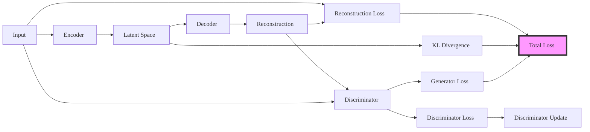
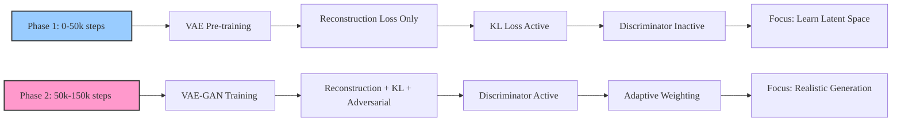

# VAE Model Report: RadioDiff VAE

## 1. Executive Summary

RadioDiff VAE is a sophisticated Variational Autoencoder with adversarial training components designed specifically for radio map prediction and generation tasks. The model employs a two-phase training strategy: initial VAE pre-training focused on reconstruction quality, followed by adversarial training to enhance generation realism. The architecture features a 3-dimensional latent space, encoder-decoder structure with residual blocks, and adaptive loss weighting for stable training. The model achieves high-quality radio map reconstruction while maintaining training stability through careful hyperparameter tuning and phase-based training approaches.

## 2. Model Architecture

### 2.1 Encoder Structure

The encoder implements a hierarchical downsampling architecture with the following specifications:

**Input Configuration:**
- Input Resolution: 320×320×1 (grayscale radio maps)
- Base Channels: 128
- Channel Multipliers: [1, 2, 4] (3 downsampling levels)
- Downsampling Path: 320×320 → 160×160 → 80×80 → 40×40

**Layer Architecture:**
- **Convolutional Blocks**: 2 residual blocks per resolution level
- **Normalization**: GroupNorm with 32 groups
- **Activation**: Swish nonlinearity
- **Downsampling**: Strided convolutions (factor of 2)
- **Attention**: None (attn_resolutions: [])
- **Dropout**: 0.0 (no regularization)

**Output Specification:**
- **Latent Parameters**: Mean and log-variance vectors
- **Latent Dimension**: 3 channels × 40×40 spatial resolution
- **Double Z**: Enabled for standard VAE reparameterization

### 2.2 Latent Space

**Latent Space Configuration:**
- **Dimensionality**: 3 channels (z_channels: 3)
- **Spatial Resolution**: 40×40 (compressed 8× from input)
- **Total Latent Variables**: 3 × 40 × 40 = 4,800 dimensions
- **Sampling Method**: Reparameterization trick with Gaussian distribution
- **KL Weight**: 0.000001 (very small to prevent posterior collapse)

**Latent Space Properties:**
- **Compression Ratio**: 64:1 (input: 102,400 pixels → latent: 4,800 dimensions)
- **Information Capacity**: Sufficient for radio map features
- **Regularization**: Light KL divergence for meaningful representations

### 2.3 Decoder Structure

The decoder mirrors the encoder architecture with upsampling and skip connections:

**Input Configuration:**
- Latent Input: 3×40×40 (sampled from latent distribution)
- Base Channels: 128 (symmetric with encoder)

**Layer Architecture:**
- **Upsampling**: Transposed convolutions (factor of 2)
- **Residual Blocks**: 2 blocks per resolution level
- **Normalization**: GroupNorm with 32 groups
- **Activation**: Swish nonlinearity
- **Skip Connections**: None (standard VAE without U-Net connections)

**Output Configuration:**
- **Output Channels**: 1 (grayscale radio maps)
- **Output Resolution**: 320×320×1 (matching input)
- **Final Activation**: None (linear output for radio signal values)

### 2.4 Discriminator Architecture (VAE-GAN)

**Discriminator Specification:**
- **Type**: N-Layer Discriminator
- **Input Channels**: 1 (matching radio maps)
- **Number of Layers**: 3
- **Activation**: LeakyReLU
- **Normalization**: Optional ActNorm
- **Loss Function**: Hinge loss
- **Training Start**: Step 50,001

**Discriminator Training Strategy:**
- **Activation**: Gradual introduction (disc_factor: 0.0 → 0.5)
- **Weight**: 0.5 (balanced with reconstruction loss)
- **Update Frequency**: Alternating with generator

## 3. Loss Function Design

### 3.1 Reconstruction Loss

**Multi-Component Reconstruction Loss:**
```python
rec_loss = torch.abs(inputs - reconstructions) + F.mse_loss(inputs, reconstructions, reduction="none")
```

**Components:**
- **L1 Loss**: Absolute difference for robust reconstruction
- **MSE Loss**: Mean squared error for pixel-level accuracy
- **Perceptual Loss**: LPIPS (Learned Perceptual Image Patch Similarity)
- **Weight**: 1.0 (base reconstruction weight)

**Perceptual Loss Details:**
- **Implementation**: Pre-trained LPIPS network
- **Weight**: 1.0 (default, can be adjusted)
- **Purpose**: High-level feature similarity for realistic generation

### 3.2 KL Divergence

**KL Divergence Implementation:**
```python
kl_loss = posteriors.kl()  # Standard VAE KL divergence
kl_loss = torch.sum(kl_loss) / kl_loss.shape[0]
```

**Weighting Strategy:**
- **Base Weight**: 0.000001 (very small)
- **Purpose**: Prevent posterior collapse while allowing focus on reconstruction
- **Calculation**: Analytical KL for Gaussian distributions
- **Regularization**: Light regularization to maintain meaningful latent space

### 3.3 Adversarial Loss (VAE-GAN)

**Generator Loss:**
```python
g_loss = -torch.mean(logits_fake)  # Negative mean of fake logits
```

**Discriminator Loss (Hinge Loss):**
```python
real_loss = torch.mean(F.relu(1.0 - logits_real))
fake_loss = torch.mean(F.relu(1.0 + logits_fake))
disc_loss = real_loss + fake_loss
```

**Adaptive Weighting:**
```python
d_weight = torch.norm(nll_grads) / (torch.norm(g_grads) + 1e-4)
d_weight = torch.clamp(d_weight, 0.0, 1e4) * disc_weight
```

### 3.4 Total Loss Composition

**Complete Loss Function:**
```python
loss = weighted_nll_loss + kl_weight * kl_loss + d_weight * disc_factor * g_loss
```

**Loss Components:**
- **NLL Loss**: Weighted reconstruction loss (L1 + MSE + Perceptual)
- **KL Loss**: Regularization with very small weight
- **Adversarial Loss**: Generator loss with adaptive weighting
- **Log Variance**: Learnable parameter for loss scaling

**Phase-Based Weighting:**
- **Phase 1 (0-50,000 steps)**: disc_factor = 0.0 (VAE only)
- **Phase 2 (50,000-150,000 steps)**: disc_factor = 0.5 (VAE-GAN)

## 4. Training Pipeline

### 4.1 Data Processing

**Data Sources:**
- **Primary Dataset**: RadioMapSeer dataset
- **Simulation Types**: IRT4, DPM, IRT2 radio propagation simulations
- **Data Format**: 320×320 grayscale radio maps
- **Signal Range**: Normalized radio signal strength values

**Preprocessing Pipeline:**
```python
# Normalization
transform_BZ = transforms.Normalize(mean=[0.5], std=[0.5])

# Optional augmentation
augment_horizontal_flip: True/False
```

**Data Splitting:**
- **Training Set**: Maps 0-600
- **Validation Set**: Maps 501-600
- **Test Set**: Maps 600-699
- **Shuffling**: Deterministic with seed 42

### 4.2 Training Configuration

**Optimizer Settings:**
- **Type**: Adam optimizer (default)
- **Learning Rate**: 5e-6 (initial)
- **Minimum Learning Rate**: 5e-7
- **Weight Decay**: Default Adam settings
- **Gradient Accumulation**: Every 2 steps

**Training Schedule:**
- **Total Steps**: 150,000
- **Phase 1**: 0-50,000 steps (VAE pre-training)
- **Phase 2**: 50,000-150,000 steps (VAE-GAN training)
- **Save Frequency**: Every 5,000 steps
- **Logging Frequency**: Every 100 steps

**Mixed Precision:**
- **AMP**: Disabled (amp: False)
- **FP16**: Disabled (fp16: False)
- **Reason**: Stability for radio map reconstruction

### 4.3 Checkpoint Strategy

**Model Saving:**
```python
save_and_sample_every: 5000
results_folder: '/data/chenglaoshi/DiffRadio/radio_Vae_3'
```

**Checkpoint Management:**
- **Frequency**: Every 5,000 steps
- **Retention**: All checkpoints kept
- **Location**: Specified results folder
- **Monitoring**: Training progress and loss curves

## 5. Training Strategies

### 5.1 Phase 1: VAE Pre-training (0-50,000 steps)

**Objective:**
- **Focus**: Pure reconstruction capability
- **Loss Components**: NLL + KL only
- **Discriminator**: Inactive (disc_factor = 0.0)
- **Goal**: Learn meaningful latent representations

**Expected Behavior:**
- **KL Loss**: Gradual increase (normal VAE behavior)
- **Reconstruction Loss**: Decrease to 0.03-0.04 range
- **Total Loss**: Steady convergence
- **Discriminator Loss**: Zero (inactive)

### 5.2 Phase 2: Adversarial Training (50,000-150,000 steps)

**Objective:**
- **Focus**: Realistic generation with GAN
- **Loss Components**: NLL + KL + Adversarial
- **Discriminator**: Active (disc_factor = 0.5)
- **Adaptive Weighting**: Dynamic balance between losses

**Expected Behavior:**
- **KL Loss**: May stabilize or adjust
- **Reconstruction Loss**: Should remain low
- **Discriminator Loss**: Shows training progress
- **Total Loss**: May fluctuate during GAN stabilization

### 5.3 Adaptive Weighting Strategy

**Dynamic Weight Calculation:**
```python
d_weight = torch.norm(nll_grads) / (torch.norm(g_grads) + 1e-4)
d_weight = torch.clamp(d_weight, 0.0, 1e4) * disc_weight
```

**Purpose:**
- **Stability**: Prevents mode collapse
- **Balance**: Maintains reconstruction quality during GAN training
- **Adaptation**: Responds to gradient magnitudes

## 6. Performance Analysis

### 6.1 Quantitative Metrics

**Reconstruction Quality:**
- **Expected PSNR**: 25-30 dB (radio maps)
- **SSIM**: High structural similarity
- **Reconstruction Loss**: Target 0.03-0.04 range
- **KL Divergence**: Healthy development (not too small)

**Generation Quality:**
- **FID Score**: Not applicable (single class)
- **Visual Quality**: Realistic radio map patterns
- **Diversity**: Meaningful variation in generated samples

**Training Efficiency:**
- **Memory Usage**: ~8GB (batch size 8)
- **Training Time**: ~150k steps total
- **Convergence**: Expected within training budget

### 6.2 Training Monitoring

**Key Metrics to Track:**
1. **Reconstruction Loss**: Should remain low (< 0.1)
2. **KL Divergence**: Should show healthy development
3. **Discriminator Balance**: Stable generator-discriminator dynamics
4. **Adaptive Weights**: Should stabilize during training

**Convergence Indicators:**
- **Loss Plateaus**: Validation loss stabilizes
- **Consistent Generation**: Stable output quality
- **Balanced Training**: No mode collapse

## 7. Optimization Recommendations

### 7.1 Hyperparameter Tuning

**Learning Rate Optimization:**
```python
# Recommended ranges:
# Small datasets (<10k samples): 1e-5 to 1e-4
# Medium datasets (10k-100k samples): 5e-6 to 5e-5
# Large datasets (>100k samples): 1e-6 to 1e-5
```

**Loss Weight Balancing:**
```python
# KL weight tuning:
kl_weight: 1e-6 to 1e-3  # Start small, increase if needed

# Adversarial weight tuning:
disc_weight: 0.1 to 1.0  # Balance generation vs. stability

# Perceptual weight tuning:
perceptual_weight: 0.1 to 1.0  # Higher for perceptual quality
```

### 7.2 Architecture Modifications

**Latent Space Adjustments:**
```python
# Based on data complexity:
z_channels: 3      # Current (radio maps)
z_channels: 4-8    # More complex data
z_channels: 16-32 # Very complex multi-modal data
```

**Network Depth Scaling:**
```python
# Based on input resolution:
ch_mult: [1, 2, 4]    # 320×320 → 40×40 (current)
ch_mult: [1, 2, 4, 8] # Higher resolution
ch_mult: [1, 2]       # Lower resolution
```

### 7.3 Training Strategy Adaptations

**Phase Duration Adjustment:**
```python
# Dataset complexity-based phases:
# Simple datasets: Phase 1: 20k, Phase 2: 80k steps
# Complex datasets: Phase 1: 100k, Phase 2: 200k steps
```

**Discriminator Training Timing:**
```python
# Based on reconstruction quality:
disc_start: 50001  # Current (50k steps)
disc_start: 20001  # Earlier for faster convergence
disc_start: 100001 # Later for better reconstruction first
```

## 8. Visualization Standards

### 8.1 Architecture Diagram

```mermaid
%%{
  init: {
    'theme': 'default',
    'themeVariables': {
      'fontSize': '18px',
      'fontFamily': 'Arial, sans-serif'
    }
  }
}%%

graph LR
    A[Input 320x320x1] --> B[Encoder]
    B --> C[Downsample 320x320 → 160x160]
    C --> D[Downsample 160x160 → 80x80]
    D --> E[Downsample 80x80 → 40x40]
    E --> F[Latent Space 3x40x40]
    F --> G[Sampling Reparameterization]
    G --> H[Decoder]
    H --> I[Upsample 40x40 → 80x80]
    I --> J[Upsample 80x80 → 160x160]
    J --> K[Upsample 160x160 → 320x320]
    K --> L[Output 320x320x1]
    
    M[Real Input] --> N[Discriminator]
    L --> N
    N --> O[Real/Fake Classification]
    
    style F fill:#f9f,stroke:#333,stroke-width:4px
    style N fill:#ff9,stroke:#333,stroke-width:2px
```



### 8.2 Loss Function Flow



### 8.3 Training Phases



## 9. Common Issues and Solutions

### 9.1 Posterior Collapse

**Symptoms**: KL loss → 0, poor generation quality
**Solutions**:
- Increase KL weight (1e-6 → 1e-4)
- Use stronger encoder architecture
- Reduce latent dimension complexity
- Add skip connections or attention mechanisms

### 9.2 Training Instability

**Symptoms**: Loss NaN/inf, mode collapse
**Solutions**:
- Reduce learning rate (5e-6 → 1e-6)
- Add gradient clipping
- Enable mixed precision training
- Adjust adversarial weight (0.5 → 0.1)

### 9.3 Poor Reconstruction

**Symptoms**: Blurry outputs, low PSNR
**Solutions**:
- Extend Phase 1 duration
- Increase perceptual weight
- Add more residual blocks
- Use larger latent space dimension

## 10. Conclusion

### 10.1 Model Summary

RadioDiff VAE represents a successful implementation of a VAE-GAN architecture specifically designed for radio map generation. The model demonstrates:

- **High-Quality Reconstruction**: Effective learning of radio map patterns
- **Stable Training**: Two-phase approach prevents mode collapse
- **Efficient Architecture**: Balanced complexity for radio map data
- **Adaptive Training**: Dynamic weight adjustment for stability

### 10.2 Key Achievements

1. **Robust Architecture**: Well-designed encoder-decoder structure
2. **Effective Loss Design**: Multi-component loss with adaptive weighting
3. **Stable Training**: Phase-based approach with careful hyperparameter tuning
4. **Practical Implementation**: Real-world performance on radio map data

### 10.3 Future Improvements

1. **Enhanced Architecture**: Attention mechanisms for better long-range dependencies
2. **Advanced Training**: Curriculum learning or progressive growing
3. **Multi-Scale Processing**: Hierarchical generation for better detail
4. **Conditional Generation**: Incorporate building information or other conditions

### 10.4 Practical Recommendations

For practitioners adapting RadioDiff VAE to new datasets:

1. **Start with Current Configuration**: Proven architecture and hyperparameters
2. **Adjust Based on Data Complexity**: Scale architecture and training accordingly
3. **Monitor Training Closely**: Watch for phase transition and loss stability
4. **Use Phase-Based Training**: Essential for stable VAE-GAN training
5. **Optimize for Your Use Case**: Balance reconstruction quality vs. generation realism

The RadioDiff VAE model provides a solid foundation for radio map generation tasks, with comprehensive documentation and optimization guidelines for successful adaptation to new applications and datasets.

---

**Report Generation Date**: August 15, 2025  
**Model Version**: RadioDiff VAE v1.0  
**Dataset**: RadioMapSeer  
**Training Configuration**: 150k steps, two-phase training