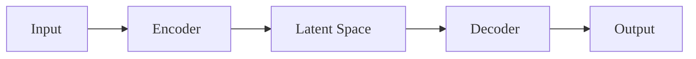

# VAE Model Report Generation Prompt Template

## Overview
This prompt template provides standardized requirements for generating comprehensive VAE (Variational Autoencoder) model reports with proper visualization standards.

## Required Report Sections

### 1. Model Architecture
- **Encoder Structure**: Detailed description of encoder layers, dimensions, and activations
- **Latent Space**: Dimensionality, sampling method (reparameterization trick)
- **Decoder Structure**: Detailed description of decoder layers, dimensions, and activations
- **Discriminator** (if VAE-GAN): Architecture and training role

### 2. Loss Function Components
- **Reconstruction Loss**: Type (MSE, L1, perceptual), calculation method
- **KL Divergence**: Weighting strategy, annealing schedule
- **Adversarial Loss** (if applicable): Generator and discriminator losses
- **Total Loss**: Weighting scheme and optimization target

### 3. Training Configuration
- **Optimizer**: Type, learning rate, weight decay
- **Batch Size**: Training and validation batch sizes
- **Training Schedule**: Total steps, phase divisions, learning rate schedule
- **Checkpoint Strategy**: Frequency, retention policy

### 4. Data Pipeline
- **Data Sources**: Input data types and formats
- **Preprocessing**: Normalization, resizing, augmentation
- **Data Loading**: Batch creation, shuffling, parallel workers
- **Validation Strategy**: Holdout set, metrics, frequency

### 5. Training Strategies
- **Phase 1**: VAE pre-training (reconstruction focus)
- **Phase 2**: Adversarial training (if VAE-GAN)
- **Weight Adaptation**: Dynamic weight adjustment strategies
- **Regularization**: Dropout, batch norm, other techniques

### 6. Optimization Guidelines
- **Hyperparameter Tuning**: Key parameters and ranges
- **Learning Rate**: Scheduling strategies and adaptation
- **Loss Weights**: Balancing techniques for different components
- **Convergence Criteria**: Early stopping, metric thresholds

### 7. Performance Metrics
- **Reconstruction Quality**: PSNR, SSIM, visual inspection
- **Generation Quality**: FID, inception score, human evaluation
- **Training Stability**: Loss curves, gradient monitoring
- **Inference Speed**: Latency, throughput requirements

### 8. Visualization Requirements
- **16:9 Aspect Ratio**: All diagrams must use 1280×720px or 1920×1080px
- **Font Size**: 18px minimum for all text elements
- **LaTeX Compatibility**: Avoid special characters, use plain text descriptions
- **Graph Layout**: Left-right (LR) orientation for better readability
- **Color Scheme**: Consistent, high-contrast colors

## Visualization Standards

### Mermaid Diagram Requirements


### LaTeX Equation Guidelines
- **Avoid**: Special characters ( ), /, ^, ×, ∈, ∇, ||
- **Use**: Plain text descriptions instead of complex equations
- **Examples**: 
  - Instead of: `L_total = L_rec + w_kl × L_kl`
  - Use: "Total Loss = Reconstruction Loss + KL Weight * KL Loss"

## Report Structure Template

```markdown
# VAE Model Report: [Model Name]

## 1. Executive Summary
[Brief overview of model purpose and key achievements]

## 2. Model Architecture
### 2.1 Encoder
[Detailed encoder description]

### 2.2 Latent Space
[Latent space specification]

### 2.3 Decoder
[Detailed decoder description]

## 3. Loss Function Design
### 3.1 Reconstruction Loss
[Reconstruction loss details]

### 3.2 KL Divergence
[KL divergence implementation]

### 3.3 Total Loss Composition
[Complete loss function]

## 4. Training Pipeline
### 4.1 Data Processing
[Data pipeline description]

### 4.2 Training Strategy
[Training approach details]

### 4.3 Optimization Strategy
[Optimization methodology]

## 5. Performance Analysis
### 5.1 Quantitative Results
[Metric results]

### 5.2 Qualitative Analysis
[Visual results and analysis]

## 6. Optimization Recommendations
### 6.1 Hyperparameter Tuning
[Tuning recommendations]

### 6.2 Architecture Improvements
[Architecture suggestions]

### 6.3 Training Enhancements
[Training improvements]

## 7. Conclusion
[Summary and future work]
```

## Quality Assurance Checklist

- [ ] All diagrams follow 16:9 aspect ratio
- [ ] Font size is 18px minimum
- [ ] LaTeX equations are properly converted to plain text
- [ ] Special characters are avoided or properly escaped
- [ ] Graph layout uses LR orientation
- [ ] Color scheme is consistent and accessible
- [ ] All report sections are complete
- [ ] Performance metrics are well-documented
- [ ] Optimization guidelines are practical and actionable
- [ ] Visualization renders correctly without parsing errors

## Export Settings

### PNG Generation
```bash
mmdc -i diagram.mmd -o diagram.png -t default -w 1280 -H 720 -s 2
```

### SVG Generation
```bash
mmdc -i diagram.mmd -o diagram.svg -t default -w 1280 -H 720
```

This template ensures consistent, high-quality VAE model reports with proper visualization standards and comprehensive documentation.