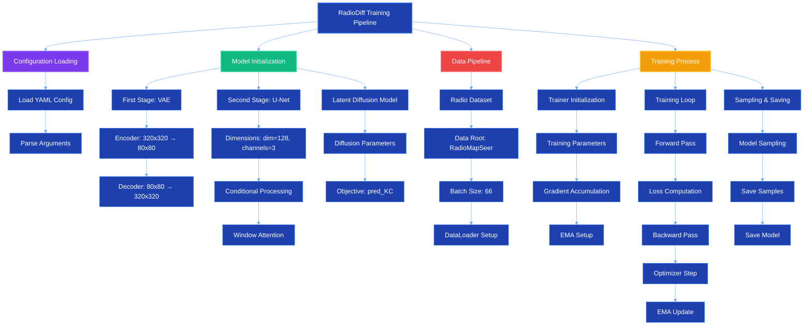
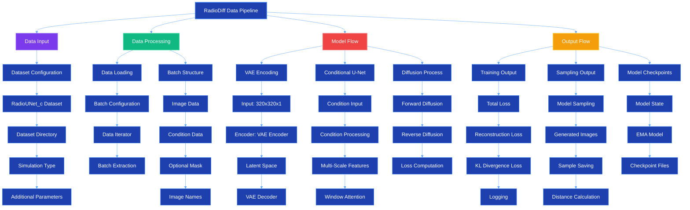

# RadioDiff Mermaid Diagrams Reference

This file contains all Mermaid diagrams from the comprehensive analysis report for reference and debugging.

---

## Diagram 1

---

## Diagram 2

---

## Diagram 3

```mermaid
%%{init: {'theme': 'base', 'themeVariables': { 'primaryColor': '#1e40af', 'primaryTextColor': '#ffffff', 'primaryBorderColor': '#3b82f6', 'lineColor': '#60a5fa', 'secondaryColor': '#7c3aed', 'tertiaryColor': '#10b981', 'clusterBkg': '#f3f4f6', 'clusterBorder': '#9ca3af', 'fontSize': '18px'}}}%%
graph TD
    A["RadioDiff Training Process"] --> B["Training Setup"]
    A --> C["Training Loop"]
    A --> D["Optimization"]
    A --> E["Monitoring & Evaluation"]
    
    B --> B1["Accelerator Setup"]
    B1 --> B2["GPU Configuration"]
    B2 --> B3["Mixed Precision"]
    B3 --> B4["Distributed Strategy"]
    
    B --> B5["Optimizer Configuration"]
    B5 --> B6["Learning Rate"]
    B6 --> B7["Weight Decay"]
    B7 --> B8["LR Scheduler"]
    B8 --> B9["LR Lambda Function"]
    
    B --> B10["Training Parameters"]
    B10 --> B11["Total Steps"]
    B11 --> B12["Gradient Accumulation"]
    B12 --> B13["Save Frequency"]
    B13 --> B14["EMA Configuration"]
    
    C --> C1["Training Loop Structure"]
    C1 --> C2["Progress Bar"]
    C2 --> C3["Step Range"]
    C3 --> C4["Gradient Accumulation Loop"]
    
    C --> C5["Batch Processing"]
    C5 --> C6["Data Loading"]
    C6 --> C7["Device Transfer"]
    C7 --> C8["Model Hook"]
    C8 --> C9["Forward Pass"]
    
    C --> C10["Loss Computation"]
    C10 --> C11["Loss Scaling"]
    C11 --> C12["Loss Components"]
    C12 --> C13["Accumulated Loss"]
    C13 --> C14["Learning Rate Tracking"]
    
    D --> D1["Backward Pass"]
    D1 --> D2["Accelerator Backward"]
    D2 --> D3["Gradient Clipping"]
    D3 --> D4["Synchronization"]
    
    D --> D5["Optimizer Step"]
    D5 --> D6["Zero Gradients"]
    D6 --> D7["Optimizer Step"]
    D7 --> D8["LR Scheduler Step"]
    D8 --> D9["EMA Update"]
    
    D --> D10["Parameter Management"]
    D10 --> D11["Trainable Parameters"]
    D11 --> D12["Gradient Tracking"]
    D12 --> D13["Parameter Updates"]
    
    E --> E1["Logging System"]
    E1 --> E2["Console Logging"]
    E2 --> E3["File Logging"]
    E3 --> E4["TensorBoard Logging"]
    E4 --> E5["Log Frequency"]
    
    E --> E6["Model Evaluation"]
    E6 --> E7["Sampling Frequency"]
    E7 --> E8["Model Evaluation Mode"]
    E8 --> E9["Conditional Sampling"]
    E9 --> E10["Quality Metrics"]
    
    E --> E11["Checkpoint Management"]
    E11 --> E12["Save Checkpoint"]
    E12 --> E13["Checkpoint Contents"]
    E13 --> E14["Resume Capability"]
    
    E --> E15["Sample Management"]
    E15 --> E16["Sample Saving"]
    E16 --> E17["File Naming"]
    E17 --> E18["Ground Truth Comparison"]
    
    classDef primaryBox fill:#1e40af,stroke:#3b82f6,stroke-width:2px,color:#ffffff
    classDef secondaryBox fill:#7c3aed,stroke:#8b5cf6,stroke-width:2px,color:#ffffff
    classDef tertiaryBox fill:#10b981,stroke:#34d399,stroke-width:2px,color:#ffffff
    classDef quaternaryBox fill:#ef4444,stroke:#f87171,stroke-width:2px,color:#ffffff
    classDef quinaryBox fill:#f59e0b,stroke:#fbbf24,stroke-width:2px,color:#ffffff
    
    class A primaryBox
    class B secondaryBox
    class C tertiaryBox
    class D quaternaryBox
    class E quinaryBox
```

---

