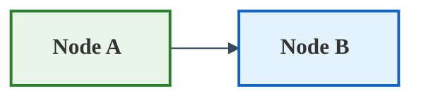

# Mermaid Visualization Guide

## Visualization Standards & Requirements

### **Image Aspect Ratio**
- **Standard**: 16:9 aspect ratio (width:height)
- **Recommended dimensions**: 1280x720px or 1920x1080px
- **Avoid**: Tall, narrow images that are hard to read

### **Font Size & Readability**
- **Minimum font size**: 16px for body text
- **Standard font size**: 18px for all diagrams (mandatory)
- **Use**: Bold fonts for important elements
- **Ensure**: Text is clearly visible at normal viewing distance
- **Requirement**: All diagrams must use 18px font size consistently

### **LaTeX Equation Rendering**
- **Limited Support**: Mermaid has very limited LaTeX/math notation support
- **Recommendation**: Use plain text descriptions instead of complex equations
- **Alternatives**:
  - Use Unicode symbols (σ, μ, ∈, ∑, etc.) where possible
  - Use plain text descriptions (e.g., "L_total = L_rec + L_kl + L_adv")
  - Use simplified notation (e.g., "sigma2" instead of "σ²")
  - **CRITICAL**: Avoid special characters that cause parsing issues:
    - Parentheses: ( ) → use "of" or rephrase
    - Division symbols: / → use "divided by" or rephrase
    - Mathematical operators: ^ × ∈ → use * or rephrase
    - Complex symbols: ∇ || → use "grad" or "norm"
    - Equal signs: = → use "is" or rephrase in context
  - **Maximum text length**: Keep node text under 50 characters
  - **Line breaks**: Use <br/> for readability but avoid complex formatting
- **Examples**:
  - Instead of: `$L_{rec} = |x - \hat{x}| + MSE(x, \hat{x})$`
  - Use: "L_rec = Absolute Difference + MSE"
  - Instead of: `$$L_{total} = L_{nll} + w_{kl} \times L_{kl} + w_{adv} \times L_{adv}$$`
  - Use: "L_total = L_nll + w_kl * L_kl + w_adv * L_adv"

### **Diagram Layout Best Practices**
- **Width**: Keep diagrams wide and short (16:9 ratio)
- **Spacing**: Use adequate spacing between elements
- **Colors**: Use consistent color scheme with good contrast
- **Labels**: Keep labels concise but informative
- **Hierarchy**: Clear visual hierarchy with different sizes/colors

## Python Libraries & Tools

### 1. **mermaid-cli** (Used in this project)
- **Installation**: `pip install mermaid-cli`
- **Usage**: Command-line tool that renders mermaid to PNG/SVG
- **Pros**: Free, offline, high-quality output
- **Cons**: Requires Node.js/Chromium installation

### 2. **py-mermaid**
- **Installation**: `pip install py-mermaid`
- **Usage**: Python wrapper for mermaid rendering
- **Pros**: Pure Python, easy integration
- **Cons**: Limited features

### 3. **mermaid-python**
- **Installation**: `pip install mermaid-python`
- **Usage**: Python library for mermaid generation
- **Pros**: Pythonic interface
- **Cons**: Basic functionality

## Free Online APIs

### 1. **Mermaid.ink API**
- **URL**: `https://mermaid.ink/`
- **Usage**: POST mermaid code to get PNG/SVG
- **Pros**: Free, no API key required
- **Cons**: Rate limits, online dependency

### 2. **GitHub Mermaid Rendering**
- **Usage**: Automatic in GitHub markdown
- **Pros**: Free, integrated with GitHub
- **Cons**: Only works on GitHub

### 3. **Mermaid Live Editor**
- **URL**: `https://mermaid.live/`
- **Usage**: Web-based editor with export
- **Pros**: Interactive, real-time preview
- **Cons**: Manual process

## Generated Diagrams Summary

This project successfully rendered **8 mermaid diagrams**:

1. **Architecture Overview** - High-level VAE-GAN structure
2. **Data Flow** - Information flow through the network
3. **Phase 1 Training** - VAE pre-training sequence
4. **Phase 2 Training** - VAE-GAN adversarial training
5. **Encoder Architecture** - Detailed encoder structure
6. **Decoder Architecture** - Detailed decoder structure
7. **Loss Components** - Loss calculation breakdown
8. **Training Schedule** - Gantt chart of training timeline

## Usage Example with 16:9 Ratio

```python
# Using mermaid-cli (as used in this project)
import subprocess

def render_mermaid(mermaid_code, output_path):
    with open('temp.mmd', 'w') as f:
        f.write(mermaid_code)
    
    subprocess.run([
        'mmdc',
        '-i', 'temp.mmd',
        '-o', output_path,
        '-t', 'default',
        '-w', '1280',  # 16:9 ratio width
        '-H', '720',   # 16:9 ratio height
        '-s', '2'      # Scale factor for better font rendering
    ])
```

## Mermaid Configuration Template



## Alternative: Online API Example

```python
import requests

def render_mermaid_online(mermaid_code, output_path):
    url = "https://mermaid.ink/img/"
    params = {
        'type': 'png',
        'code': mermaid_code
    }
    
    response = requests.get(url, params=params)
    if response.status_code == 200:
        with open(output_path, 'wb') as f:
            f.write(response.content)
    else:
        print(f"Error: {response.status_code}")
```

## Recommendations

1. **For offline use**: Use `mermaid-cli` (as implemented)
2. **For web applications**: Use Mermaid.ink API
3. **For GitHub documentation**: Use native GitHub mermaid support
4. **For interactive development**: Use Mermaid Live Editor

The current implementation uses `mermaid-cli` which provides the best balance of quality, control, and offline availability for documentation purposes.