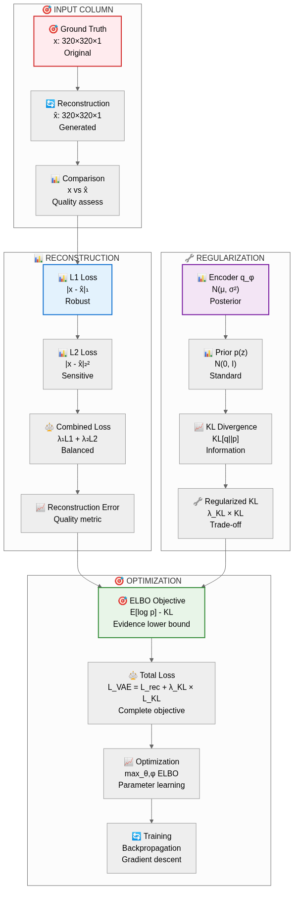

```mermaid
%% Enhanced RadioDiff System Architecture - Ultra Simple
graph TB
    subgraph "📡 INPUT DATA PIPELINE"
        A["RadioMapSeer Dataset<br/>320×320 Radio Maps<br/>Real-world data"] --> B["RadioUNet_c Loader<br/>batch_size: 66<br/>DPM simulation"]
        B --> C["Gradient Accumulation<br/>8 steps → Effective: 528<br/>Memory optimization"]
        C --> D["Input Tensors<br/>image: B×1×320×320<br/>cond: B×3×320×320"]
    end
    
    subgraph "🎯 FIRST STAGE: VAE ENCODER"
        E["AutoencoderKL<br/>embed_dim: 3<br/>KL divergence"] --> F["Encoder Network<br/>ResNet Architecture<br/>Multi-scale features"]
        F --> G["Latent Space z<br/>Shape: B×3×80×80<br/>16× compression ratio"]
        G --> H["Compression Benefits<br/>320×320 → 80×80<br/>Computational efficiency"]
    end
    
    subgraph "🔄 SECOND STAGE: CONDITIONAL U-NET"
        I["Conditional U-Net<br/>dim: 128<br/>Noise prediction"] --> J["Time Embedding<br/>Sinusoidal Encoding<br/>Positional info"]
        J --> K["Condition Integration<br/>Swin Transformer<br/>Window-based attention"]
        K --> L["Multi-scale Features<br/>dim_mults: [1,2,4,4]<br/>Hierarchical processing"]
        L --> M["Adaptive FFT Module<br/>Fourier Scale: 16<br/>Frequency domain"]
        M --> N["Noise Prediction<br/>Knowledge-aware objective<br/>Physics-based"]
    end
    
    subgraph "🌊 DIFFUSION PROCESS"
        O["Forward Diffusion<br/>Noise addition<br/>1000 timesteps"] --> P["Noise Schedule<br/>Linear: 0.0001→0.02<br/>Beta schedule"]
        P --> Q["Reverse Process<br/>Denoising with condition<br/>Learned reverse"]
        Q --> R["Knowledge-Aware Objective<br/>Radio propagation physics<br/>Domain knowledge"]
    end
    
    subgraph "⚙️ TRAINING LOOP"
        S["L2 Loss Computation<br/>Mean squared error<br/>Reconstruction loss"] --> T["Backpropagation<br/>Gradient Clipping: 1.0<br/>Stable training"]
        T --> U["AdamW Optimizer<br/>lr: 5e-5, wd: 1e-4<br/>Weight decay"]
        U --> V["Cosine LR Schedule<br/>Learning rate decay<br/>Cosine annealing"]
        V --> W["EMA Model Update<br/>beta: 0.999<br/>Moving average"]
    end
    
    D --> E
    G --> I
    N --> S
    R --> S
    
    style A fill:#E3F2FD,stroke:#1976D2,stroke-width:3px
    style E fill:#E8F5E8,stroke:#388E3C,stroke-width:3px
    style I fill:#FFF3E0,stroke:#F57C00,stroke-width:3px
    style O fill:#FFEBEE,stroke:#D32F2F,stroke-width:3px
    style S fill:#F3E5F5,stroke:#7B1FA2,stroke-width:3px
```

```mermaid
%% Compact VAE Encoder Architecture - Horizontal Layout
graph LR
    A[["📡 Input<br/>320×320×1<br/>Radio map"]] --> B[["🔧 Conv 128<br/>Feature extraction"]]
    B --> C[["📐 ResNet 1<br/>320→160<br/>Downsample"]]
    C --> D[["📐 ResNet 2<br/>160→80<br/>Downsample"]]
    D --> E[["🎯 Bottleneck<br/>80×80×3<br/>Latent space"]]
    
    F[["📊 Mean μ<br/>Distribution"]] --> G[["📊 Var σ²<br/>Uncertainty"]]
    G --> H[["🔄 Reparameterization<br/>z = μ + σ·ε"]]
    H --> I[["📈 Latent Dist<br/>q_φ(z|x)"]]
    
    J[["⚡ Multi-scale<br/>320→160→80"]] --> K[["🎯 16× Compression<br/>Efficient"]]
    K --> L[["🔒 Info Bottleneck<br/>Essential features"]]
    
    E --> F
    I --> J
    
    style A fill:#F3E5F5,stroke:#7B1FA2,stroke-width:2px
    style F fill:#E3F2FD,stroke:#1976D2,stroke-width:2px
    style J fill:#E8F5E8,stroke:#388E3C,stroke-width:2px
```

```mermaid
%% Compact VAE Decoder Architecture - Horizontal Layout
graph LR
    A[["🎯 Latent z<br/>80×80×3<br/>Compressed"]] --> B[["🔧 Conv 128<br/>Feature expand"]]
    B --> C[["📐 ResNet 1<br/>80→160<br/>Upsample"]]
    C --> D[["📐 ResNet 2<br/>160→320<br/>Upsample"]]
    D --> E[["📡 Output<br/>320×320×1<br/>Reconstructed"]]
    
    F[["🔄 Generation<br/>p_θ(x|z)"]] --> G[["📊 Likelihood<br/>Output model"]]
    G --> H[["🎯 Decoding<br/>x̂ = Decoder(z)"]]
    H --> I[["📈 Quality<br/>||x - x̂||²"]]
    
    J[["⚡ Progressive<br/>80→160→320"]] --> K[["🔗 Skip Conn<br/>Detail preserve"]]
    K --> L[["🎯 Physical<br/>Radio constraints"]]
    
    E --> F
    I --> J
    
    style A fill:#E3F2FD,stroke:#1976D2,stroke-width:2px
    style F fill:#F3E5F5,stroke:#7B1FA2,stroke-width:2px
    style J fill:#E8F5E8,stroke:#388E3C,stroke-width:2px
```

```mermaid
%% Compact VAE Loss Architecture - Horizontal Layout
graph TB
    A[["🎯 Ground Truth<br/>x: 320×320×1"]] --> B[["🔄 Reconstruction<br/>x̂: 320×320×1"]]
    B --> C[["📊 L1 Loss<br/>|x - x̂|₁"]]
    B --> D[["📊 L2 Loss<br/>|x - x̂|₂²"]]
    C --> E[["⚖️ Combined<br/>λ₁L1 + λ₂L2"]]
    D --> E
    
    F[["📊 Encoder q_φ<br/>N(μ, σ²)"]] --> G[["📊 Prior p(z)<br/>N(0, I)"]]
    G --> H[["📈 KL Divergence<br/>KL[q||p]"]]
    H --> I[["🔧 Regularization<br/>λ_KL × KL"]]
    
    J[["🎯 ELBO<br/>E[log p] - KL"]] --> K[["⚖️ Total Loss<br/>L_VAE = L_rec + λ_KL × L_KL"]]
    K --> L[["📈 Optimization<br/>max_θ,φ ELBO"]]
    
    E --> J
    I --> J
    
    style A fill:#FFEBEE,stroke:#D32F2F,stroke-width:2px
    style F fill:#E3F2FD,stroke:#1976D2,stroke-width:2px
    style J fill:#E8F5E8,stroke:#388E3C,stroke-width:2px
```

```mermaid
%% Vertical Multi-Column VAE Loss Architecture - 16:9 Layout
graph TB
    subgraph "🎯 INPUT COLUMN"
        A1["🎯 Ground Truth<br/>x: 320×320×1<br/>Original"]
        A2["🔄 Reconstruction<br/>x̂: 320×320×1<br/>Generated"]
        A3["📊 Comparison<br/>x vs x̂<br/>Quality assess"]
        
        A1 --> A2
        A2 --> A3
    end
    
    subgraph "📊 RECONSTRUCTION COLUMN"
        B1["📊 L1 Loss<br/>|x - x̂|₁<br/>Robust"]
        B2["📊 L2 Loss<br/>|x - x̂|₂²<br/>Sensitive"]
        B3["⚖️ Combined Loss<br/>λ₁L1 + λ₂L2<br/>Balanced"]
        B4["📈 Reconstruction Error<br/>Quality metric"]
        
        B1 --> B2
        B2 --> B3
        B3 --> B4
    end
    
    subgraph "🔧 REGULARIZATION COLUMN"
        C1["📊 Encoder q_φ<br/>N(μ, σ²)<br/>Posterior"]
        C2["📊 Prior p(z)<br/>N(0, I)<br/>Standard"]
        C3["📈 KL Divergence<br/>KL[q||p]<br/>Information"]
        C4["🔧 Regularized KL<br/>λ_KL × KL<br/>Trade-off"]
        
        C1 --> C2
        C2 --> C3
        C3 --> C4
    end
    
    subgraph "🎯 OPTIMIZATION COLUMN"
        D1["🎯 ELBO Objective<br/>E[log p] - KL<br/>Evidence lower bound"]
        D2["⚖️ Total Loss<br/>L_VAE = L_rec + λ_KL × L_KL<br/>Complete objective"]
        D3["📈 Optimization<br/>max_θ,φ ELBO<br/>Parameter learning"]
        D4["🔄 Training<br/>Backpropagation<br/>Gradient descent"]
        
        D1 --> D2
        D2 --> D3
        D3 --> D4
    end
    
    %% Column connections
    A3 --> B1
    B4 --> D1
    C4 --> D1
    
    %% Style columns with different colors
    style A1 fill:#FFEBEE,stroke:#D32F2F,stroke-width:2px
    style B1 fill:#E3F2FD,stroke:#1976D2,stroke-width:2px
    style C1 fill:#F3E5F5,stroke:#7B1FA2,stroke-width:2px
    style D1 fill:#E8F5E8,stroke:#388E3C,stroke-width:2px
```

```mermaid
%% Vertical Multi-Column Diffusion Process - 16:9 Layout
graph TB
    subgraph "📈 FORWARD COLUMN"
        A1["📈 Forward Process<br/>q(xₜ|x₀)<br/>Noise addition"]
        A2["📊 Initial State<br/>x₀: Clean radio<br/>320×320×1"]
        A3["🔄 Noise Schedule<br/>β: 0.0001→0.02<br/>1000 steps"]
        A4["🎯 Final State<br/>x_T: Pure noise<br/>N(0, I)"]
        
        A1 --> A2
        A2 --> A3
        A3 --> A4
    end
    
    subgraph "🔄 REVERSE COLUMN"
        B1["🔄 Reverse Process<br/>p_θ(xₜ₋₁|xₜ, c)<br/>Denoising"]
        B2["📊 Input State<br/>xₜ: Noisy data<br/>t = T, T-1, ..., 1"]
        B3["🔧 U-Net Prediction<br/>ε_θ(xₜ, t, c)<br/>Noise estimate"]
        B4["🎯 Output State<br/>x₀: Clean result<br/>Reconstructed"]
        
        B1 --> B2
        B2 --> B3
        B3 --> B4
    end
    
    subgraph "🎯 KNOWLEDGE COLUMN"
        C1["🎯 Knowledge-Aware<br/>pred_KC<br/>Physics objective"]
        C2["📊 Loss Function<br/>L_KC = E||ε - ε_θ||²<br/>MSE loss"]
        C3["🔧 EM Constraints<br/>Domain knowledge<br/>Radio physics"]
        C4["📈 Benefits<br/>1000× speedup<br/>Real-time"]
        
        C1 --> C2
        C2 --> C3
        C3 --> C4
    end
    
    subgraph "⚡ MATHEMATICAL COLUMN"
        D1["⚡ Forward Math<br/>xₜ = √ᾱₜx₀ + √(1-ᾱₜ)ε<br/>Conditional Gaussian"]
        D2["🔧 Condition Integration<br/>c: Building layout<br/>Spatial info"]
        D3["📊 Reverse Math<br/>xₜ₋₁ = f(xₜ, ε_θ)<br/>Learned reverse"]
        D4["🎯 Single-Step<br/>No field测量<br/>Cost-effective"]
        
        D1 --> D2
        D2 --> D3
        D3 --> D4
    end
    
    %% Column connections
    A4 --> B1
    B4 --> C1
    C4 --> D1
    
    %% Style columns with different colors
    style A1 fill:#FFF3E0,stroke:#F57C00,stroke-width:2px
    style B1 fill:#F3E5F5,stroke:#7B1FA2,stroke-width:2px
    style C1 fill:#E3F2FD,stroke:#1976D2,stroke-width:2px
    style D1 fill:#E8F5E8,stroke:#388E3C,stroke-width:2px
```

# Appendix: Original Enhanced Mermaid Diagrams

This appendix contains the original mermaid code for all enhanced diagrams used in the RadioDiff VAE Enhanced Visual Report.

## Diagram 1: RadioDiff System Architecture

### Original Mermaid Code

---

## Diagram 2: VAE Architecture Details (Split into Three Parts)

### Diagram 2a: VAE Encoder Architecture

#### Original Mermaid Code (Compact Version)

#### Vertical Multi-Column Layout (16:9)

```mermaid
%% Vertical Multi-Column VAE Encoder Architecture - 16:9 Layout
graph TB
    subgraph "📡 INPUT COLUMN"
        A1["🎯 Input Data<br/>320×320×1<br/>Radio map"]
        A2["📊 Shape<br/>B×1×320×320"]
        A3["🔧 Type<br/>Float32"]
        
        A1 --> A2
        A2 --> A3
    end
    
    subgraph "🔄 ENCODING COLUMN"
        B1["🔧 Conv 128<br/>Feature extraction<br/>Kernel: 3×3"]
        B2["📐 ResNet 1<br/>320→160<br/>Downsample 2×"]
        B3["📐 ResNet 2<br/>160→80<br/>Downsample 2×"]
        B4["🎯 Bottleneck<br/>80×80×3<br/>Latent space"]
        
        B1 --> B2
        B2 --> B3
        B3 --> B4
    end
    
    subgraph "📊 MATHEMATICAL COLUMN"
        C1["📊 Mean μ<br/>Distribution<br/>z ~ N(μ, σ²)"]
        C2["📊 Variance σ²<br/>Uncertainty<br/>log σ²"]
        C3["🔄 Reparameterization<br/>z = μ + σ·ε"]
        C4["📈 Latent Distribution<br/>q_φ(z|x)"]
        
        C1 --> C2
        C2 --> C3
        C3 --> C4
    end
    
    subgraph "⚡ FEATURES COLUMN"
        D1["⚡ Multi-scale<br/>320→160→80<br/>Hierarchical"]
        D2["🎯 16× Compression<br/>Efficient<br/>Computational"]
        D3["🔒 Information Bottleneck<br/>Essential features<br/>Only key info"]
        D4["📈 Benefits<br/>Memory efficiency<br/>Faster training"]
        
        D1 --> D2
        D2 --> D3
        D3 --> D4
    end
    
    %% Column connections
    A3 --> B1
    B4 --> C1
    C4 --> D1
    
    %% Style columns with different colors
    style A1 fill:#F3E5F5,stroke:#7B1FA2,stroke-width:2px
    style B1 fill:#E3F2FD,stroke:#1976D2,stroke-width:2px
    style C1 fill:#E8F5E8,stroke:#388E3C,stroke-width:2px
    style D1 fill:#FFF3E0,stroke:#F57C00,stroke-width:2px
```

### Diagram 2b: VAE Decoder Architecture

#### Original Mermaid Code (Compact Version)

#### Vertical Multi-Column Layout (16:9)

```mermaid
%% Vertical Multi-Column VAE Decoder Architecture - 16:9 Layout
graph TB
    subgraph "🎯 LATENT COLUMN"
        A1["🎯 Latent z<br/>80×80×3<br/>Compressed"]
        A2["📊 Shape<br/>B×3×80×80"]
        A3["🔧 Distribution<br/>q_φ(z|x)"]
        
        A1 --> A2
        A2 --> A3
    end
    
    subgraph "🔄 DECODING COLUMN"
        B1["🔧 Conv 128<br/>Feature expand<br/>Kernel: 3×3"]
        B2["📐 ResNet 1<br/>80→160<br/>Upsample 2×"]
        B3["📐 ResNet 2<br/>160→320<br/>Upsample 2×"]
        B4["📡 Output<br/>320×320×1<br/>Reconstructed"]
        
        B1 --> B2
        B2 --> B3
        B3 --> B4
    end
    
    subgraph "📊 GENERATION COLUMN"
        C1["🔄 Generation Process<br/>p_θ(x|z)"]
        C2["📊 Likelihood Model<br/>Output distribution"]
        C3["🎯 Decoding Function<br/>x̂ = Decoder(z)"]
        C4["📈 Quality Metric<br/>||x - x̂||²"]
        
        C1 --> C2
        C2 --> C3
        C3 --> C4
    end
    
    subgraph "⚡ RECONSTRUCTION COLUMN"
        D1["⚡ Progressive<br/>80→160→320<br/>Hierarchical"]
        D2["🔗 Skip Connections<br/>Detail preserve<br/>Feature reuse"]
        D3["🎯 Physical Constraints<br/>Radio propagation<br/>EM physics"]
        D4["📈 Applications<br/>Real-time<br/>6G networks"]
        
        D1 --> D2
        D2 --> D3
        D3 --> D4
    end
    
    %% Column connections
    A3 --> B1
    B4 --> C1
    C4 --> D1
    
    %% Style columns with different colors
    style A1 fill:#E3F2FD,stroke:#1976D2,stroke-width:2px
    style B1 fill:#F3E5F5,stroke:#7B1FA2,stroke-width:2px
    style C1 fill:#E8F5E8,stroke:#388E3C,stroke-width:2px
    style D1 fill:#FFF3E0,stroke:#F57C00,stroke-width:2px
```

### Diagram 2c: VAE Loss Architecture

#### Original Mermaid Code (Compact Version)

#### Vertical Multi-Column Layout (16:9)

---

## Diagram 3: Loss Functions Architecture

### Original Mermaid Code

---

## Diagram 4: Three-Column Diffusion Process

### Original Mermaid Code (Compact Version)

```mermaid
%% Compact Three-Column Diffusion Process - Optimized Layout
graph TB
    subgraph "📈 FORWARD DIFFUSION"
        A[["x₀: Clean<br/>Radio map"]] --> B[["β: 0.0001→0.02<br/>1000 steps"]]
        B --> C[["ε ~ N(0, I)<br/>Noise add"]]
        C --> D[["xₜ = √ᾱₜx₀ + √(1-ᾱₜ)ε<br/>Noisy data"]]
        D --> E[["q(xₜ|x₀)<br/>Conditional Gaussian"]]
        E --> F[["x_T: Pure noise<br/>N(0, I)"]]
    end
    
    subgraph "🔄 REVERSE DIFFUSION"
        G[["xₜ: Noisy input<br/>t = T, T-1, ..., 1"]] --> H[["c: Building layout<br/>Condition"]]
        H --> I[["ε_θ(xₜ, t, c)<br/>U-Net predict"]]
        I --> J[["xₜ₋₁ = f(xₜ, ε_θ)<br/>Denoise"]]
        J --> K[["p_θ(xₜ₋₁|xₜ, c)<br/>Learned reverse"]]
        K --> L[["x₀: Clean output<br/>Result"]]
    end
    
    subgraph "🎯 KNOWLEDGE-AWARE"
        M[["pred_KC<br/>Physics objective"]] --> N[["L_KC = E||ε - ε_θ||²<br/>MSE loss"]]
        N --> O[["EM constraints<br/>Domain knowledge"]]
        O --> P[["Single-step<br/>Real-time"]]
        P --> Q[["1000× speedup<br/>Efficient"]]
        Q --> R[["No field测量<br/>Cost-effective"]]
    end
    
    style A fill:#FFF3E0,stroke:#F57C00,stroke-width:2px
    style G fill:#F3E5F5,stroke:#7B1FA2,stroke-width:2px
    style M fill:#E3F2FD,stroke:#1976D2,stroke-width:2px
```

#### Vertical Multi-Column Layout (16:9)

---

## Diagram 5: Training Configuration

### Original Mermaid Code

---

## Diagram 6: Optimization Strategy

### Original Mermaid Code

---

## Rendering Information

All diagrams were rendered using:
- **Mermaid CLI**: mmdc command-line tool
- **Dimensions**: 1600×900 pixels (16:9 aspect ratio)
- **Theme**: Custom color scheme with enhanced visual styling
- **Format**: PNG images for high-quality reproduction

## Technical Notes

The enhanced diagrams feature:
- **Color-coded components**: Different colors for different system components
- **Hierarchical organization**: Clear subgraph boundaries and logical grouping
- **Professional styling**: Consistent fonts, borders, and visual elements
- **16:9 aspect ratio**: Optimized for presentations and modern displays
- **Enhanced readability**: Better contrast and visual hierarchy

These diagrams provide a comprehensive visual understanding of the RadioDiff VAE system architecture, training methodology, and mathematical foundations.