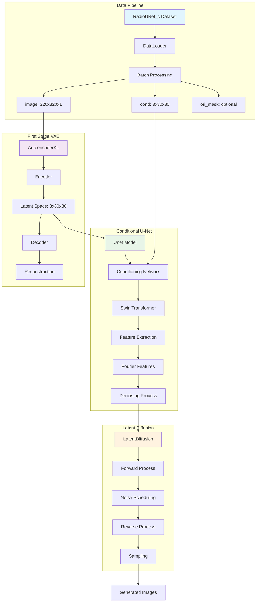
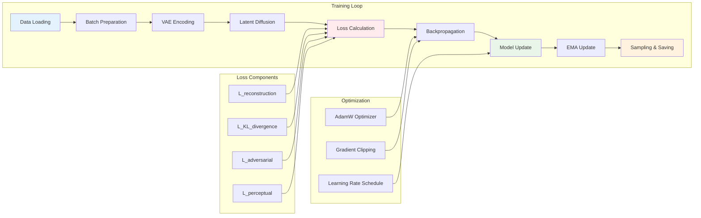
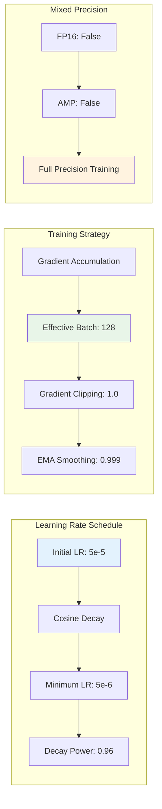
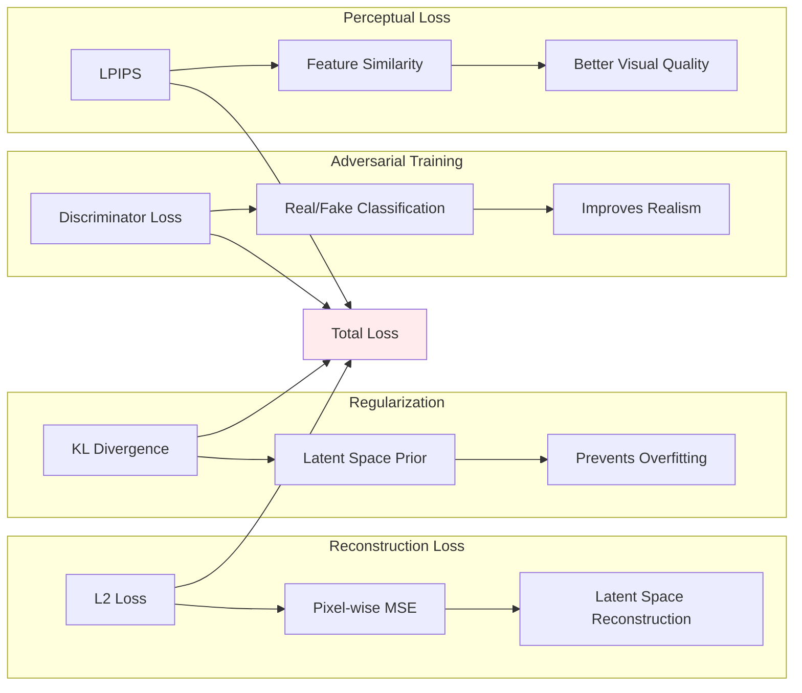

# RadioDiff VAE Architecture Diagram



## Training Data Flow



## VAE Architecture

```mermaid
graph TB
    subgraph "VAE Architecture"
        A[Input: 320x320x1] --> B[Encoder]
        B --> C[Downsampling: 128 channels]
        C --> D[Channel Multipliers: [1,2,4]]
        D --> E[Residual Blocks: 2 per level]
        E --> F[Latent Space: 3x80x80]
        F --> G[Decoder]
        G --> H[Output: 320x320x1]
    end
    
    subgraph "Loss Configuration"
        I[KL Weight: 0.000001] --> J[Total Loss]
        K[Discriminator Weight: 0.5] --> J
        L[Discriminator Start: 50001] --> J
    end
    
    style A fill:#e1f5fe
    style F fill:#f3e5f5
    style J fill:#ffebee
```

## U-Net Architecture

```mermaid
graph TB
    subgraph "U-Net Structure"
        A[Input: 3x80x80] --> B[Base Dim: 128]
        B --> C[Dim Multipliers: [1,2,4,4]]
        C --> D[Conditioning Network]
        D --> E[Swin Transformer]
        E --> F[Window Attention]
        F --> G[Fourier Scale: 16]
        G --> H[Output: 3x80x80]
    end
    
    subgraph "Conditioning"
        I[Cond Input Dim: 3] --> D
        J[Cond Dim: 128] --> D
        K[Cond Dim Multipliers: [2,4]] --> D
        L[Window Sizes: 8x8, 4x4, 2x2, 1x1] --> F
    end
    
    style A fill:#e8f5e8
    style E fill:#fff3e0
    style H fill:#e1f5fe
```

## Learning Rate Schedule



## Data Pipeline

```mermaid
graph TB
    subgraph "Data Structure"
        A[Building Maps] --> B[Transmitter Locations]
        B --> C[Radio Measurements]
        C --> D[Environmental Conditions]
    end
    
    subgraph "Data Processing"
        E[Image: 320x320x1] --> F[Normalization]
        F --> G[Condition: 3x80x80]
        G --> H[Mask: Optional]
    end
    
    subgraph "Augmentation"
        I[Random Crops] --> J[Flips]
        J --> K[Rotations]
        K --> L[Color Jitter]
    end
    
    style A fill:#e1f5fe
    style F fill:#e8f5e8
    style I fill:#fff3e0
```



## Training Process

```mermaid
graph TD
    subgraph "Training Step"
        A[Load Batch] --> B[Move to Device]
        B --> C[VAE Forward Pass]
        C --> D[Diffusion Forward Pass]
        D --> E[Loss Calculation]
        E --> F[Backward Pass]
        F --> G[Gradient Accumulation]
        G --> H[Optimizer Step]
        H --> I[EMA Update]
        I --> J[Logging]
    end
    
    subgraph "Sampling"
        K[Every 200 Steps] --> L[Generate Samples]
        L --> M[Save Images]
        M --> N[Save Checkpoint]
    end
    
    subgraph "Monitoring"
        O[TensorBoard Logging] --> P[Loss Curves]
        P --> Q[Learning Rate]
        Q --> R[Sample Quality]
    end
    
    style A fill:#e3f2fd
    style E fill:#ffebee
    style L fill:#e8f5e8
    style O fill:#fff3e0
```



## Loss Components

