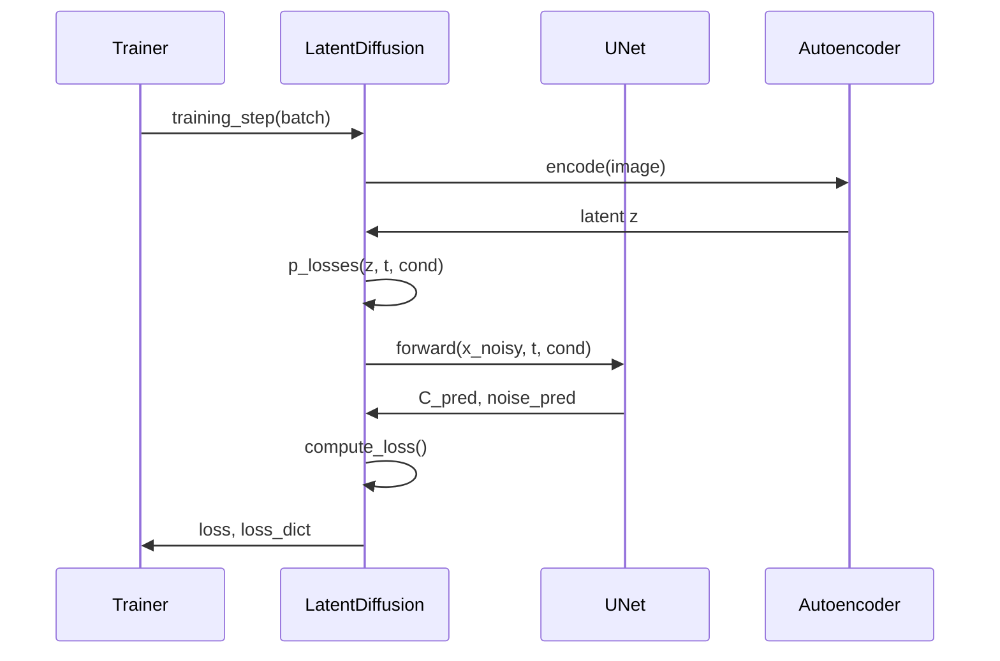

# RadioDiff Conditional LDM Loss Function Analysis

## Loss Function Architecture

The RadioDiff conditional LDM implements a sophisticated loss function with multiple components for training the latent diffusion model. Here's a detailed breakdown:

### Main Loss Components

#### 1. **Simple Loss (loss_simple)**
- **C Prediction Loss**: MSE/L1 loss between predicted C coefficient and target C
- **Noise Prediction Loss**: MSE/L1 loss between predicted noise and target noise
- **Weighting Scheme**: Time-dependent weights applied to balance predictions
  - `simple_weight1 = 2*torch.exp(1-t)` for C prediction
  - `simple_weight2 = torch.exp(torch.sqrt(t))` for noise prediction

#### 2. **VLB Loss (loss_vlb)**
- Currently set to 0 in this implementation
- Can be extended with reconstruction loss components

#### 3. **Total Loss**
- Combined loss: `loss = loss_simple + loss_vlb`

### Loss Function Flow

```mermaid
graph TD
    A[Input Batch] --> B[Autoencoder Encoding]
    B --> C[Latent Representation z]
    C --> D[Time Sampling]
    D --> E[Noise Generation]
    E --> F[Noisy Latent Construction]
    F --> G[UNet Forward Pass]
    G --> H[C and Noise Prediction]
    H --> I[Loss Computation]
    
    I --> J[C Prediction Loss]
    I --> K[Noise Prediction Loss]
    J --> L[Time-Dependent Weighting]
    K --> L
    L --> M[Simple Loss]
    M --> N[Total Loss]
    
    subgraph "Loss Components"
        J
        K
        L
        M
    end
    
    subgraph "Mathematical Operations"
        P[Target C = -1 * x_start]
        Q[x_noisy = x_start + C*t + sqrt(t)*noise]
        R[x_rec = x_noisy - C_pred*t - sqrt(t)*noise_pred]
    end
    
    F --> Q
    H --> R
```

### Detailed Loss Function Implementation

#### Core Loss Calculation (p_losses method)


#### Weighting Strategy

```mermaid
graph LR
    A[Time t] --> B[Weight Function 1]
    A --> C[Weight Function 2]
    
    B --> D[2*exp(1-t)]
    C --> E[exp(sqrt(t))]
    
    D --> F[C Prediction Weight]
    E --> G[Noise Prediction Weight]
    
    F --> H[Weighted C Loss]
    G --> I[Weighted Noise Loss]
    
    H --> J[Simple Loss]
    I --> J
    
    style J fill:#fff3e0
```

### Mathematical Formulation

The loss function follows the equation:

```
loss_simple = w1(t) * MSE(C_pred, C_target) + w2(t) * MSE(noise_pred, noise_target)

where:
w1(t) = 2 * exp(1-t)
w2(t) = exp(sqrt(t))
C_target = -1 * x_start
```

### Key Features

1. **Time-Dependent Weighting**: Loss weights vary with diffusion time steps
2. **Dual Prediction**: Simultaneously predicts C coefficient and noise
3. **Numerical Stability**: Includes NaN checks and clipping
4. **Flexible Loss Types**: Supports both L1 and L2 loss functions
5. **Conditional Training**: Incorporates conditional information via UNet

### Training Process Integration



This comprehensive loss function design enables stable and effective training of the conditional latent diffusion model for radio map generation tasks.